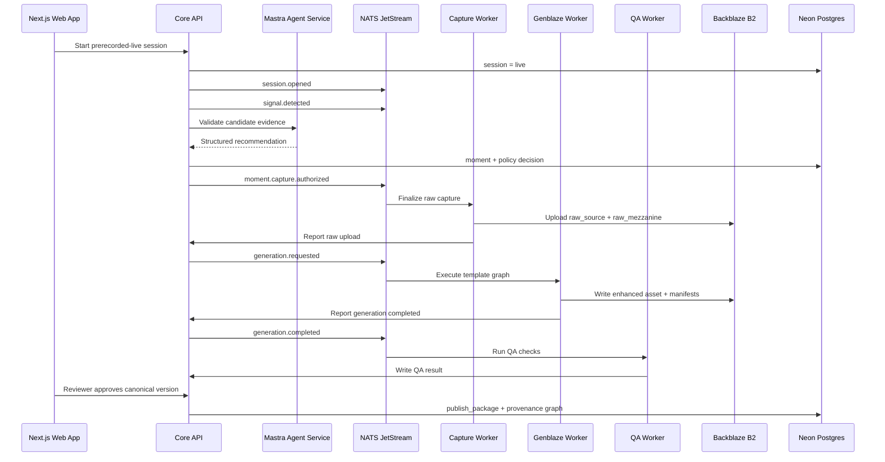
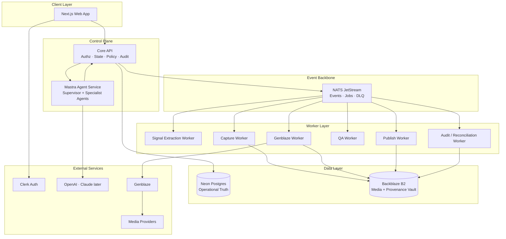

<div align="center">

# Lumiq

### Live Commerce Moment Vault

**Detect high-value live-shopping moments, generate polished commerce clips, and prove every output with B2-backed provenance.**

<br />

[](#project-status)
[](#architecture)
[](#storage--provenance)
[](#ai-agent-boundary)
[](#media-pipeline)

<br />

**Lumiq is not a generic AI clipper.**  
It is a traceable AI media operations platform for live commerce teams.

</div>

---

## What Lumiq does

Lumiq turns live or prerecorded-live commerce sessions into verified, reusable media assets.

A host shows a product. Lumiq detects the valuable sales moment, captures the raw source, runs an approved Genblaze media pipeline, creates a polished vertical asset, checks product claims, sends the result to review, builds a publish package, and stores every asset and manifest in Backblaze B2.

The core promise:

> Every polished commerce asset can be traced back to the exact live moment, raw source asset, catalog snapshot, generation run, QA result, and publish package that produced it.

---

## Why this exists

Live commerce streams are full of valuable moments:

- product reveals
- feature demos
- host reactions
- offer mentions
- try-ons
- limited-time calls to action
- authentic buyer-facing explanations

Most tools can cut or generate short clips, but commerce teams need more than attractive output. They need buyer trust.

Lumiq is designed to answer questions like:

- Which exact source moment created this asset?
- Did AI change the product appearance?
- Which product facts were used?
- Was the discount actually grounded in a campaign?
- Did QA pass before publish?
- Where are the raw, enhanced, manifest, and publish assets stored?

---

## Golden path

The first implementation target is the smallest real end-to-end vertical slice:

```txt
seeded setup
→ prerecorded-live session
→ signal detection
→ Mastra recommendation
→ policy-authorized capture
→ raw B2 asset
→ Genblaze generation
→ QA
→ review approval
→ publish package/share page
→ provenance graph
```

This path is the product, demo, and engineering spine of the repository.



---

## Architecture

Lumiq is built around one non-negotiable responsibility split:

```txt
Mastra recommends.
Core API authorizes.
NATS dispatches.
Workers execute.
Genblaze generates media.
Backblaze B2 stores media and proof.
Neon Postgres tracks operational truth.
```



---

## Core capabilities

| Capability | What it means |
|---|---|
| Live Studio | Start and monitor browser/prerecorded-live commerce sessions. |
| Signal detection | Detect transcript, offer, product, scene, audio, and manual-marker signals. |
| Moment ranking | Convert evidence into candidate moments with confidence, type, and explanation. |
| Policy capture | Authorize capture only after score, budget, privacy, duplicate, and retention checks. |
| B2 media vault | Store raw, mezzanine, enhanced, captions, thumbnails, manifests, and publish assets. |
| Genblaze pipeline | Run approved media generation/editing workflows through safe template step graphs. |
| Product grounding | Use catalog snapshots and allowed claims instead of freeform AI product facts. |
| QA and moderation | Check output quality, caption accuracy, product claims, product appearance, and publish readiness. |
| Review workflow | Compare raw and enhanced assets, inspect evidence, approve/reject/rerender. |
| Publish package | Create canonical publish-ready bundles with variants, captions, thumbnails, product links, and provenance. |
| Provenance graph | Show raw source → generation run → enhanced master → publish package lineage. |

---

## Tech stack

| Layer | Technology |
|---|---|
| Web app | Next.js, TypeScript, Tailwind/shadcn-compatible design system |
| Authentication | Clerk |
| Authorization | Internal organization roles and capabilities |
| Core API | TypeScript or FastAPI, final runtime decision pending |
| Agent framework | Mastra |
| LLM routing | OpenAI primary, Claude fallback later |
| Event backbone | NATS JetStream |
| Database | Neon Postgres |
| Object storage | Backblaze B2 |
| Media orchestration | Genblaze |
| Workers | Python-first for capture, media, Genblaze, QA, publish, recovery |
| Contracts | OpenAPI, AsyncAPI, JSON Schema Draft 2020-12 |
| Observability | Trace IDs, structured logs, audit events, cost records |

---

## Repository structure

Current layout on disk:

```txt
lumiq/
  README.md
  AGENTS.md               # canonical coding-agent instructions
  CLAUDE.md               # pointer to AGENTS.md for Claude Code
  .env.example
  package.json
  pnpm-workspace.yaml
  turbo.json
  docker-compose.yml
  skills-lock.json        # manifest for shared AI-agent skills
  skills/                 # 46 shared AI-agent skills (tool-agnostic)
  .claude/                # Claude Code local settings
  .specify/               # Spec Kit config

  docs/
    00-spec-index.md
    product/              # PRD, glossary, requirements, UX flows
    architecture/         # constitution, C4, data model, agent + media specs
    contracts/
      09-api-contract-openapi.yaml
      10-event-contract-asyncapi.yaml
      11-json-schemas.md
      schemas/            # asset, moment, generation-run, provenance, etc.
    policies/             # template graph, grounding, QA, security, privacy
    engineering/          # infra, testing, runbooks, implementation plan
    design/               # design tokens (tokens.json, theme.css, variables.css)
    demo/                 # hackathon demo submission spec

  specs/
    001-ui-screens/       # Spec Kit feature spec (plan, tasks, contracts)

  apps/
    web/                  # Next.js app — primary build target
    api/                  # Core API (stub)
    mastra/               # Mastra agent service (stub)

  packages/
    api-client/           # generated API client (stub)
    test-fixtures/        # shared test fixtures (stub)
```

### Planned, not yet scaffolded

The full target topology below is the destination, not the current state. These
directories are referenced by the specs but do not exist on disk yet:

```txt
apps/workers/            # signal, capture, genblaze, qa, publish, recovery
packages/                # db, contracts, schemas, domain, auth, events,
                         #   storage, media, ui, design-system, observability
infra/                   # docker, nats, neon, b2, clerk, scripts, ci
tests/                   # e2e, contract, integration, fixtures
scripts/
```

---

## Project status

Lumiq is currently in a **spec-first implementation phase**.

The repository should be built in this order:

```txt
1. Align docs and repo skeleton
2. Add README and AGENTS.md
3. Add JSON schemas and contract validation
4. Build platform foundation
5. Implement the golden path backend
6. Implement the golden path frontend
7. Add tests, observability, and recovery
8. Deploy and record the demo
9. Harden into production beta
```

---

## Quick start

> Commands below are the intended developer workflow. Exact scripts may be adjusted as implementation lands.

```bash
pnpm install
cp .env.example .env.local
pnpm dev
```

Run the local stack:

```bash
docker compose up --build
```

Run validation gates:

```bash
pnpm lint
pnpm typecheck
pnpm test
pnpm contracts:validate
pnpm schemas:validate
```

Run the seeded golden path smoke test:

```bash
pnpm seed:demo
pnpm test:e2e:golden
```

---

## Environment variables

Use environment-specific credentials. Never commit secrets.

```txt
# App
NEXT_PUBLIC_APP_URL=
CORE_API_URL=

# Clerk
CLERK_SECRET_KEY=
NEXT_PUBLIC_CLERK_PUBLISHABLE_KEY=

# Database
DATABASE_URL=

# NATS
NATS_URL=
NATS_USER=
NATS_PASSWORD=

# Backblaze B2
B2_APPLICATION_KEY_ID=
B2_APPLICATION_KEY=
B2_REGION=
B2_RAW_BUCKET=
B2_DERIVED_BUCKET=
B2_PUBLISHED_BUCKET=
B2_PROVENANCE_BUCKET=

# AI / LLM
OPENAI_API_KEY=
ANTHROPIC_API_KEY=

# Genblaze / media providers
GENBLAZE_CONFIG_PATH=
MEDIA_PROVIDER_API_KEY=

# Internal services
SERVICE_IDENTITY_SECRET=
WORKER_CALLBACK_SECRET=
```

Local development should use mock providers by default. Real provider calls should require explicit opt-in.

---

## Contracts

Lumiq is contract-first.

| Contract | Location | Purpose |
|---|---|---|
| OpenAPI | `docs/contracts/09-api-contract-openapi.yaml` | Core API, internal agent gateway, worker callbacks |
| AsyncAPI | `docs/contracts/10-event-contract-asyncapi.yaml` | NATS subjects, messages, producers, consumers |
| JSON Schema | `docs/contracts/schemas/*.schema.json` | Cross-language validation for API, events, manifests, agents, workers, and QA |

Contract rules:

- Validate API payloads before state changes.
- Validate events before publish and before consume.
- Validate agent tool calls before execution.
- Validate B2 manifests before upload.
- Validate LLM structured output before it affects product behavior.
- Use strict ULID validation everywhere: `^[0-9A-HJKMNP-TV-Z]{26}$`.
- Keep event-specific payload schemas inside `nats-events.schema.json` for the initial schema package.
- Schema models represent database rows and API responses where those objects cross service boundaries.

---

## Storage & provenance

Backblaze B2 is the durable media/provenance vault.

Every tenant-scoped object key must start with:

```txt
tenants/{organization_id}/
```

Canonical assets are immutable. Rerenders create new assets, new object keys, new manifests, and new generation runs.

```txt
raw_source_asset
  → raw_mezzanine_asset
  → generation_run
  → enhanced_master_asset
  → qa_result
  → approved canonical version
  → publish_package
  → publish_variant_asset
  → provenance_manifest
```

Postgres stores queryable operational truth. B2 stores durable media and proof. Both must cross-reference each other through IDs, object keys, checksums, and manifest records.

---

## AI agent boundary

Mastra agents reason. They do not execute privileged side effects.

Agents may:

- read safe session context
- inspect bounded evidence
- recommend a candidate moment
- suggest product matches
- suggest trim boundaries
- recommend templates
- generate constrained caption options
- explain QA and provenance

Agents must not:

- write directly to B2
- mutate Postgres directly
- call media providers directly
- call Genblaze directly
- publish externally
- change budgets
- change retention policy
- delete assets
- override catalog facts

All agent side effects must pass through the Core API Agent Tool Gateway with service identity, tenant scope, schema validation, idempotency, policy checks, and audit logging.

---

## Media pipeline

Genblaze is the generative media orchestration layer.

The Genblaze Worker consumes approved generation events, loads context through the Core API, executes a safe template step graph, writes output assets and manifests to B2, and reports state transitions back through the Core API.

Templates compile into safe, typed step graphs. They must never expose arbitrary shell commands, arbitrary FFmpeg strings, arbitrary provider calls, or user-defined executable code.

P0 template target:

```txt
clean_product_reveal_v1
  1. load input asset
  2. select final trim boundaries
  3. normalize mezzanine
  4. reframe vertical
  5. generate captions
  6. render product card overlay
  7. burn captions
  8. generate thumbnail
  9. run QA
  10. write provenance manifest
  11. create publish variants
```

---

## Product grounding

Commerce facts must come from structured catalog/campaign data, not from freeform AI output.

A commerce-grounded session needs a `catalog_snapshot_id`. Generated overlays, captions, titles, descriptions, thumbnails, and publish copy can only use verified facts from the catalog snapshot or approved live refresh.

Restricted claims require explicit support:

```txt
percent discounts
sale prices
free shipping
limited stock
expires today
best-selling
official/authentic/licensed
waterproof/water-resistant
warranty or guarantee claims
fast shipping claims
```

If a claim cannot be verified, Lumiq must remove it, rewrite it, block generation, or route it to human review.

---

## QA and review

QA is multi-stage:

```txt
pre-enhancement QA
post-enhancement QA
pre-publish QA
admin reconciliation QA
```

Failure classes:

| Class | Meaning |
|---|---|
| `retryable` | Same inputs may succeed on retry. |
| `remediable` | Output can likely be fixed by deterministic adjustment or rerender. |
| `review_required` | Human judgment is needed. |
| `terminal` | Workflow cannot safely proceed. |

Publishing requires human approval by default unless an explicit organization automation policy allows otherwise.

---

## Design system

Lumiq uses a dark-only cinematic AI studio design language.

Core rules:

- dark mode only
- pure black media canvas
- near-black panels
- deep royal/cobalt blue for actions and live signal
- flat gradients only
- no glow, no blur, no aura
- Inter for UI
- mono font for IDs, B2 keys, checksums, timestamps, and manifest snippets
- provenance should be visible, not buried

Design tokens currently live in:

```txt
docs/design/          # tokens.json, theme.css, variables.css
apps/web/src/app/globals.css   # applied tokens for the web app
```

A dedicated `packages/design-system/` is planned once tokens are shared across apps.

---

## Testing

Lumiq requires more than generic unit tests. Anything that can create media, change state, spend money, publish content, expose data, delete assets, or influence product claims needs automated tests or explicit manual evaluation criteria.

Required gates:

| Gate | Covers |
|---|---|
| Static | lint, typecheck, format, secret scan |
| Schema | JSON Schema, OpenAPI, AsyncAPI validation |
| DB | migrations, FK/index checks, tenant scope |
| Auth | capability denial, service identity, tenant isolation |
| Worker | duplicate event handling, retry, DLQ, idempotency |
| Media | checksum, manifest validation, no overwrite |
| AI | structured output, tool denial, prompt injection fixtures |
| UI | design tokens, empty/loading/error states, provenance |
| Golden | full seeded demo path |

---

## Demo scenario

The locked demo scenario is:

```txt
The Crossbody Bag Flash Offer Demo
```

A fictional brand runs a live launch for the **Aster Everyday Crossbody**. Lumiq detects the product reveal, captures the raw moment, stores source assets in B2, generates a vertical polished asset through Genblaze, validates allowed claims, sends it to review, creates a publish package, and shows a provenance graph.

Must be visible in the demo:

- raw source asset
- B2 object key
- checksum
- generation_run_id
- enhanced master
- QA status
- publish package
- provenance manifest
- raw → generated → published lineage

---

## Security posture

Lumiq is built for least privilege and auditability.

Security rules:

- Clerk authenticates humans.
- Lumiq internal RBAC authorizes actions.
- Agents and workers use service identities.
- Tenant scope is mandatory everywhere.
- Secrets never go to browsers, prompts, logs, or agent memory.
- All important side effects require idempotency keys.
- Canonical B2 objects are never overwritten.
- Public share access is explicit and revocable.
- Prompt injection is treated as a real threat.

---

## Coding agent protocol

Every coding agent must start with the specs.

Required reading order:

```txt
1. docs/00-spec-index.md
2. docs/architecture/02-project-constitution.md
3. docs/product/03-glossary-domain-language.md
4. docs/product/PRD.md
5. docs/product/04-requirements-ears.md
6. Relevant domain spec
7. Relevant API/event/schema contracts
```

Required task prompt format:

```txt
Task ID:
Relevant specs:
Requirement IDs:
Files likely touched:
Expected output:
Tests required:
Do not change:
```

Stop and request a spec update when:

- a required schema field is missing
- a state transition is undefined
- a capability is missing
- a B2 key pattern is unclear
- product claim behavior is ambiguous
- external publish behavior is requested without policy
- secrets or credentials are requested in code

---

## Roadmap

### P0 — Hackathon golden path

- app shell
- seeded catalog/campaign setup
- prerecorded-live session
- signal detection
- Mastra recommendation
- capture policy
- B2 raw/mezzanine storage
- Genblaze enhancement
- QA minimal checks
- review approval
- publish package/share page
- provenance graph
- golden E2E test

### P1 — Production beta

- CSV import
- controlled rerender
- advanced QA
- cost reconciliation
- admin recovery
- search and pgvector
- retention/deletion jobs
- provider fallback policies
- operational dashboards

### P2/P3 — Integrations and enterprise

- Shopify catalog adapter
- OBS/RTMP ingest
- TikTok/Instagram/YouTube publish adapters
- dedicated buckets
- legal hold workflows
- advanced audit export
- SSO/SAML

---

## Maintainer note

Lumiq is intentionally strict because it sits at the intersection of AI generation, live media, commerce claims, user trust, storage provenance, and publishing. The goal is not to move fast by bypassing controls. The goal is to make the safe, traceable path the fastest path.

</div>
