# 06 — System Architecture C4

**Project:** Lumiq — Live Commerce Moment Vault  
**Document ID:** `06-system-architecture-c4.md`  
**Status:** Draft v1  
**Audience:** backend engineers, frontend engineers, AI engineers, infra/devops, QA, AI coding agents  
**Depends on:** `00-spec-index.md`, `01-product-requirements.md`, `02-project-constitution.md`, `03-glossary-domain-language.md`, `04-requirements-ears.md`, `05-user-flows-ux-spec.md`

---

## 1. Purpose

This document defines the C4-style architecture for Lumiq.

It describes:

```txt
System Context
Container View
Component Views
Deployment View
Critical Sequence Diagrams
Trust Boundaries
Data Flow
Implementation Priorities
Architecture Rules
```

The goal is to make the system architecture clear enough for humans and coding agents to implement without inventing boundaries.

---

## 2. Architecture Summary

Lumiq is a live-commerce AI media platform.

Core flow:

```txt
live/prerecorded session
→ signal detection
→ Mastra agent recommendation
→ policy authorization
→ raw capture
→ B2 storage
→ Genblaze generation
→ QA
→ review
→ publish package
→ provenance graph
```

Primary architecture principle:

```txt
Agents recommend.
Core API authorizes.
NATS dispatches.
Workers execute.
Genblaze generates media.
B2 stores media/proof.
Postgres tracks operational truth.
```

---

## 3. Architectural Goals

The architecture must support:

```txt
setup-first commerce grounding
browser-first/prerecorded-live source path
future source adapters
Mastra supervisor + specialist agents
gateway-only agent tools
NATS JetStream event backbone
Postgres state machines
B2 canonical media/provenance storage
Genblaze media generation orchestration
immutable assets and manifests
review/publish human approval
admin recovery and DLQ
cost/budget tracking
traceable observability
```

The architecture must prevent:

```txt
agents mutating state directly
ungrounded product claims
untraceable generated assets
overwritten canonical B2 objects
duplicate generation due to event redelivery
external publishing without approval/policy
provider costs without budget checks
tenant data leakage
```

---

## 4. C4 Level 1 — System Context

### 4.1 Primary users

```txt
Live commerce host
Editor
Reviewer
Admin/Owner
Viewer/share recipient
```

### 4.2 Lumiq system

Lumiq includes:

```txt
Next.js workspace
Core API
Mastra Agent Service
NATS JetStream event backbone
Python worker services
Genblaze media pipeline worker
Neon Postgres
Backblaze B2
```

### 4.3 Current required external systems

```txt
Clerk
  authentication and session identity

Backblaze B2
  canonical media/provenance storage

Genblaze
  generative media orchestration SDK/layer

Media providers through Genblaze/provider adapters
  Decart
  GMI Cloud
  Runway
  OpenAI media models
  other approved providers

LLM providers
  OpenAI primary
  Anthropic Claude secondary/fallback
  Google Gemini Flash-style later

Neon Postgres
  managed operational database

NATS JetStream
  managed or self-hosted event backbone
```

### 4.4 Future/optional external systems

```txt
Shopify
  catalog/product/campaign sync

WooCommerce/custom commerce APIs
  catalog adapters

OBS/RTMP/WHIP ingress
  future live source adapters

TikTok / Instagram / YouTube
  future publish adapters or draft connectors

CDN layer
  future public/share delivery optimization

Observability vendor
  future OpenTelemetry backend, logs, metrics, traces
```

### 4.5 Context diagram

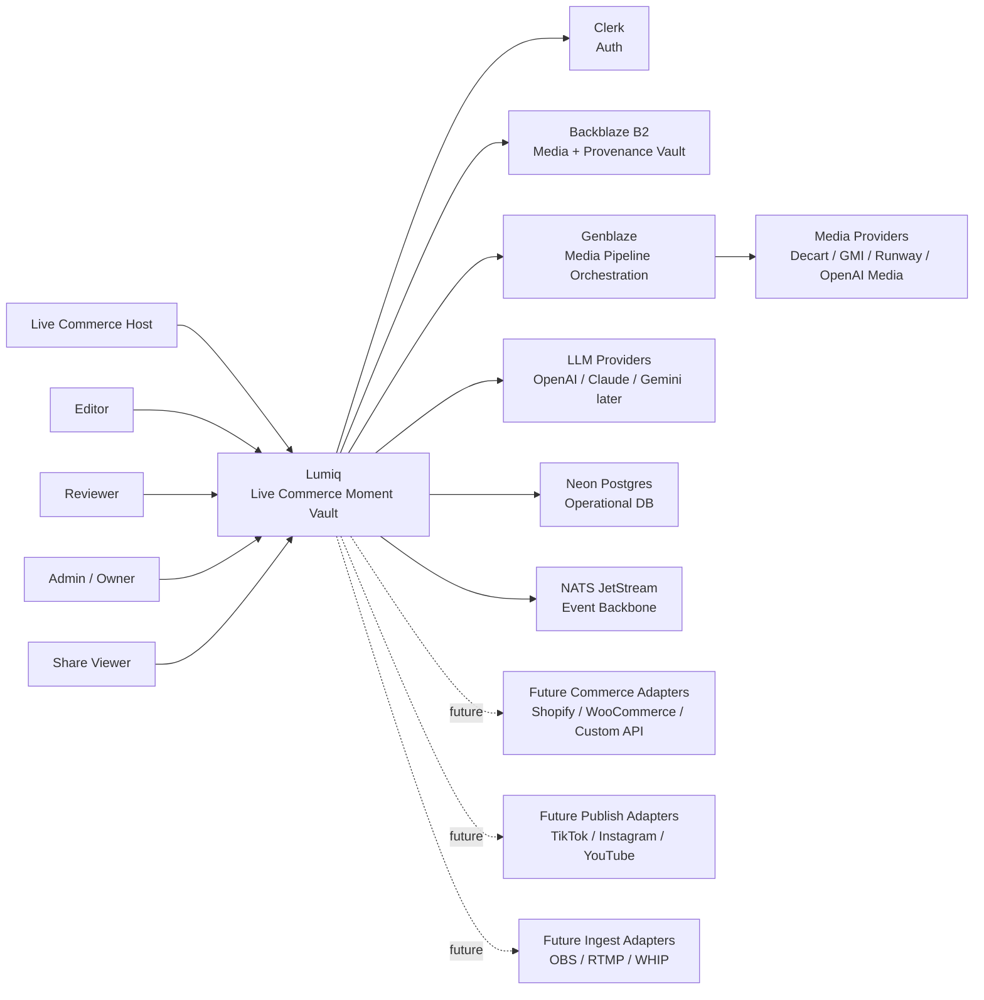

### 4.6 Context notes

Current required systems must be represented as actual dependencies in implementation.

Future systems must be represented as adapters/interfaces, not as built functionality unless explicitly implemented.

---

## 5. C4 Level 2 — Container View

### 5.1 Container inventory

| Container | Priority | Runtime | Responsibility |
|---|---|---|---|
| Web App | P0 | Next.js / TypeScript | Workspace UI, Live Studio, Review, Vault, Share Pages |
| Core API | P0 | Node/FastAPI TBD | Authz, state transitions, budgets, agent tool gateway, audit |
| Mastra Agent Service | P0 | TypeScript | Supervisor/specialist agents, structured recommendations |
| NATS JetStream | P0 | Managed/self-hosted | Event/job transport, replay, DLQ |
| Neon Postgres | P0 | Managed Postgres | Operational truth, state, indexes, audit |
| Backblaze B2 | P0 | Object storage | Raw/derived/published media and manifests |
| Capture Worker | P0 | Python | Raw capture finalization, B2 upload, mezzanine creation |
| Genblaze Worker | P0 | Python | Genblaze media generation, provider calls, manifests |
| QA Worker | P0 | Python/TypeScript | Pre/post/publish QA checks |
| Publish Worker | P0 | Python/TypeScript | Publish package and share asset creation |
| Signal Extraction Worker | P0/P1 | Python/TS | Cheap signals, transcript/frame signal processing |
| Search Indexing Worker | P1 | Python/TS | Structured/semantic indexing |
| Admin/Recovery Service | P1 | Core API module | DLQ, reconciliation, manual replay |
| Observability Stack | P1 | OTel/logs/metrics | Traces, logs, metrics, cost/audit insights |

### 5.2 Container diagram

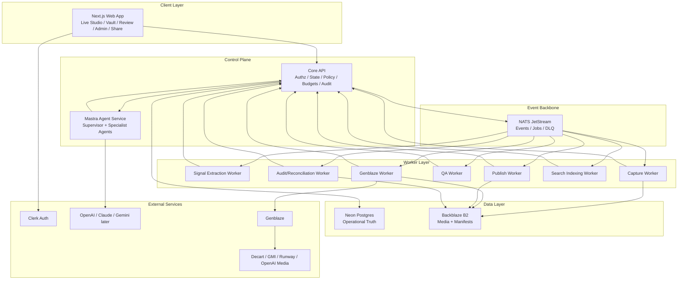

### 5.3 Container priorities

P0 implementation slice:

```txt
Web App
Core API
Mastra Agent Service
NATS JetStream
Neon Postgres
Backblaze B2
Capture Worker
Genblaze Worker
QA Worker minimal
Publish Worker minimal
Signal Extraction minimal
```

P1 production beta:

```txt
Search Indexing Worker
Admin/Recovery Console
Advanced QA Worker
Cost reconciliation
Provider fallback policies
Observability dashboards
```

P2/P3:

```txt
Shopify adapter
OBS/RTMP adapter
social publish adapters
advanced analytics
enterprise isolation
```

---

## 6. Core Architectural Boundaries

### 6.1 Agent boundary

Mastra agents may call only internal typed tools through Core API.

Forbidden:

```txt
direct B2 write/delete
direct provider calls
direct Postgres mutation
direct publish
direct budget changes
direct retention changes
```

### 6.2 State boundary

Core API owns business state transitions.

Workers may perform tasks but update state through Core API or an approved internal state-transition mechanism.

### 6.3 Storage boundary

B2 stores media and manifests.

Postgres stores asset rows, state, indexes, and queryable provenance.

### 6.4 Event boundary

NATS transports events/jobs.

NATS is not the business source of truth.

### 6.5 Media generation boundary

Genblaze Worker handles media generation/editing through Genblaze/provider adapters.

Normal LLM providers are not used for media generation.

### 6.6 Product truth boundary

Product facts must come from catalog/campaign snapshots, not freeform LLM output.

---

## 7. C4 Level 3 — Core API Components

### 7.1 Core API responsibilities

```txt
verify Clerk identity
map user to organization/member/role
check exact capabilities
validate agent tool calls
manage session state
manage moment state
manage asset records
manage generation_run records
manage publish_package records
enforce budget/policy
emit NATS events
write audit events
provide signed asset URLs
serve review/vault/admin queries
```

### 7.2 Component diagram

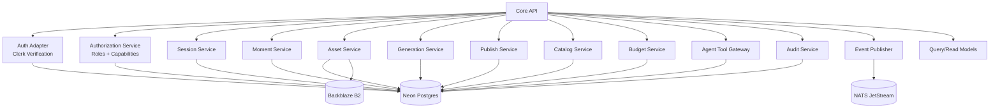

### 7.3 Core API component responsibilities

#### Auth Adapter

```txt
verify Clerk token
map Clerk user to internal user
load memberships
```

#### Authorization Service

```txt
role checks
capability checks
service identity checks
tenant isolation
```

#### Session Service

```txt
create session
preflight validation
start/end session
attach catalog snapshot
record source metadata
```

#### Moment Service

```txt
create candidate
authorize capture
state transitions
review state
canonical promotion
```

#### Asset Service

```txt
create asset record
generate B2 object keys
verify checksum metadata
issue signed URLs
soft delete assets
```

#### Generation Service

```txt
create generation_run
authorize generation budget
handle generation started/completed/failed
track provider metadata
```

#### Publish Service

```txt
create publish package
validate publish readiness
approve package
create share page
revoke package/share page
```

#### Catalog Service

```txt
manage products
manage campaigns/offers
create catalog snapshots
verify product claims
live refresh before publish
```

#### Budget Service

```txt
estimate media/LLM costs
check org/campaign/session/model caps
record usage
reconcile actual cost
```

#### Agent Tool Gateway

```txt
validate Mastra agent tool calls
check service identity
check agent capabilities
validate tool schema
record agent_tool_call
return safe context/results
```

#### Audit Service

```txt
write audit_events
link trace/correlation IDs
store before/after state
```

#### Event Publisher

```txt
emit versioned NATS events
ensure event envelope
write outbox if used
```

---

## 8. C4 Level 3 — Mastra Agent Service Components

### 8.1 Responsibilities

```txt
run supervisor agent
run specialist agents
call LLMProviderRouter
call Core API tool gateway
return structured outputs
maintain working context
retrieve governed memory through Core API
```

### 8.2 Component diagram

```mermaid
flowchart TB
  AgentSvc[Mastra Agent Service]

  Supervisor[Supervisor Agent]
  SignalAgent[Signal/Moment Agent]
  ProductAgent[Product Matcher Agent]
  BoundaryAgent[Clip Boundary Agent]
  TemplateAgent[Enhancement Planner Agent]
  CaptionAgent[Caption/Copy Agent]
  QAAgent[QA Agent]
  ProvAgent[Provenance Explainer Agent]

  Router[LLMProviderRouter]
  ToolClient[Core API Tool Client]
  MemoryClient[Memory/Context Client]
  SchemaValidator[Structured Output Validator]

  OpenAI[OpenAI]
  Claude[Anthropic Claude]
  Gemini[Gemini Flash-style later]
  API[Core API]

  AgentSvc --> Supervisor
  Supervisor --> SignalAgent
  Supervisor --> ProductAgent
  Supervisor --> BoundaryAgent
  Supervisor --> TemplateAgent
  Supervisor --> CaptionAgent
  Supervisor --> QAAgent
  Supervisor --> ProvAgent

  AgentSvc --> Router
  AgentSvc --> ToolClient
  AgentSvc --> MemoryClient
  AgentSvc --> SchemaValidator

  Router --> OpenAI
  Router --> Claude
  Router -. later .-> Gemini
  ToolClient --> API
  MemoryClient --> API
```

### 8.3 Agent output contract

All behavior-affecting outputs must be structured and schema-validated.

No freeform-only control decisions.

### 8.4 Agent security

Agent service has no direct B2/provider/database mutation credentials.

---

## 9. C4 Level 3 — Genblaze Worker Components

### 9.1 Responsibilities

```txt
consume generation.requested
load generation_run
load input asset metadata
fetch input media from B2
execute approved template step graph
call Genblaze
call media providers through Genblaze/provider adapters
write output assets to B2
write Genblaze manifest
write app provenance manifest
update Core API
emit generation completed/failed
```

### 9.2 Component diagram

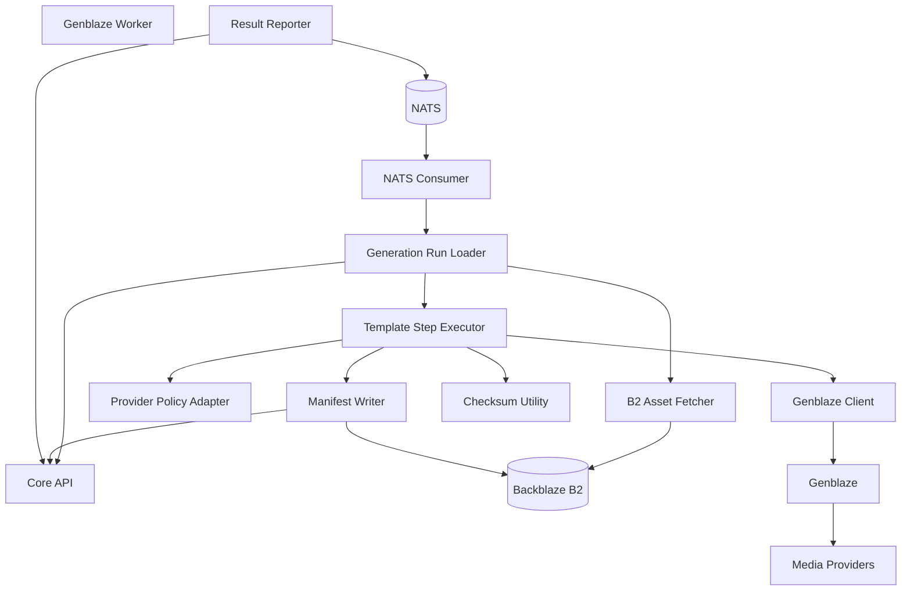

### 9.3 Genblaze worker constraints

```txt
must be idempotent
must not overwrite canonical B2 keys
must write generation_run status
must write manifests
must report failures
must respect provider fallback policy
must respect budget authorization
```

---

## 10. C4 Level 3 — Capture Worker Components

### 10.1 Responsibilities

```txt
consume moment.capture.authorized
retrieve source/capture buffer
finalize raw clip
upload raw source to B2
create checksum
create raw_source asset record
create mezzanine asset where possible
emit moment.raw.uploaded
```

### 10.2 Component diagram

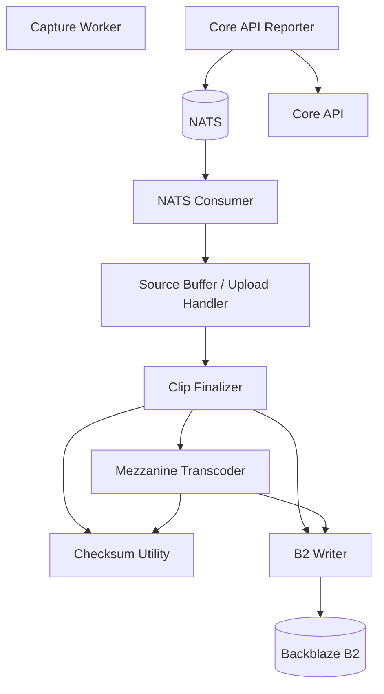

---

## 11. C4 Level 3 — Web App Components

### 11.1 Responsibilities

```txt
render app shell
run Live Studio UI
show signal feed
show timelines
show Review Queue
show Moment Vault
show provenance graph
show Catalog/Campaign setup
show Share Pages
show Admin/Recovery
call Core API
use Clerk session
follow Lumiq design tokens
```

### 11.2 Component diagram

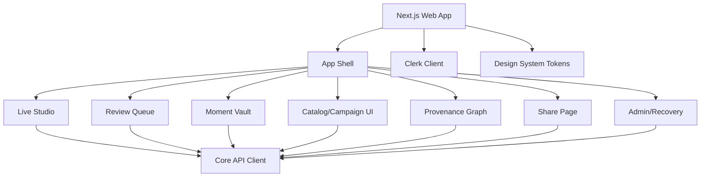

### 11.3 Frontend constraints

```txt
dark-only
use design tokens
no glow gradients
show lineage for generated assets
show layered explanations
do not expose unauthorized actions
support reduced motion
```

---

## 12. Data Stores

### 12.1 Neon Postgres

Stores:

```txt
organizations
users
memberships
roles
capabilities
sessions
moments
signals
moment_evidence
assets
generation_runs
provenance_links
catalog_snapshots
products
campaigns
qa_checks
publish_packages
agent_tool_calls
llm_runs
audit_events
system_events
dead_letter_events
search metadata
budgets/costs
```

### 12.2 Backblaze B2

Stores:

```txt
raw source assets
raw mezzanine assets
live transformed assets
enhanced master assets
publish variants
thumbnails
captions
catalog snapshot manifests
provenance manifests
Genblaze manifests
evidence bundles
logs/backups where appropriate
```

### 12.3 NATS JetStream

Stores/delivers:

```txt
session events
signal events
moment events
generation events
QA events
publish events
admin/recovery events
DLQ events
```

NATS is not the final business truth.

---

## 13. Critical Sequence Diagrams

## 13.1 Golden Path — Prerecorded-live Demo

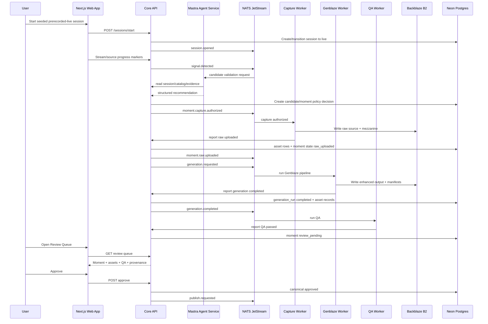

## 13.2 Agent Validation Sequence

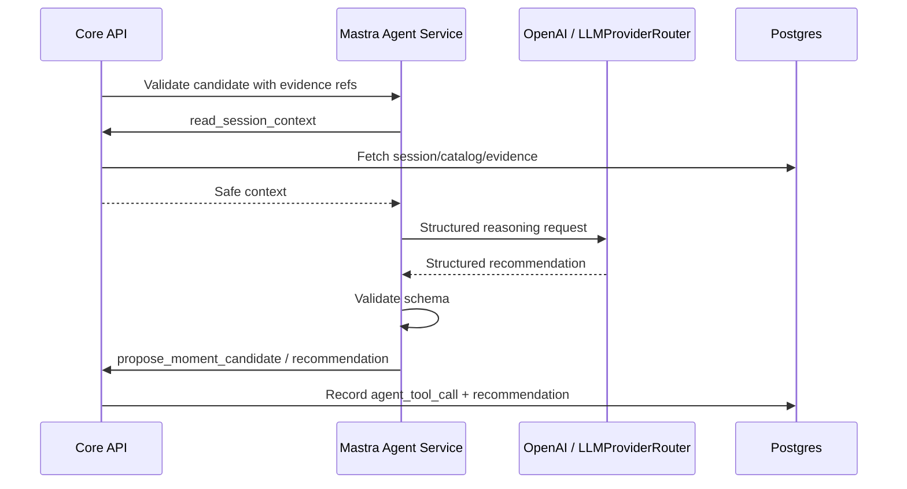

## 13.3 Capture Sequence

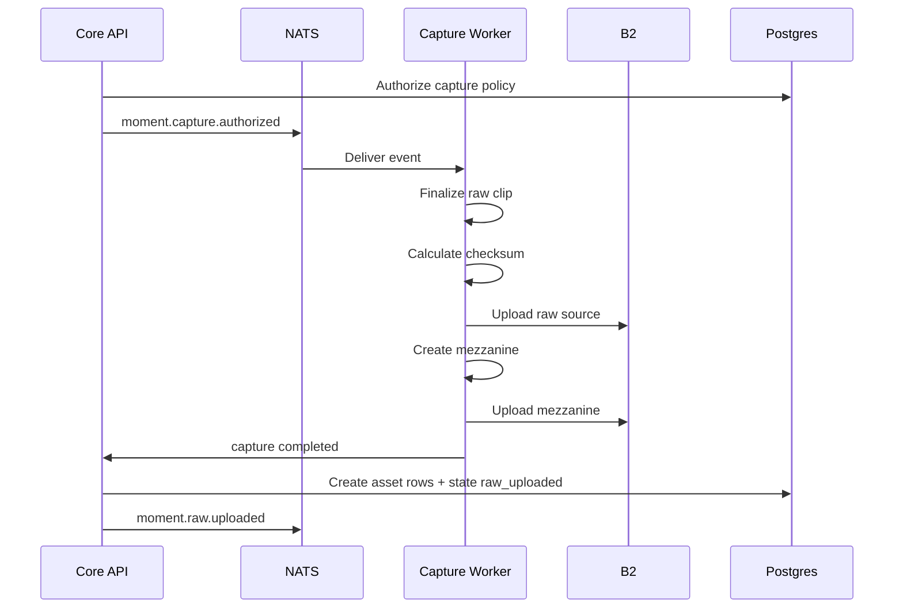

## 13.4 Genblaze Generation Sequence

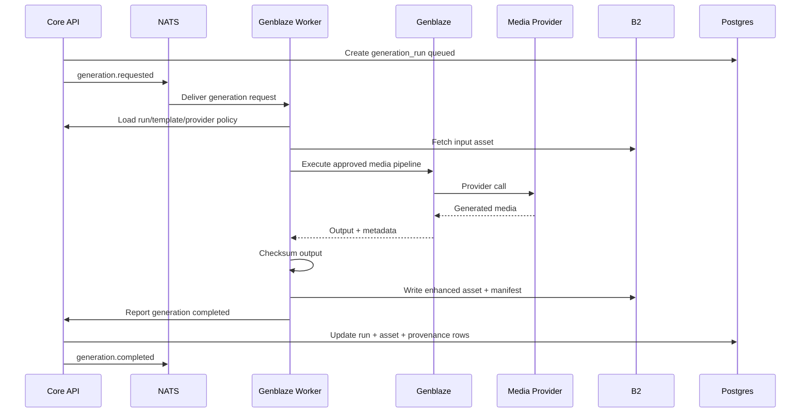

## 13.5 Review and Publish Sequence

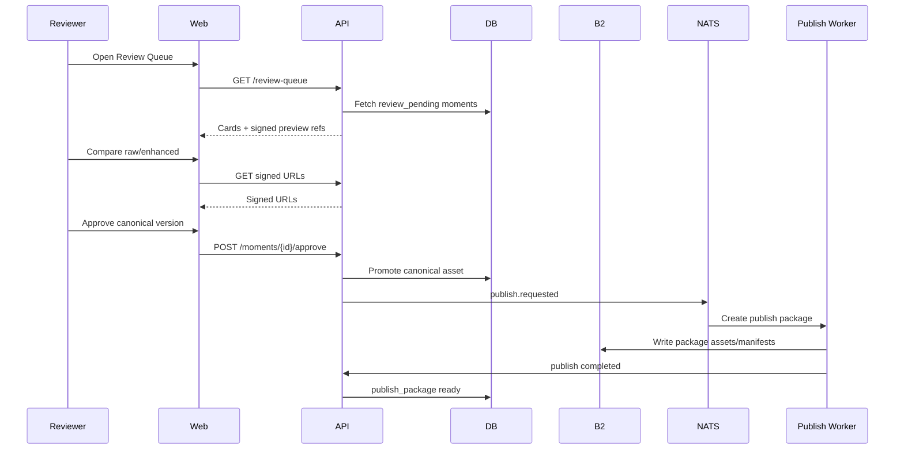

## 13.6 Failure and DLQ Sequence

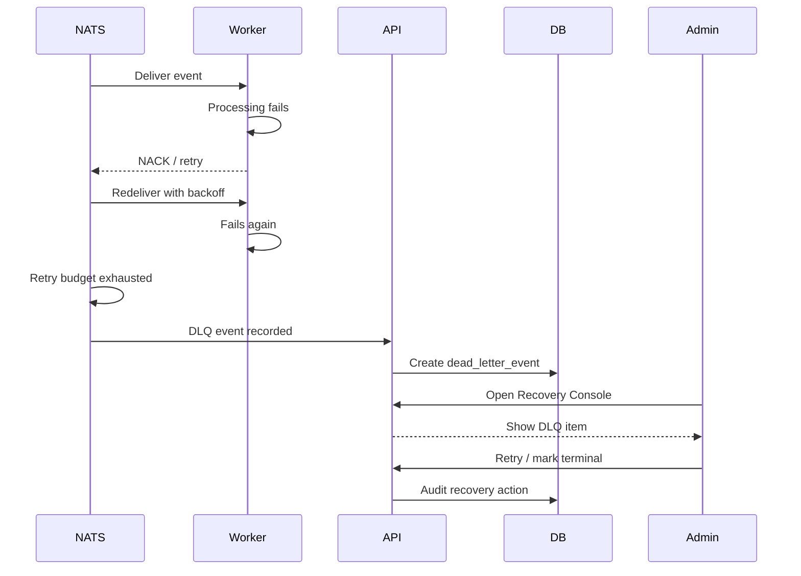

---

## 14. Deployment View

### 14.1 Environment separation

Separate resources per environment:

```txt
dev
staging
prod
```

Each environment should have:

```txt
separate Clerk app
separate Neon database or branch
separate B2 buckets
separate NATS streams
separate provider credentials/quotas
separate LLM keys/quotas
separate secrets
```

### 14.2 Deployment diagram

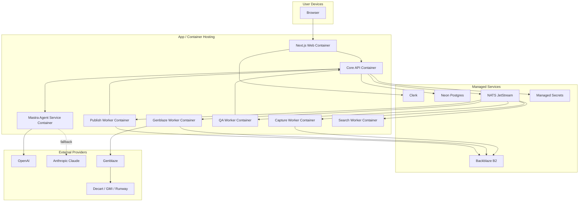

### 14.3 Deployment rules

```txt
Core API should scale independently of workers.
Genblaze Worker should scale independently for generation workload.
Mastra Agent Service should scale independently for LLM/agent tasks.
Capture Worker should handle media processing constraints.
NATS should support durable consumers and DLQ.
B2 buckets should be separated by environment and sensitivity.
```

---

## 15. Trust Boundaries

### 15.1 Boundary list

```txt
Browser/User Boundary
  user input, media source, auth token

Core API Boundary
  authorization and policy enforcement

Agent Boundary
  LLM-generated recommendations, untrusted transcripts/prompts

Worker Boundary
  async job execution and external provider calls

Storage Boundary
  B2 object writes/reads

External Provider Boundary
  Genblaze, media providers, LLM providers

Public Share Boundary
  share page access and signed/public asset delivery
```

### 15.2 Trust boundary diagram

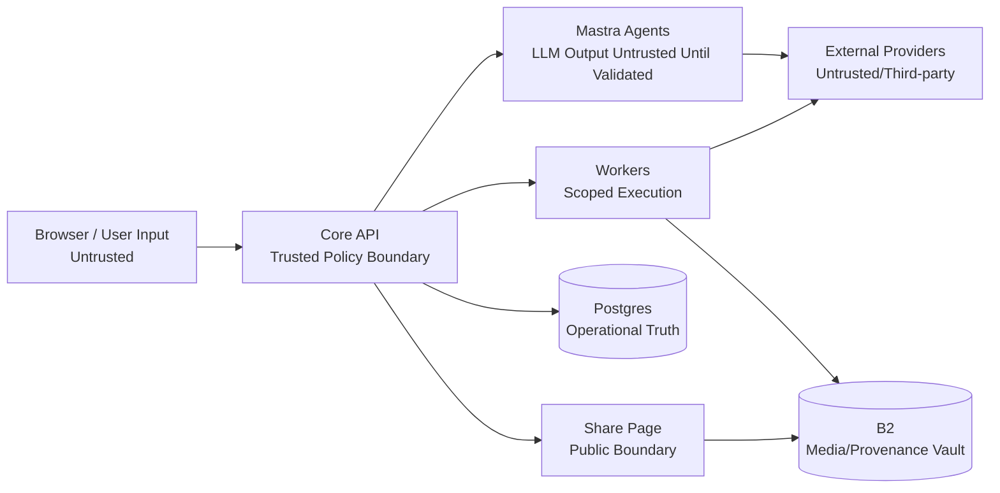

### 15.3 Trust rules

```txt
Browser input must be validated.
LLM output must be schema-validated.
Agent actions must go through tool gateway.
Provider outputs must pass QA.
B2 writes must use scoped service credentials.
Share access must obey package visibility policy.
```

---

## 16. Data Flow Summary

### 16.1 Session data

```txt
Browser/prerecorded source
→ Web App
→ Core API/session service
→ NATS events
→ Signal/Capture workers
→ Postgres session/moment state
→ B2 media objects
```

### 16.2 Agent data

```txt
Core API safe context
→ Mastra Agent Service
→ LLMProviderRouter
→ OpenAI/Claude
→ structured output
→ schema validation
→ Core API tool gateway
→ Postgres audit/tool records
```

### 16.3 Media generation data

```txt
raw_mezzanine asset in B2
→ Genblaze Worker
→ Genblaze/provider
→ enhanced output
→ B2 derived bucket
→ Postgres asset/generation/provenance records
```

### 16.4 Publishing data

```txt
canonical enhanced master
→ Publish Worker
→ publish variants/package
→ B2 published bucket
→ share page
→ provenance reference
```

---

## 17. B2 Bucket Architecture

### 17.1 Production buckets

```txt
moment-vault-prod-raw
moment-vault-prod-derived
moment-vault-prod-published
moment-vault-prod-provenance-lock
moment-vault-prod-logs
moment-vault-prod-backups
```

### 17.2 Object key pattern

```txt
tenants/{organization_id}/sessions/{session_id}/moments/{moment_id}/runs/{run_id}/outputs/{asset_id}.mp4
```

### 17.3 Session object layout

```txt
tenants/{organization_id}/sessions/{session_id}/
  session_manifest.json
  catalog/catalog_snapshot.json
  catalog/catalog_snapshot_manifest.json
  moments/{moment_id}/
    raw/source/{asset_id}.webm
    raw/mezzanine/{asset_id}.mp4
    transformed/{asset_id}.mp4
    evidence/{evidence_id}.json
    transcripts/{transcript_excerpt_id}.json
    runs/{run_id}/
      inputs/{asset_id}.json
      outputs/{asset_id}.mp4
      manifest/genblaze_manifest.json
      provenance/provenance.json
    publish/{publish_package_id}/
      variants/{variant_id}.mp4
      captions/{caption_id}.vtt
      thumbnails/{thumbnail_id}.jpg
```

---

## 18. Event Subject Architecture

### 18.1 Core subjects

```txt
session.opened
session.closed
signal.detected
moment.candidate.proposed
moment.capture.authorized
moment.raw.uploaded
generation.requested
generation.completed
generation.failed
qa.completed
review.approved
review.rejected
publish.requested
publish.completed
asset.deleted
audit.recorded
```

### 18.2 Event envelope

All events use:

```txt
event_id
event_type
schema_version
organization_id
occurred_at
producer
idempotency_key
correlation_id
trace_id
payload
```

### 18.3 Event rules

```txt
Events are versioned.
Events are schema-validated.
Consumers are idempotent.
Retry exhaustion goes to DLQ.
Organization/session IDs live inside payload/envelope, not high-cardinality subjects.
```

---

## 19. Architecture Decision Notes

### 19.1 Why Mastra + NATS/Postgres instead of one agent framework?

Mastra handles agent reasoning and structured recommendations.

NATS/Postgres handle durable execution/state.

This prevents agent framework state from becoming the business source of truth.

### 19.2 Why Genblaze is separate from LLM provider routing

LLM providers think, classify, explain, and write.

Genblaze generates/edits media.

Keeping these separate prevents media workflows from being scattered across agent code.

### 19.3 Why B2 + Postgres dual-source provenance

Postgres makes provenance queryable.

B2 makes provenance durable, portable, and tied to media objects.

### 19.4 Why setup-first onboarding

Commerce-grounded outputs require product/catalog/campaign truth. Setup-first prevents ungrounded product claims before Live Studio.

Hackathon/demo flows may preload setup to avoid friction while preserving product truth.

---

## 20. Implementation Priority Map

### P0

```txt
Next.js workspace
Clerk auth integration
Core API
Neon Postgres schema
NATS JetStream
B2 storage utilities
Mastra Agent Service with OpenAI
Live Studio prerecorded-live path
Signal/candidate minimal flow
Capture Worker
Genblaze Worker
QA minimal worker
Review Queue
Provenance graph
Share Page
```

### P1

```txt
Search indexing
Admin/Recovery
Cost ledger
Advanced QA
Catalog CSV import
Controlled rerender
Provider fallback
LLMProviderRouter full config
```

### P2

```txt
OBS/RTMP source adapter
Shopify adapter
Social publish adapters
Advanced analytics
Enterprise retention/legal hold
```

---

## 21. Architecture Acceptance Checklist

Before coding major systems, verify:

```txt
[ ] C4 container is identified
[ ] owner service is clear
[ ] data store ownership is clear
[ ] events are identified
[ ] API boundary is identified
[ ] state transitions go through Core API
[ ] agent actions use tool gateway
[ ] B2 object keys are immutable
[ ] product facts are grounded
[ ] generation outputs have generation_run records
[ ] audit events are required
[ ] idempotency is defined
[ ] failure/DLQ path exists
```

---

## 22. Open Architecture Questions

Not blocking P0:

```txt
exact hosting provider
exact managed NATS provider
exact STT provider
exact first media provider beyond Genblaze/Decart
exact CDN/share delivery pattern
exact observability backend
exact future Shopify adapter shape
exact OBS/RTMP implementation
```

---

## 23. Change Log

| Version | Change |
|---|---|
| v1 | Created C4 architecture with context, containers, components, deployment, trust boundaries, and sequences |
