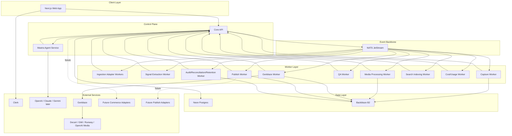

# 07 — Service Decomposition

**Project:** Lumiq — Live Commerce Moment Vault  
**Document ID:** `07-service-decomposition.md`  
**Status:** Draft v1  
**Audience:** backend engineers, frontend engineers, AI engineers, infra/devops, QA, AI coding agents  
**Primary goal:** Define every runtime/service boundary clearly enough that humans and coding agents can implement Lumiq without inventing architecture.

---

## 1. Purpose

This document decomposes Lumiq into implementation services, workers, modules, and integration adapters.

It answers:

1. Which services exist?
2. What does each service own?
3. What must each service never own?
4. Which data does each service read/write?
5. Which events does each service emit/consume?
6. Which APIs or internal tools does each service expose?
7. Which service identity/capabilities are required?
8. How do services fail and recover?
9. Which services are P0 for the hackathon path, and which are P1/P2?

This document is optimized for AI coding agents. Every service has a deterministic boundary and a machine-readable registry block.

---

## 2. Current Spec Context

This service decomposition assumes these previous decisions are locked:

```yaml
product:
  name: Lumiq
  category: Live Commerce Moment Vault
  core_promise: >
    Detect valuable live-commerce moments, generate polished clips,
    and prove lineage through B2-backed provenance.

platform:
  auth: Clerk
  database: Neon Postgres
  object_storage: Backblaze B2
  event_backbone: NATS JetStream
  agent_framework: Mastra
  primary_llm: OpenAI
  fallback_llm: Anthropic Claude
  media_orchestration: Genblaze
  frontend: Next.js / TypeScript
  workers: Python-first for media/AI execution
  deployment: containerized services

architecture_rule:
  - Agents recommend.
  - Core API authorizes.
  - NATS dispatches.
  - Workers execute.
  - Genblaze generates media.
  - B2 stores media and proof.
  - Postgres tracks operational truth.
```

---

## 3. Service Decomposition Principles

### 3.1 Core API owns business state

The Core API is the control plane. It owns state transitions, policy checks, capability checks, audit writes, and safe internal command execution.

Workers may process media, call providers, and report results, but they should not silently mutate business state outside approved Core API paths.

### 3.2 Agents are not privileged executors

Mastra agents are reasoning services. They may call typed internal tools. They must not receive raw B2, provider, database, publish, billing, or deletion credentials.

### 3.3 B2 is media/provenance vault, not app database

B2 stores binary media, manifests, catalog snapshots, evidence bundles, and logs/backups. Postgres stores queryable state and indexes.

### 3.4 NATS transports work, not truth

NATS JetStream transports durable events/jobs and supports replay/DLQ. It is not the source of business truth.

### 3.5 Every side effect needs idempotency

Every side-effecting API command, worker task, agent tool call, provider call, B2 write, and publish action needs an idempotency key.

### 3.6 Implementation priority must be visible

This document marks each service as:

```yaml
priority:
  P0: needed for hackathon golden path
  P1: needed for production beta
  P2: later production/scale
  P3: enterprise/future
```

---

## 4. High-Level Runtime Map



---

## 5. Service Registry — Machine-readable Overview

```yaml
service_registry:
  web_app:
    priority: P0
    runtime: "Next.js / TypeScript"
    type: frontend
    owns_business_state: false
    uses:
      - core_api
      - clerk
      - design_system
    exposes:
      - live_studio_ui
      - review_queue_ui
      - moment_vault_ui
      - catalog_ui
      - provenance_ui
      - share_page_ui
      - admin_recovery_ui
    must_not:
      - bypass_core_api_authorization
      - hardcode_provider_secrets
      - invent_design_tokens

  core_api:
    priority: P0
    runtime: "TypeScript or Python/FastAPI; final choice TBD"
    type: control_plane
    owns_business_state: true
    owns:
      - authz
      - state_transitions
      - budgets
      - policy_checks
      - agent_tool_gateway
      - audit_writes
      - signed_url_generation
      - query_read_models
    uses:
      - clerk
      - neon_postgres
      - nats_jetstream
      - backblaze_b2_for_signed_urls
      - mastra_agent_service
    must_not:
      - perform_heavy_media_processing
      - run_unbounded_generation_jobs
      - bypass_audit_for_sensitive_actions

  mastra_agent_service:
    priority: P0
    runtime: "TypeScript / Mastra"
    type: agent_reasoning
    owns_business_state: false
    owns:
      - supervisor_agent
      - specialist_agents
      - structured_agent_outputs
      - agent_tool_schemas
      - working_context
    uses:
      - openai_primary
      - claude_fallback_later
      - core_api_tool_gateway
    must_not:
      - write_b2_directly
      - call_genblaze_directly
      - mutate_postgres_directly
      - publish_externally
      - delete_assets
      - change_budgets_or_retention

  nats_jetstream:
    priority: P0
    runtime: "Managed or self-hosted NATS"
    type: event_backbone
    owns_business_state: false
    owns:
      - event_transport
      - durable_streams
      - worker_fanout
      - replay
      - dlq
    must_not:
      - be_treated_as_operational_truth
      - store_unbounded_business_state

  neon_postgres:
    priority: P0
    runtime: "Managed Postgres"
    type: database
    owns:
      - operational_truth
      - tenant_scoped_rows
      - state_machines
      - indexes
      - audit_records
      - search_metadata
    must_not:
      - store_large_media_blobs

  backblaze_b2:
    priority: P0
    runtime: "Backblaze B2"
    type: object_storage
    owns:
      - raw_media
      - derived_media
      - published_media
      - manifests
      - catalog_snapshot_json
      - provenance_json
      - evidence_bundles
    must_not:
      - be_used_as_query_database

  capture_worker:
    priority: P0
    runtime: "Python"
    type: worker
    consumes:
      - moment.capture.authorized
    emits:
      - moment.raw.uploaded
      - asset.verification.failed
    owns:
      - raw_clip_finalization
      - raw_b2_upload
      - checksum_calculation
      - mezzanine_creation_request_or_basic_transcode
    must_not:
      - decide_capture_policy
      - create_unapproved_moments
      - overwrite_canonical_assets

  signal_extraction_worker:
    priority: P0
    runtime: "Python or TypeScript"
    type: worker
    consumes:
      - session.opened
      - media.chunk.available
      - transcript.chunk.created
    emits:
      - signal.detected
      - moment.candidate.proposed
    owns:
      - cheap_signal_detection
      - keyword_hits
      - scene_change_signals
      - audio_energy_signals
      - product_visibility_heuristics
    must_not:
      - authorize_capture
      - run_expensive_generation
      - publish_results

  genblaze_worker:
    priority: P0
    runtime: "Python"
    type: worker
    consumes:
      - generation.requested
    emits:
      - generation.started
      - generation.completed
      - generation.failed
    owns:
      - genblaze_pipeline_execution
      - media_provider_calls_through_genblaze
      - derived_asset_write
      - genblaze_manifest_write
      - app_provenance_manifest_write
    must_not:
      - choose_provider_without_policy
      - bypass_generation_run_records
      - overwrite_outputs

  qa_worker:
    priority: P0
    runtime: "Python or TypeScript"
    type: worker
    consumes:
      - generation.completed
      - publish.requested
    emits:
      - qa.completed
      - qa.failed
    owns:
      - pre_enhancement_checks
      - post_enhancement_checks
      - pre_publish_checks
      - failure_classification
    must_not:
      - approve_external_publish_without_policy
      - silently_ignore_failed_checks

  publish_worker:
    priority: P0
    runtime: "Python or TypeScript"
    type: worker
    consumes:
      - publish.requested
    emits:
      - publish.completed
      - publish.failed
    owns:
      - publish_package_asset_generation
      - share_page_asset_preparation
      - destination_variant_packaging
    must_not:
      - publish_external_without_approval
      - make_external_destination_source_of_truth

  search_indexing_worker:
    priority: P1
    runtime: "Python or TypeScript"
    type: worker
    consumes:
      - moment.review_ready
      - asset.created
      - publish.completed
    owns:
      - structured_indexing
      - pgvector_embedding_jobs
      - search_index_jobs
    must_not:
      - index_deleted_or_revoked_assets
      - embed_low_confidence_noise_by_default

  audit_reconciliation_retention_worker:
    priority: P1
    runtime: "Python"
    type: worker
    consumes:
      - retention.sweep
      - audit.reconcile.requested
      - b2.reconcile.requested
    owns:
      - b2_postgres_reconciliation
      - retention_sweeps
      - orphan_asset_detection
      - audit_export_support
    must_not:
      - hard_delete_without_policy
```

---

## 6. Core API Decomposition

### 6.1 Purpose

The Core API is the control plane and the only normal path for durable business state transitions.

### 6.2 Core API modules

```yaml
core_api_modules:
  auth_adapter:
    responsibility:
      - verify_clerk_session
      - resolve_internal_user
      - resolve_organization_memberships
    reads:
      - users
      - organizations
      - memberships
    writes:
      - users
      - memberships
    external_dependencies:
      - Clerk

  authorization_service:
    responsibility:
      - check_role
      - check_capability
      - check_service_identity
      - enforce_tenant_scope
    reads:
      - memberships
      - roles
      - role_capabilities
      - service_identities
      - service_capabilities
    writes: []

  session_service:
    responsibility:
      - create_session
      - run_preflight_validation
      - start_session
      - end_session
      - attach_catalog_snapshot
      - record_source_metadata
    reads:
      - sessions
      - catalog_snapshots
      - session_recording_policies
      - budgets
    writes:
      - sessions
      - session_sources
      - audit_events
    emits:
      - session.opened
      - session.closed

  moment_service:
    responsibility:
      - create_candidate_moment
      - authorize_capture
      - transition_moment_state
      - manage_review_state
      - promote_canonical_version
    reads:
      - moments
      - signals
      - moment_policy_decisions
      - budgets
      - catalog_snapshots
    writes:
      - moments
      - moment_evidence
      - moment_policy_decisions
      - audit_events
    emits:
      - moment.candidate.proposed
      - moment.capture.authorized
      - review.approved
      - review.rejected

  asset_service:
    responsibility:
      - create_asset_record
      - generate_b2_object_key
      - issue_signed_url
      - verify_asset_metadata
      - soft_delete_asset
    reads:
      - assets
      - organizations
      - retention_policies
    writes:
      - assets
      - asset_verifications
      - audit_events
    emits:
      - asset.created
      - asset.deleted
      - asset.verification.failed

  generation_service:
    responsibility:
      - create_generation_run
      - enforce_generation_budget
      - record_generation_start
      - record_generation_result
      - handle_rerender_request
    reads:
      - generation_runs
      - moments
      - assets
      - enhancement_templates
      - budgets
      - provider_policies
    writes:
      - generation_runs
      - moment_versions
      - audit_events
    emits:
      - generation.requested
      - generation.completed
      - generation.failed

  catalog_service:
    responsibility:
      - manage_products
      - manage_campaigns
      - manage_allowed_claims
      - create_catalog_snapshot
      - validate_product_facts
      - refresh_critical_facts_before_publish
    reads:
      - products
      - campaigns
      - campaign_offers
      - allowed_product_claims
    writes:
      - catalog_snapshots
      - catalog_snapshot_products
      - catalog_snapshot_offers
      - catalog_snapshot_claims
      - audit_events

  publish_service:
    responsibility:
      - validate_publish_readiness
      - create_publish_package
      - approve_publish_package
      - create_share_page
      - revoke_share_page
    reads:
      - moments
      - assets
      - qa_checks
      - catalog_snapshots
      - publish_packages
    writes:
      - publish_packages
      - publish_variants
      - share_pages
      - audit_events
    emits:
      - publish.requested
      - publish.completed
      - publish.failed

  agent_tool_gateway:
    responsibility:
      - validate_agent_tool_call
      - check_agent_service_identity
      - enforce_tool_schema
      - record_agent_tool_call
      - return_safe_context
    reads:
      - service_identities
      - agent_memory_records
      - sessions
      - moments
      - catalog_snapshots
      - moment_evidence
    writes:
      - agent_tool_calls
      - audit_events

  budget_service:
    responsibility:
      - estimate_llm_cost
      - estimate_media_generation_cost
      - enforce_budget_caps
      - record_cost_ledger
      - reconcile_actual_cost
    reads:
      - budgets
      - cost_ledger
      - provider_usage_records
      - llm_provider_usage
    writes:
      - budget_authorizations
      - cost_ledger
      - provider_usage_records
      - llm_provider_usage
      - audit_events

  audit_service:
    responsibility:
      - write_audit_event
      - query_audit_events
      - connect_trace_context
    reads:
      - audit_events
    writes:
      - audit_events
```

### 6.3 Core API must expose

Public/user-facing APIs are specified later in `09-api-contract-openapi.yaml`. Until then, the service must support these command/query groups:

```yaml
api_groups:
  sessions:
    commands:
      - create_session
      - start_session
      - end_session
    queries:
      - list_sessions
      - get_session
      - get_session_timeline

  moments:
    commands:
      - approve_moment
      - reject_moment
      - rerender_moment
      - promote_canonical_version
    queries:
      - get_moment
      - get_moment_evidence
      - get_moment_provenance

  assets:
    commands:
      - request_asset_delete
    queries:
      - get_asset
      - get_signed_url
      - get_manifest

  catalog:
    commands:
      - create_product
      - import_products
      - create_campaign
      - create_catalog_snapshot
    queries:
      - list_products
      - get_product
      - get_catalog_snapshot

  publish:
    commands:
      - create_publish_package
      - approve_publish_package
      - create_share_page
      - revoke_share_page
    queries:
      - get_publish_package
      - get_share_page

  admin:
    commands:
      - retry_dlq_event
      - mark_dlq_terminal
      - request_b2_reconciliation
    queries:
      - list_dlq_events
      - list_failed_runs
      - search_audit_events
```

---

## 7. Web App Decomposition

### 7.1 Purpose

The Web App renders Lumiq’s dark-only workspace and communicates with the Core API.

### 7.2 Modules

```yaml
web_modules:
  app_shell:
    screens:
      - topbar
      - sidebar
      - workspace_layout
    reads:
      - current_user
      - organization
      - capabilities

  onboarding_setup:
    screens:
      - organization_setup
      - product_catalog_setup
      - campaign_setup
      - provider_budget_setup
      - setup_complete
    owns:
      - setup_first_user_flow

  live_studio:
    screens:
      - preflight
      - control_room
      - source_preview
      - signal_feed
      - bottom_timeline
      - active_candidate_card
    calls:
      - session_create
      - session_start
      - session_end
      - timeline_query

  review_queue:
    screens:
      - global_review_queue
      - by_session
      - by_campaign
      - publish_ready
    calls:
      - review_queue_query
      - approve_moment
      - reject_moment
      - rerender_moment

  moment_detail:
    screens:
      - preview
      - compare
      - evidence
      - product_facts
      - qa
      - provenance
      - versions
      - publish
    calls:
      - get_moment
      - get_signed_url
      - get_provenance
      - promote_canonical

  vault:
    screens:
      - grid
      - session_timeline
      - product_campaign_view
      - search_results
    calls:
      - structured_search
      - semantic_search_later

  catalog_campaign:
    screens:
      - product_table
      - product_detail
      - campaign_detail
      - catalog_snapshot_detail
    calls:
      - product_crud
      - campaign_crud
      - snapshot_create

  admin_recovery:
    screens:
      - dlq_viewer
      - failed_runs
      - b2_reconciliation
      - budget_anomalies
      - audit_search
    calls:
      - admin_queries
      - admin_recovery_commands

  share_page:
    screens:
      - private_share
      - public_share
      - revoked_share
      - expired_share
    calls:
      - get_share_page
      - signed_asset_url
```

### 7.3 Frontend rules

```yaml
frontend_rules:
  - Use design tokens only.
  - Do not implement light mode.
  - Do not use glow gradients.
  - Hide unauthorized controls, but never rely only on frontend auth.
  - Use mono font for technical IDs.
  - Show provenance for generated assets.
  - Show layered explanations for AI decisions.
  - Always include empty/loading/error states.
```

---

## 8. Mastra Agent Service Decomposition

### 8.1 Purpose

The Mastra Agent Service runs all AI reasoning workflows. It produces structured recommendations, not direct side effects.

### 8.2 Agent registry

```yaml
agents:
  supervisor_agent:
    priority: P0
    responsibility:
      - coordinate_specialists
      - combine_evidence
      - produce_final_recommendation
    input:
      - session_context
      - candidate_evidence
      - policy_summary
      - catalog_snapshot_summary
    output_schema:
      recommendation: ["capture_and_enhance", "capture_only", "queue_for_review", "ignore"]
      confidence: number
      moment_type: string
      recommended_template_id: string_or_null
      requires_human_review: boolean
      reason: string
      evidence_refs: array

  signal_moment_agent:
    priority: P0
    responsibility:
      - classify_candidate_window
      - explain_moment_value
      - propose_moment_type
    output_schema:
      start_ms: integer
      end_ms: integer
      moment_type: string
      confidence: number
      reason: string
      evidence_refs: array

  product_matcher_agent:
    priority: P0
    responsibility:
      - compare_frames_and_transcript_to_catalog_snapshot
      - return_possible_skus
      - flag_uncertainty
    output_schema:
      matches: array
      needs_human_review: boolean

  clip_boundary_agent:
    priority: P1
    responsibility:
      - recommend_final_trim_inside_raw_capture
      - identify_hook_and_cta_bounds

  enhancement_planner_agent:
    priority: P0
    responsibility:
      - recommend_template
      - recommend_product_card_behavior
      - recommend_caption_style
      - decide_if_restyle_is_allowed_or_needed

  caption_copy_agent:
    priority: P1
    responsibility:
      - generate_hook_title
      - generate_caption_text
      - generate_publish_copy
      - obey_allowed_claims

  qa_agent:
    priority: P0
    responsibility:
      - evaluate_output_risk
      - classify_qa_failure
      - explain_review_required_state

  provenance_explainer_agent:
    priority: P1
    responsibility:
      - convert_lineage_graph_to_human_readable_explanation
```

### 8.3 LLMProviderRouter

```yaml
llm_provider_router:
  default_provider: OpenAI
  fallback_provider: Anthropic Claude
  cheap_validation_provider_later: Google Gemini Flash-style
  embedding_provider: OpenAI
  rules:
    - route_by_task_type
    - enforce_cost_policy
    - enforce_timeout
    - enforce_structured_output_schema
    - record_llm_run
```

### 8.4 Agent tool calls

Agents may call:

```yaml
allowed_tools:
  read:
    - get_session_context
    - get_candidate_evidence
    - get_catalog_snapshot
    - get_org_brand_memory
    - get_moment_versions
    - get_qa_results
    - get_provenance_summary
  propose:
    - propose_moment_candidate
    - suggest_template
    - suggest_clip_boundaries
    - suggest_caption_options
    - explain_qa_result
  validate:
    - validate_product_match
    - validate_product_claim
    - validate_publish_readiness_explanation
```

Agents may not call:

```yaml
forbidden_tools:
  - write_b2_object
  - delete_b2_object
  - call_provider_directly
  - call_genblaze_directly
  - mutate_postgres_directly
  - publish_external
  - hard_delete_asset
  - change_budget
  - change_retention_policy
```

---

## 9. Worker Service Decomposition

## 9.1 Signal Extraction Worker

### Responsibility

Detect cheap realtime or near-realtime signals.

### Consumes

```yaml
consumes:
  - session.opened
  - media.chunk.available
  - transcript.chunk.created
  - manual.marker.created
```

### Emits

```yaml
emits:
  - signal.detected
  - moment.candidate.proposed
```

### Reads

```yaml
reads:
  - sessions
  - catalog_snapshots
  - transcript_chunks
  - signal_config
```

### Writes through Core API

```yaml
writes:
  - signals
  - moment_candidates
```

### Failure behavior

```yaml
failure:
  retry: true
  dlq_after_retry_exhausted: true
  safe_to_skip_low_priority_signals: true
```

---

## 9.2 Capture Worker

### Responsibility

Finalize and store raw captures.

### Consumes

```yaml
consumes:
  - moment.capture.authorized
```

### Emits

```yaml
emits:
  - moment.raw.uploaded
  - asset.created
  - asset.verification.failed
```

### Writes to B2

```yaml
b2_writes:
  - raw/source/{asset_id}.webm
  - raw/mezzanine/{asset_id}.mp4
  - evidence/capture_manifest.json
```

### Reports to Core API

```yaml
reports:
  - capture_started
  - capture_completed
  - capture_failed
  - asset_verified
```

### Must enforce

```yaml
must:
  - use_immutable_object_keys
  - calculate_sha256
  - include_organization_id_in_object_key
  - be_idempotent
```

---

## 9.3 Media Processing Worker

### Responsibility

Handle deterministic media operations that are not provider-based generation.

Examples:

```yaml
operations:
  - remux
  - transcode_mezzanine
  - extract_thumbnail
  - extract_waveform
  - generate_proxy_preview
  - normalize_audio
```

This may be merged into Capture Worker for P0 and split later.

---

## 9.4 Genblaze Worker

### Responsibility

Execute approved Genblaze media generation/editing pipelines.

### Consumes

```yaml
consumes:
  - generation.requested
```

### Emits

```yaml
emits:
  - generation.started
  - generation.completed
  - generation.failed
```

### Reads

```yaml
reads:
  - generation_runs
  - assets
  - enhancement_templates
  - step_graphs
  - provider_policies
  - catalog_snapshots
```

### Writes to B2

```yaml
b2_writes:
  - runs/{run_id}/outputs/{asset_id}.mp4
  - runs/{run_id}/manifest/genblaze_manifest.json
  - runs/{run_id}/provenance/provenance.json
```

### Must enforce

```yaml
must:
  - only_execute_approved_template_steps
  - use_generation_run_id
  - respect_provider_policy
  - respect_budget_authorization
  - write_manifest
  - report_result_to_core_api
  - never_overwrite_output
```

---

## 9.5 QA Worker

### Responsibility

Run QA gates.

### QA types

```yaml
qa_types:
  pre_enhancement:
    - raw_moment_usable
    - product_match_confident
    - claims_grounded
    - template_allowed
    - budget_allowed
  post_enhancement:
    - render_succeeded
    - captions_match_transcript
    - product_appearance_preserved
    - overlays_use_approved_facts
    - quality_score_acceptable
  pre_publish:
    - price_availability_refreshed
    - approval_exists
    - destination_package_valid
    - required_labels_present
    - moderation_current
```

### Failure classes

```yaml
failure_classes:
  - retryable
  - remediable
  - review_required
  - terminal
```

---

## 9.6 Publish Worker

### Responsibility

Create publish packages, variants, share-page assets, and export packages.

### Consumes

```yaml
consumes:
  - publish.requested
```

### Emits

```yaml
emits:
  - publish.completed
  - publish.failed
```

### Writes

```yaml
writes:
  - publish_packages
  - publish_variants
  - share_pages
  - published_asset_records
```

### B2 writes

```yaml
b2_writes:
  - publish/{publish_package_id}/variants/{variant_id}.mp4
  - publish/{publish_package_id}/captions/{caption_id}.vtt
  - publish/{publish_package_id}/thumbnails/{thumbnail_id}.jpg
  - publish/{publish_package_id}/publish_manifest.json
```

### Must not

```yaml
must_not:
  - publish_external_without_approval
  - treat_external_destination_as_source_of_truth
```

---

## 9.7 Search Indexing Worker

### Responsibility

Maintain structured and semantic search indexes.

### P0

```yaml
p0:
  - structured_filter_index_metadata
  - captions_and_summary_full_text
```

### P1

```yaml
p1:
  - pgvector_embeddings_for_accepted_moments
  - semantic_search_jobs
```

### Must enforce

```yaml
must:
  - not_index_deleted_assets
  - respect_tenant_scope
  - avoid_embedding_low_confidence_noise_by_default
```

---

## 9.8 Cost and Usage Worker

### Responsibility

Reconcile provider/LLM costs and update budgets.

Can be P1 or part of Core API for P0.

### Tracks

```yaml
tracks:
  - media_generation_cost
  - llm_cost
  - B2_storage_estimates
  - provider_usage
  - session_budget_usage
  - campaign_budget_usage
```

---

## 9.9 Audit/Reconciliation/Retention Worker

### Responsibility

Operational integrity.

### Jobs

```yaml
jobs:
  - b2_postgres_reconciliation
  - orphan_asset_detection
  - retention_sweep
  - soft_delete_cleanup
  - public_link_revocation_check
  - manifest_integrity_check
  - audit_export
```

---

## 10. Service Identity and Capability Matrix

```yaml
service_identities:
  web_app:
    type: public_client
    capabilities:
      - uses_user_session_only

  core_api:
    type: trusted_service
    capabilities:
      - auth:verify
      - state:transition
      - event:publish
      - audit:write
      - signed_url:create

  mastra_agent_service:
    type: internal_service
    capabilities:
      - agent:reason
      - agent:tool_call
      - moment:propose
      - template:suggest
      - qa:explain
    denied:
      - asset:write_b2
      - asset:delete
      - publish:external
      - budget:mutate
      - retention:change

  capture_worker:
    type: internal_worker
    capabilities:
      - capture:finalize
      - asset:write_raw
      - asset:write_mezzanine
      - checksum:calculate
      - event:report_worker_result

  genblaze_worker:
    type: internal_worker
    capabilities:
      - generation:execute
      - asset:read_raw
      - asset:write_derived
      - manifest:write
      - provider:call_media

  qa_worker:
    type: internal_worker
    capabilities:
      - qa:run
      - qa:write_result
      - asset:read_preview
      - catalog:read_snapshot

  publish_worker:
    type: internal_worker
    capabilities:
      - publish:package
      - asset:read_canonical
      - asset:write_published
      - share:create_internal

  search_indexing_worker:
    type: internal_worker
    capabilities:
      - search:index
      - embeddings:create
      - asset:read_metadata

  audit_reconciliation_worker:
    type: internal_worker
    capabilities:
      - audit:read
      - b2:read_metadata
      - reconciliation:write
      - retention:schedule
```

---

## 11. Event Ownership Matrix

```yaml
event_ownership:
  session.opened:
    producer: core_api.session_service
    consumers:
      - signal_extraction_worker
      - audit_worker

  session.closed:
    producer: core_api.session_service
    consumers:
      - signal_extraction_worker
      - audit_reconciliation_worker
      - search_indexing_worker

  signal.detected:
    producer: signal_extraction_worker
    consumers:
      - core_api.moment_service
      - mastra_agent_service_if_candidate_relevant

  moment.candidate.proposed:
    producer: core_api.moment_service
    consumers:
      - mastra_agent_service
      - audit_worker

  moment.capture.authorized:
    producer: core_api.moment_service
    consumers:
      - capture_worker

  moment.raw.uploaded:
    producer: core_api.asset_service
    consumers:
      - core_api.generation_service
      - qa_worker
      - audit_worker

  generation.requested:
    producer: core_api.generation_service
    consumers:
      - genblaze_worker

  generation.completed:
    producer: core_api.generation_service
    consumers:
      - qa_worker
      - search_indexing_worker
      - audit_worker

  generation.failed:
    producer: core_api.generation_service
    consumers:
      - admin_recovery
      - audit_worker

  qa.completed:
    producer: core_api.qa_service
    consumers:
      - core_api.moment_service
      - review_queue
      - publish_service

  publish.requested:
    producer: core_api.publish_service
    consumers:
      - publish_worker
      - qa_worker_pre_publish

  publish.completed:
    producer: core_api.publish_service
    consumers:
      - search_indexing_worker
      - analytics_worker
      - audit_worker
```

---

## 12. API Boundary Ownership

```yaml
api_boundary_ownership:
  public_http:
    owner: core_api
    consumers:
      - web_app
    auth:
      - clerk_user_session
    examples:
      - POST /api/sessions
      - GET /api/review-queue
      - POST /api/moments/{moment_id}/approve
      - GET /api/assets/{asset_id}/signed-url

  internal_worker_http:
    owner: core_api
    consumers:
      - workers
    auth:
      - service_identity_token
    examples:
      - POST /internal/workers/generation-completed
      - POST /internal/workers/capture-completed

  internal_agent_tools:
    owner: core_api.agent_tool_gateway
    consumers:
      - mastra_agent_service
    auth:
      - service_identity_token
      - agent_id
      - tool_capability
    examples:
      - POST /internal/agent-tools/propose-moment-candidate
      - POST /internal/agent-tools/suggest-template

  nats_events:
    owner: core_api_and_workers
    consumers:
      - workers
      - audit_recovery
    auth:
      - nats_credentials_per_service
```

---

## 13. Failure Handling by Service

```yaml
failure_handling:
  core_api:
    failures:
      - validation_error
      - authz_denied
      - db_write_failed
      - event_publish_failed
    behavior:
      - return_structured_error
      - write_audit_for_sensitive_denials
      - use_outbox_or_reconciliation_for_event_publish_failure

  mastra_agent_service:
    failures:
      - llm_timeout
      - invalid_structured_output
      - tool_denied
      - budget_denied
    behavior:
      - retry_if_safe
      - record_llm_run_failed
      - record_agent_tool_call_failed
      - no_side_effect_without_valid_tool_response

  capture_worker:
    failures:
      - source_buffer_missing
      - transcode_failed
      - b2_upload_failed
      - checksum_mismatch
    behavior:
      - retry_transient
      - report_failure_to_core_api
      - dlq_after_retry_exhaustion
      - never_mark_raw_uploaded_without_verified_asset

  genblaze_worker:
    failures:
      - provider_timeout
      - provider_429
      - provider_output_invalid
      - b2_manifest_write_failed
    behavior:
      - retry_with_backoff
      - fallback_only_if_policy_allows
      - write_generation_failed
      - dlq_after_retry_exhaustion

  qa_worker:
    failures:
      - model_or_validation_timeout
      - qa_uncertain
      - product_mismatch
      - unsafe_output
    behavior:
      - classify_failure
      - route_to_review_required_or_terminal
      - never_auto_publish_uncertain_output

  publish_worker:
    failures:
      - variant_render_failed
      - pre_publish_fact_changed
      - share_page_write_failed
    behavior:
      - mark_publish_failed_or_review_required
      - revoke_partial_public_access_if_needed
      - preserve_canonical_assets
```

---

## 14. Observability Responsibilities

```yaml
observability:
  required_trace_fields:
    - organization_id
    - session_id
    - moment_id
    - asset_id
    - generation_run_id
    - event_id
    - trace_id
    - correlation_id
    - idempotency_key

  core_api_metrics:
    - api_latency
    - authz_denials
    - state_transition_failures
    - event_publish_failures

  agent_metrics:
    - llm_latency
    - llm_cost
    - structured_output_failure_rate
    - tool_denial_rate
    - agent_recommendation_count

  worker_metrics:
    - capture_success_rate
    - b2_upload_failure_rate
    - generation_success_rate
    - provider_failure_rate
    - qa_failure_rate
    - publish_success_rate
    - dlq_rate

  storage_metrics:
    - asset_verification_failures
    - orphan_asset_count
    - b2_write_latency
    - manifest_write_failures
```

---

## 15. Implementation Order

### 15.1 P0 service build order

```yaml
p0_build_order:
  1:
    service: core_api
    deliverables:
      - auth_adapter
      - organization_user_membership
      - sessions
      - moments
      - assets
      - audit
  2:
    service: neon_postgres
    deliverables:
      - initial_schema
      - migration_system
      - seed_data
  3:
    service: backblaze_b2
    deliverables:
      - bucket_config
      - object_key_utility
      - signed_url_utility
  4:
    service: nats_jetstream
    deliverables:
      - stream_setup
      - event_envelope
      - test_consumer
  5:
    service: web_app
    deliverables:
      - setup_flow
      - live_studio_prerecorded
      - review_queue
  6:
    service: mastra_agent_service
    deliverables:
      - supervisor_agent
      - moment_validation_tool_flow
      - OpenAI primary
  7:
    service: signal_extraction_worker
    deliverables:
      - cheap_signal_detection
      - candidate_proposal
  8:
    service: capture_worker
    deliverables:
      - raw_capture
      - b2_upload
      - checksum
  9:
    service: genblaze_worker
    deliverables:
      - one_template
      - genblaze_generation
      - manifest_write
  10:
    service: qa_worker
    deliverables:
      - minimal_qa_pass_fail
  11:
    service: publish_worker
    deliverables:
      - publish_package
      - share_page_asset_prep
```

### 15.2 P0 acceptance

P0 is complete when:

```yaml
p0_acceptance:
  - user_can_complete_setup
  - user_can_start_prerecorded_live_session
  - candidate_moment_can_be_detected
  - mastra_recommendation_visible
  - raw_clip_saved_to_b2
  - genblaze_output_saved_to_b2
  - provenance_manifest_created
  - review_queue_shows_moment
  - user_can_approve
  - publish_package_created
  - share_page_loads
  - provenance_graph_visible
```

---

## 16. Coding Agent Instructions

When implementing any service:

```yaml
agent_instructions:
  before_coding:
    - read_00_spec_index
    - read_02_project_constitution
    - read_03_glossary
    - read_04_requirements
    - read_this_service_decomposition
    - read_relevant_contract_or_schema_if_available

  must_do:
    - identify_service_owner
    - identify_state_owner
    - use_domain_terms
    - add_idempotency
    - add_audit_for_sensitive_actions
    - validate_inputs
    - avoid_unapproved_side_effects
    - include_tests

  must_not:
    - invent_new_service_boundary
    - bypass_core_api
    - call_b2_from_agents
    - hardcode_llm_provider_in_agent_logic
    - overwrite_canonical_assets
    - introduce_untracked_generation_outputs
```

---

## 17. Open Service Questions

These are not blockers for P0:

```yaml
open_questions:
  core_api_runtime:
    options:
      - TypeScript Node
      - Python FastAPI
    current_guidance: "Either is acceptable; keep contracts explicit."

  managed_nats_provider:
    current_guidance: "Use managed NATS if available; otherwise containerized."

  capture_worker_source_buffer:
    current_guidance: "P0 may use prerecorded-live buffered clips."

  media_processing_split:
    current_guidance: "P0 may merge media processing into Capture Worker; split later."

  observability_backend:
    current_guidance: "Use OpenTelemetry-compatible design; backend TBD."

  external_publish_adapters:
    current_guidance: "Future adapters only; P0 creates share/export package."
```

---

## 18. Service Readiness Checklist

Before marking a service ready:

```yaml
readiness_checklist:
  - service_has_clear_owner
  - service_has_priority
  - service_has_runtime
  - service_has_inputs_outputs
  - service_has_allowed_reads_writes
  - service_has_forbidden_actions
  - service_identity_defined
  - idempotency_defined
  - events_defined
  - failure_behavior_defined
  - audit_behavior_defined
  - tests_defined
```

---

## 19. Change Log

| Version | Change |
|---|---|
| v1 | Initial full service decomposition for Lumiq |
