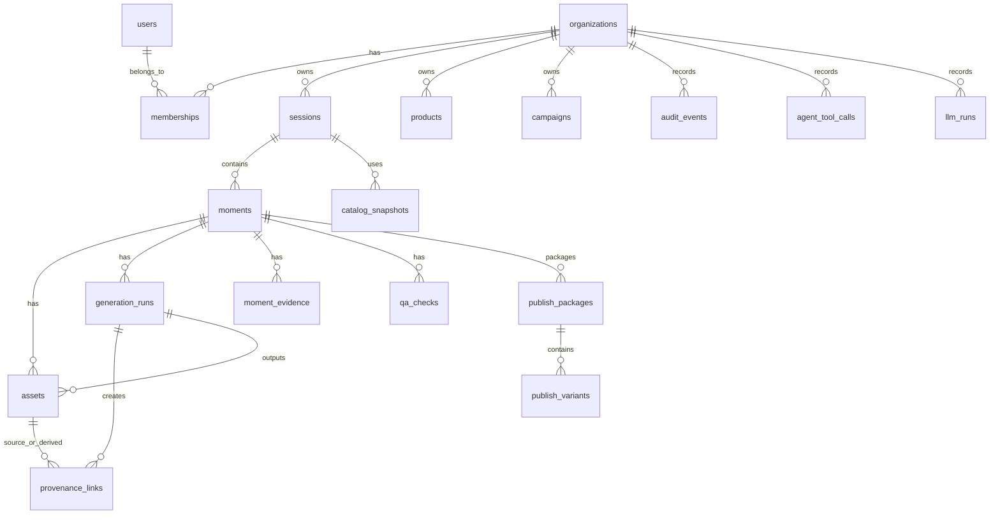

# 08 — Data Model & Database Schema

**Project:** Lumiq — Live Commerce Moment Vault  
**Document ID:** `08-data-model-database-schema.md`  
**Status:** Draft v1  
**Audience:** backend engineers, data engineers, AI coding agents, QA, analytics, infra/devops  
**Primary goal:** Define the operational data model for Lumiq clearly enough to implement Neon Postgres schema, migrations, indexes, state machines, RLS strategy, and data lifecycle rules.

---

## 1. Purpose

This document defines Lumiq’s database model and schema conventions.

Lumiq stores large media and manifest objects in Backblaze B2. Postgres stores the operational truth:

```txt
tenants
users
sessions
moments
assets
generation runs
catalog snapshots
agent tool calls
LLM runs
QA results
publish packages
provenance links
audit logs
budgets
events
search metadata
```

The database is not where video blobs live. It is where the system tracks what happened, what state it is in, who is allowed to do what, and how every output traces back to source evidence.

This document is written for both humans and AI coding agents. It includes Markdown explanation, YAML table registry, enum definitions, and SQL-style DDL examples.

---

## 2. Database Principles

### 2.1 Postgres is operational truth

Postgres is the system of record for queryable state.

It owns:

```txt
business state
state machines
relationships
audit records
cost records
permissions
asset indexes
run records
catalog snapshots
provenance links
```

### 2.2 B2 is object truth

B2 owns:

```txt
raw video/audio/image objects
enhanced media
published variants
thumbnails
captions
manifests
catalog snapshot JSON
evidence bundles
logs/backups
```

Postgres references B2 objects using:

```txt
bucket
object_key
sha256
bytes
asset_id
manifest_asset_id
```

### 2.3 Tenant scope everywhere

Every tenant-owned table must include:

```txt
organization_id
```

Almost every query must filter by `organization_id`.

### 2.4 ULID primary keys

Use ULID-style IDs for application objects.

Recommended storage:

```txt
text or char(26)
```

Benefits:

```txt
globally unique
roughly time-sortable
safe for distributed workers
readable in logs
```

### 2.5 Immutable canonical assets

Canonical asset rows may change lifecycle/status, but canonical B2 objects must not be overwritten.

A new generated output means:

```txt
new asset_id
new generation_run_id
new object_key
new manifest
```

### 2.6 Append-heavy logs should be partitioned

Large append-heavy tables should be partitioned by time and optionally organization.

PostgreSQL supports declarative partitioning, including range, list, and hash partitioning. The docs describe partitioning as splitting a logical large table into smaller physical pieces and note benefits for query performance and bulk deletion/maintenance of old data.

Partition candidates:

```txt
audit_events
system_events
dead_letter_events
signals
transcript_chunks
provider_usage_records
llm_provider_usage
cost_ledger
```

### 2.7 RLS strategy

Postgres Row-Level Security may be used as a second-layer guard for tenant isolation, especially for app-facing query paths. PostgreSQL’s RLS restricts visible or modifiable rows with policies evaluated per row when row security is enabled.

RLS does not replace Core API authorization.

### 2.8 JSONB is allowed but not a dumping ground

Use `jsonb` for:

```txt
provider-specific metadata
template parameters
policy snapshots
agent structured outputs
model outputs by hash/reference
event payloads
manifest previews
```

Do not use `jsonb` to avoid modeling first-class relationships.

### 2.9 State machines require explicit enums

Important state transitions must use explicit enums or check constraints.

Examples:

```txt
session_status
moment_state
generation_run_status
publish_package_status
qa_status
asset_verification_status
```

### 2.10 Audit every sensitive state transition

Sensitive tables should be linked to `audit_events` through trace/correlation IDs.

---

## 3. Extensions and Database Features

Recommended Postgres extensions / features:

```yaml
postgres_features:
  pgvector:
    purpose: semantic_search_embeddings
    priority: P1
  pgcrypto:
    purpose: random_bytes_or_hash_helpers_if_needed
    priority: optional
  citext:
    purpose: case_insensitive_emails_if_not_normalized
    priority: optional
  row_level_security:
    purpose: tenant_isolation_defense_in_depth
    priority: P1
  declarative_partitioning:
    purpose: high_volume_append_tables
    priority: P1
  generated_columns:
    purpose: derived_search_or_duration_fields_where_safe
    priority: optional
```

Generated columns should be used sparingly. PostgreSQL generated columns are computed from other columns and cannot be written directly. They are useful for stable derived values but not for complex business logic.

---

## 4. Schema Namespaces

Recommended schemas:

```yaml
schemas:
  public:
    purpose: default application tables
  app:
    purpose: optional main application tables if avoiding public
  audit:
    purpose: optional audit/log partitions
  search:
    purpose: optional search and embedding tables
```

For initial simplicity, using `public` is acceptable. If using multiple schemas, be consistent from the start.

---

## 5. Naming Conventions

```yaml
naming:
  table_names: plural_snake_case
  column_names: snake_case
  primary_keys: "{singular_table_name}_id"
  foreign_keys: "{referenced_singular}_id"
  enum_names: singular_domain_state
  indexes: "idx_{table}_{columns}"
  unique_indexes: "uq_{table}_{columns}"
  check_constraints: "chk_{table}_{condition}"
  foreign_keys: "fk_{table}_{referenced_table}"
```

Examples:

```txt
organizations
organization_id
session_id
moment_id
generation_run_id
idx_moments_organization_session_state
uq_assets_bucket_object_key
fk_moments_sessions
```

---

## 6. Entity Relationship Overview



---

## 7. Enum Registry

```yaml
enums:
  organization_plan:
    values: [free, hackathon, pro, team, enterprise]

  membership_role:
    values: [owner, admin, editor, reviewer, viewer, host]

  service_identity_type:
    values: [core_api, mastra_agent_service, worker, system]

  source_type:
    values:
      - browser_camera
      - screen_share
      - upload_prerecorded
      - prerecorded_live
      - obs_rtmp
      - external_adapter

  session_status:
    values:
      - created
      - opening
      - live
      - closing
      - closed
      - error
      - reconciled

  moment_state:
    values:
      - candidate
      - capture_authorized
      - capturing
      - raw_uploaded
      - enhancement_pending
      - enhancing
      - qa_pending
      - review_pending
      - approved
      - canonical
      - published
      - rejected
      - failed
      - archived
      - deleted

  moment_type:
    values:
      - product_reveal
      - offer_mention
      - try_on
      - feature_demo
      - host_reaction
      - before_after
      - limited_stock_cta
      - unknown

  asset_role:
    values:
      - raw_source
      - raw_mezzanine
      - live_transformed
      - enhanced_master
      - publish_variant
      - thumbnail
      - captions
      - transcript
      - evidence
      - manifest
      - catalog_snapshot
      - full_session_recording
      - waveform
      - proxy_preview

  asset_verification_status:
    values: [unverified, verified, failed]

  retention_class:
    values:
      - tmp
      - raw_active
      - mezzanine
      - derived
      - published
      - provenance_locked
      - audit
      - debug

  generation_run_type:
    values:
      - capture
      - enhancement
      - restyle
      - thumbnail
      - captions
      - publish_variant
      - qa_auxiliary
      - manifest

  generation_run_status:
    values:
      - queued
      - running
      - provider_pending
      - completed
      - failed
      - cancelled
      - reconciled

  qa_status:
    values:
      - not_started
      - running
      - passed
      - failed
      - review_required
      - remediated
      - terminal

  qa_failure_class:
    values:
      - retryable
      - remediable
      - review_required
      - terminal

  publish_package_status:
    values:
      - draft
      - ready
      - review_pending
      - approved
      - published
      - failed
      - revoked
      - deleted

  audit_actor_type:
    values:
      - user
      - service_agent
      - worker
      - system

  event_processing_status:
    values:
      - pending
      - processing
      - processed
      - failed
      - dead_lettered

  llm_run_status:
    values:
      - queued
      - running
      - succeeded
      - failed
      - cancelled

  agent_tool_call_status:
    values:
      - started
      - succeeded
      - failed
      - denied
```

---

## 8. Table Registry — Machine-readable Summary

```yaml
table_registry:
  identity_access:
    - organizations
    - users
    - memberships
    - roles
    - role_capabilities
    - service_identities
    - service_capabilities

  commerce:
    - products
    - product_assets
    - campaigns
    - campaign_offers
    - allowed_product_claims
    - catalog_snapshots
    - catalog_snapshot_products
    - catalog_snapshot_offers
    - catalog_snapshot_claims
    - catalog_snapshot_assets

  sessions_moments:
    - sessions
    - session_sources
    - session_recording_policies
    - signals
    - moments
    - moment_evidence
    - moment_policy_decisions
    - moment_versions

  media_generation:
    - assets
    - generation_runs
    - provenance_links
    - manifest_records
    - enhancement_templates
    - template_versions
    - step_graphs
    - step_registry_metadata

  qa_review_publish:
    - qa_checks
    - qa_failures
    - review_actions
    - publish_packages
    - publish_variants
    - publish_adapters
    - share_pages

  ai_agents:
    - agent_tool_calls
    - llm_runs
    - llm_provider_usage
    - agent_memory_records

  events_audit_operations:
    - system_events
    - outbox_events
    - dead_letter_events
    - audit_events
    - reconciliation_jobs
    - retention_jobs

  search_analytics_cost:
    - transcript_chunks
    - transcript_excerpts
    - captions
    - embeddings
    - search_index_jobs
    - budgets
    - budget_authorizations
    - cost_ledger
    - provider_usage_records
```

---

# 9. Identity and Access Tables

## 9.1 `organizations`

### Purpose

Represents a tenant/account.

```yaml
table: organizations
primary_key: organization_id
columns:
  organization_id: {type: text, pk: true}
  clerk_org_id: {type: text, unique: true, nullable: true}
  name: {type: text, nullable: false}
  slug: {type: text, unique: true, nullable: false}
  plan: {type: organization_plan, nullable: false, default: hackathon}
  settings_json: {type: jsonb, nullable: false, default: "{}"}
  created_at: {type: timestamptz, nullable: false}
  updated_at: {type: timestamptz, nullable: false}
indexes:
  - unique: [slug]
  - unique: [clerk_org_id]
```

## 9.2 `users`

```yaml
table: users
primary_key: user_id
columns:
  user_id: {type: text, pk: true}
  clerk_user_id: {type: text, unique: true, nullable: false}
  email: {type: text, nullable: false}
  display_name: {type: text, nullable: true}
  avatar_url: {type: text, nullable: true}
  created_at: {type: timestamptz, nullable: false}
  updated_at: {type: timestamptz, nullable: false}
indexes:
  - unique: [clerk_user_id]
  - index: [email]
```

## 9.3 `memberships`

```yaml
table: memberships
primary_key: membership_id
columns:
  membership_id: {type: text, pk: true}
  organization_id: {type: text, fk: organizations.organization_id, nullable: false}
  user_id: {type: text, fk: users.user_id, nullable: false}
  role: {type: membership_role, nullable: false}
  status: {type: text, nullable: false, default: active}
  created_at: {type: timestamptz, nullable: false}
  updated_at: {type: timestamptz, nullable: false}
indexes:
  - unique: [organization_id, user_id]
  - index: [user_id]
  - index: [organization_id, role]
```

## 9.4 `role_capabilities`

```yaml
table: role_capabilities
primary_key: role_capability_id
columns:
  role_capability_id: {type: text, pk: true}
  role: {type: membership_role, nullable: false}
  capability: {type: text, nullable: false}
  created_at: {type: timestamptz, nullable: false}
indexes:
  - unique: [role, capability]
```

## 9.5 `service_identities`

```yaml
table: service_identities
primary_key: service_identity_id
columns:
  service_identity_id: {type: text, pk: true}
  service_name: {type: text, unique: true, nullable: false}
  identity_type: {type: service_identity_type, nullable: false}
  is_active: {type: boolean, nullable: false, default: true}
  metadata_json: {type: jsonb, nullable: false, default: "{}"}
  created_at: {type: timestamptz, nullable: false}
  updated_at: {type: timestamptz, nullable: false}
```

## 9.6 `service_capabilities`

```yaml
table: service_capabilities
primary_key: service_capability_id
columns:
  service_capability_id: {type: text, pk: true}
  service_identity_id: {type: text, fk: service_identities.service_identity_id, nullable: false}
  capability: {type: text, nullable: false}
  scope_json: {type: jsonb, nullable: false, default: "{}"}
  created_at: {type: timestamptz, nullable: false}
indexes:
  - unique: [service_identity_id, capability]
```

---

# 10. Commerce and Catalog Tables

## 10.1 `products`

```yaml
table: products
primary_key: product_id
tenant_scoped: true
columns:
  product_id: {type: text, pk: true}
  organization_id: {type: text, fk: organizations.organization_id, nullable: false}
  sku: {type: text, nullable: false}
  name: {type: text, nullable: false}
  description: {type: text, nullable: true}
  product_url: {type: text, nullable: true}
  price_amount: {type: numeric, nullable: true}
  price_currency: {type: text, nullable: true}
  inventory_status: {type: text, nullable: true}
  source_adapter: {type: text, nullable: false, default: manual_catalog}
  external_ref: {type: text, nullable: true}
  metadata_json: {type: jsonb, nullable: false, default: "{}"}
  created_at: {type: timestamptz, nullable: false}
  updated_at: {type: timestamptz, nullable: false}
indexes:
  - unique: [organization_id, sku]
  - index: [organization_id, name]
  - index: [organization_id, source_adapter, external_ref]
```

## 10.2 `product_assets`

Links product images/videos to products. These may reference B2 assets or external URLs.

```yaml
table: product_assets
primary_key: product_asset_id
columns:
  product_asset_id: {type: text, pk: true}
  organization_id: {type: text, nullable: false}
  product_id: {type: text, fk: products.product_id, nullable: false}
  asset_id: {type: text, fk: assets.asset_id, nullable: true}
  external_url: {type: text, nullable: true}
  role: {type: text, nullable: false, default: image}
  sort_order: {type: integer, nullable: false, default: 0}
  created_at: {type: timestamptz, nullable: false}
indexes:
  - index: [organization_id, product_id]
```

## 10.3 `campaigns`

```yaml
table: campaigns
primary_key: campaign_id
columns:
  campaign_id: {type: text, pk: true}
  organization_id: {type: text, nullable: false}
  name: {type: text, nullable: false}
  status: {type: text, nullable: false, default: draft}
  starts_at: {type: timestamptz, nullable: true}
  ends_at: {type: timestamptz, nullable: true}
  metadata_json: {type: jsonb, nullable: false, default: "{}"}
  created_at: {type: timestamptz, nullable: false}
  updated_at: {type: timestamptz, nullable: false}
indexes:
  - index: [organization_id, status]
  - index: [organization_id, starts_at, ends_at]
```

## 10.4 `campaign_offers`

```yaml
table: campaign_offers
primary_key: campaign_offer_id
columns:
  campaign_offer_id: {type: text, pk: true}
  organization_id: {type: text, nullable: false}
  campaign_id: {type: text, fk: campaigns.campaign_id, nullable: false}
  product_id: {type: text, fk: products.product_id, nullable: true}
  offer_type: {type: text, nullable: false}
  offer_text: {type: text, nullable: false}
  price_amount: {type: numeric, nullable: true}
  price_currency: {type: text, nullable: true}
  discount_percent: {type: numeric, nullable: true}
  valid_from: {type: timestamptz, nullable: true}
  valid_until: {type: timestamptz, nullable: true}
  is_active: {type: boolean, nullable: false, default: true}
  created_at: {type: timestamptz, nullable: false}
indexes:
  - index: [organization_id, campaign_id]
  - index: [organization_id, product_id]
```

## 10.5 `allowed_product_claims`

```yaml
table: allowed_product_claims
primary_key: claim_id
columns:
  claim_id: {type: text, pk: true}
  organization_id: {type: text, nullable: false}
  product_id: {type: text, fk: products.product_id, nullable: true}
  campaign_id: {type: text, fk: campaigns.campaign_id, nullable: true}
  claim_text: {type: text, nullable: false}
  claim_type: {type: text, nullable: false}
  evidence_ref: {type: text, nullable: true}
  valid_from: {type: timestamptz, nullable: true}
  valid_until: {type: timestamptz, nullable: true}
  approval_status: {type: text, nullable: false, default: approved}
  created_by_user_id: {type: text, fk: users.user_id, nullable: true}
  created_at: {type: timestamptz, nullable: false}
indexes:
  - index: [organization_id, product_id]
  - index: [organization_id, campaign_id]
```

## 10.6 `catalog_snapshots`

```yaml
table: catalog_snapshots
primary_key: catalog_snapshot_id
columns:
  catalog_snapshot_id: {type: text, pk: true}
  organization_id: {type: text, nullable: false}
  campaign_id: {type: text, fk: campaigns.campaign_id, nullable: true}
  manifest_asset_id: {type: text, fk: assets.asset_id, nullable: true}
  product_count: {type: integer, nullable: false, default: 0}
  offer_count: {type: integer, nullable: false, default: 0}
  claim_count: {type: integer, nullable: false, default: 0}
  snapshot_hash: {type: text, nullable: true}
  created_by_user_id: {type: text, fk: users.user_id, nullable: true}
  created_at: {type: timestamptz, nullable: false}
indexes:
  - index: [organization_id, campaign_id]
  - index: [organization_id, created_at]
```

## 10.7 Snapshot detail tables

These freeze product facts at session time.

```yaml
snapshot_detail_tables:
  catalog_snapshot_products:
    columns:
      catalog_snapshot_product_id: text pk
      catalog_snapshot_id: text fk
      organization_id: text
      source_product_id: text
      sku: text
      name: text
      description: text
      product_url: text
      price_amount: numeric
      price_currency: text
      inventory_status: text
      data_json: jsonb

  catalog_snapshot_offers:
    columns:
      catalog_snapshot_offer_id: text pk
      catalog_snapshot_id: text fk
      organization_id: text
      source_offer_id: text
      product_id: text nullable
      offer_type: text
      offer_text: text
      valid_from: timestamptz
      valid_until: timestamptz
      data_json: jsonb

  catalog_snapshot_claims:
    columns:
      catalog_snapshot_claim_id: text pk
      catalog_snapshot_id: text fk
      organization_id: text
      source_claim_id: text
      product_id: text nullable
      claim_text: text
      claim_type: text
      valid_from: timestamptz
      valid_until: timestamptz
      data_json: jsonb
```

---

# 11. Session and Moment Tables

## 11.1 `sessions`

```yaml
table: sessions
primary_key: session_id
columns:
  session_id: {type: text, pk: true}
  organization_id: {type: text, fk: organizations.organization_id, nullable: false}
  host_user_id: {type: text, fk: users.user_id, nullable: true}
  title: {type: text, nullable: false}
  source_type: {type: source_type, nullable: false}
  status: {type: session_status, nullable: false, default: created}
  catalog_snapshot_id: {type: text, fk: catalog_snapshots.catalog_snapshot_id, nullable: true}
  campaign_id: {type: text, fk: campaigns.campaign_id, nullable: true}
  started_at: {type: timestamptz, nullable: true}
  ended_at: {type: timestamptz, nullable: true}
  full_session_recording_enabled: {type: boolean, nullable: false, default: false}
  live_transform_enabled: {type: boolean, nullable: false, default: false}
  live_transform_audience_visible: {type: boolean, nullable: false, default: false}
  region: {type: text, nullable: true}
  metadata_json: {type: jsonb, nullable: false, default: "{}"}
  created_at: {type: timestamptz, nullable: false}
  updated_at: {type: timestamptz, nullable: false}
indexes:
  - index: [organization_id, status]
  - index: [organization_id, started_at]
  - index: [organization_id, campaign_id]
```

## 11.2 `session_sources`

```yaml
table: session_sources
primary_key: session_source_id
columns:
  session_source_id: {type: text, pk: true}
  organization_id: {type: text, nullable: false}
  session_id: {type: text, fk: sessions.session_id, nullable: false}
  source_type: {type: source_type, nullable: false}
  source_uri: {type: text, nullable: true}
  source_metadata_json: {type: jsonb, nullable: false, default: "{}"}
  created_at: {type: timestamptz, nullable: false}
indexes:
  - index: [organization_id, session_id]
```

## 11.3 `session_recording_policies`

```yaml
table: session_recording_policies
primary_key: session_recording_policy_id
columns:
  session_recording_policy_id: {type: text, pk: true}
  organization_id: {type: text, nullable: false}
  session_id: {type: text, fk: sessions.session_id, nullable: false}
  moment_only_default: {type: boolean, nullable: false, default: true}
  full_session_recording_enabled: {type: boolean, nullable: false, default: false}
  raw_retention_days: {type: integer, nullable: false, default: 90}
  mezzanine_retention_days: {type: integer, nullable: false, default: 180}
  transcript_retention_days: {type: integer, nullable: false, default: 30}
  created_at: {type: timestamptz, nullable: false}
```

## 11.4 `signals`

Append-heavy table. Partition by month on `created_at`.

```yaml
table: signals
primary_key: signal_id
partition: range_by_created_at_month
columns:
  signal_id: {type: text, pk: true}
  organization_id: {type: text, nullable: false}
  session_id: {type: text, fk: sessions.session_id, nullable: false}
  moment_id: {type: text, fk: moments.moment_id, nullable: true}
  signal_type: {type: text, nullable: false}
  emitter: {type: text, nullable: false}
  t_start_ms: {type: bigint, nullable: false}
  t_end_ms: {type: bigint, nullable: true}
  score: {type: numeric, nullable: true}
  payload_json: {type: jsonb, nullable: false, default: "{}"}
  created_at: {type: timestamptz, nullable: false}
indexes:
  - index: [organization_id, session_id, t_start_ms]
  - index: [organization_id, signal_type, created_at]
```

## 11.5 `moments`

```yaml
table: moments
primary_key: moment_id
columns:
  moment_id: {type: text, pk: true}
  organization_id: {type: text, nullable: false}
  session_id: {type: text, fk: sessions.session_id, nullable: false}
  catalog_snapshot_id: {type: text, fk: catalog_snapshots.catalog_snapshot_id, nullable: true}
  state: {type: moment_state, nullable: false, default: candidate}
  moment_type: {type: moment_type, nullable: false, default: unknown}
  start_ms: {type: bigint, nullable: false}
  end_ms: {type: bigint, nullable: false}
  duration_ms: {type: bigint, nullable: false}
  raw_capture_start_ms: {type: bigint, nullable: true}
  raw_capture_end_ms: {type: bigint, nullable: true}
  score: {type: numeric, nullable: true}
  selection_reason: {type: text, nullable: true}
  is_human_confirmed: {type: boolean, nullable: false, default: false}
  canonical_asset_id: {type: text, fk: assets.asset_id, nullable: true}
  published_package_id: {type: text, fk: publish_packages.publish_package_id, nullable: true}
  moment_fingerprint: {type: text, nullable: true}
  metadata_json: {type: jsonb, nullable: false, default: "{}"}
  created_at: {type: timestamptz, nullable: false}
  updated_at: {type: timestamptz, nullable: false}
indexes:
  - index: [organization_id, session_id, state]
  - index: [organization_id, moment_type, created_at]
  - index: [organization_id, score]
  - unique_partial: [organization_id, session_id, moment_fingerprint]
```

## 11.6 `moment_evidence`

```yaml
table: moment_evidence
primary_key: evidence_id
columns:
  evidence_id: {type: text, pk: true}
  organization_id: {type: text, nullable: false}
  session_id: {type: text, fk: sessions.session_id, nullable: false}
  moment_id: {type: text, fk: moments.moment_id, nullable: false}
  evidence_type: {type: text, nullable: false}
  source_ref_type: {type: text, nullable: true}
  source_ref_id: {type: text, nullable: true}
  summary: {type: text, nullable: true}
  payload_json: {type: jsonb, nullable: false, default: "{}"}
  retention_class: {type: retention_class, nullable: false, default: debug}
  created_at: {type: timestamptz, nullable: false}
indexes:
  - index: [organization_id, moment_id]
  - index: [organization_id, evidence_type]
```

## 11.7 `moment_policy_decisions`

```yaml
table: moment_policy_decisions
primary_key: policy_decision_id
columns:
  policy_decision_id: {type: text, pk: true}
  organization_id: {type: text, nullable: false}
  session_id: {type: text, nullable: false}
  moment_id: {type: text, nullable: true}
  candidate_id: {type: text, nullable: true}
  decision_type: {type: text, nullable: false}
  decision_result: {type: text, nullable: false}
  reason: {type: text, nullable: true}
  policy_snapshot_json: {type: jsonb, nullable: false, default: "{}"}
  created_by_actor_type: {type: audit_actor_type, nullable: false}
  created_by_actor_id: {type: text, nullable: false}
  created_at: {type: timestamptz, nullable: false}
indexes:
  - index: [organization_id, session_id, created_at]
  - index: [organization_id, moment_id]
```

## 11.8 `moment_versions`

```yaml
table: moment_versions
primary_key: moment_version_id
columns:
  moment_version_id: {type: text, pk: true}
  organization_id: {type: text, nullable: false}
  moment_id: {type: text, fk: moments.moment_id, nullable: false}
  generation_run_id: {type: text, fk: generation_runs.generation_run_id, nullable: true}
  asset_id: {type: text, fk: assets.asset_id, nullable: false}
  version_number: {type: integer, nullable: false}
  state: {type: text, nullable: false, default: generated}
  is_canonical: {type: boolean, nullable: false, default: false}
  created_at: {type: timestamptz, nullable: false}
indexes:
  - unique: [organization_id, moment_id, version_number]
  - index: [organization_id, moment_id, is_canonical]
```

---

# 12. Asset, Generation, and Provenance Tables

## 12.1 `assets`

```yaml
table: assets
primary_key: asset_id
columns:
  asset_id: {type: text, pk: true}
  organization_id: {type: text, nullable: false}
  session_id: {type: text, fk: sessions.session_id, nullable: true}
  moment_id: {type: text, fk: moments.moment_id, nullable: true}
  generation_run_id: {type: text, fk: generation_runs.generation_run_id, nullable: true}
  asset_role: {type: asset_role, nullable: false}
  bucket: {type: text, nullable: false}
  object_key: {type: text, nullable: false}
  mime_type: {type: text, nullable: true}
  bytes: {type: bigint, nullable: true}
  sha256: {type: text, nullable: true}
  width: {type: integer, nullable: true}
  height: {type: integer, nullable: true}
  duration_ms: {type: bigint, nullable: true}
  frame_count: {type: bigint, nullable: true}
  codec_video: {type: text, nullable: true}
  codec_audio: {type: text, nullable: true}
  retention_class: {type: retention_class, nullable: false, default: tmp}
  verification_status: {type: asset_verification_status, nullable: false, default: unverified}
  is_deleted: {type: boolean, nullable: false, default: false}
  deleted_at: {type: timestamptz, nullable: true}
  metadata_json: {type: jsonb, nullable: false, default: "{}"}
  created_at: {type: timestamptz, nullable: false}
  updated_at: {type: timestamptz, nullable: false}
indexes:
  - unique: [bucket, object_key]
  - index: [organization_id, session_id]
  - index: [organization_id, moment_id]
  - index: [organization_id, asset_role]
  - index: [organization_id, sha256]
```

## 12.2 `generation_runs`

```yaml
table: generation_runs
primary_key: generation_run_id
columns:
  generation_run_id: {type: text, pk: true}
  organization_id: {type: text, nullable: false}
  session_id: {type: text, nullable: true}
  moment_id: {type: text, nullable: true}
  parent_run_id: {type: text, fk: generation_runs.generation_run_id, nullable: true}
  run_type: {type: generation_run_type, nullable: false}
  status: {type: generation_run_status, nullable: false, default: queued}
  provider: {type: text, nullable: true}
  model: {type: text, nullable: true}
  template_id: {type: text, nullable: true}
  template_version: {type: text, nullable: true}
  step_graph_id: {type: text, nullable: true}
  input_asset_id: {type: text, fk: assets.asset_id, nullable: true}
  output_asset_id: {type: text, fk: assets.asset_id, nullable: true}
  manifest_asset_id: {type: text, fk: assets.asset_id, nullable: true}
  provider_job_ref: {type: text, nullable: true}
  estimated_cost_usd: {type: numeric, nullable: true}
  actual_cost_usd: {type: numeric, nullable: true}
  started_at: {type: timestamptz, nullable: true}
  completed_at: {type: timestamptz, nullable: true}
  error_code: {type: text, nullable: true}
  error_message: {type: text, nullable: true}
  metadata_json: {type: jsonb, nullable: false, default: "{}"}
  created_at: {type: timestamptz, nullable: false}
  updated_at: {type: timestamptz, nullable: false}
indexes:
  - index: [organization_id, moment_id]
  - index: [organization_id, status, created_at]
  - index: [organization_id, provider, model]
  - index: [parent_run_id]
```

## 12.3 `provenance_links`

```yaml
table: provenance_links
primary_key: provenance_link_id
columns:
  provenance_link_id: {type: text, pk: true}
  organization_id: {type: text, nullable: false}
  source_asset_id: {type: text, fk: assets.asset_id, nullable: false}
  derived_asset_id: {type: text, fk: assets.asset_id, nullable: false}
  generation_run_id: {type: text, fk: generation_runs.generation_run_id, nullable: true}
  parent_run_id: {type: text, nullable: true}
  relationship: {type: text, nullable: false}
  transform_signature: {type: text, nullable: true}
  verified: {type: boolean, nullable: false, default: false}
  verified_at: {type: timestamptz, nullable: true}
  metadata_json: {type: jsonb, nullable: false, default: "{}"}
  created_at: {type: timestamptz, nullable: false}
indexes:
  - index: [organization_id, source_asset_id]
  - index: [organization_id, derived_asset_id]
  - index: [organization_id, generation_run_id]
```

## 12.4 `manifest_records`

```yaml
table: manifest_records
primary_key: manifest_id
columns:
  manifest_id: {type: text, pk: true}
  organization_id: {type: text, nullable: false}
  session_id: {type: text, nullable: true}
  moment_id: {type: text, nullable: true}
  asset_id: {type: text, fk: assets.asset_id, nullable: true}
  generation_run_id: {type: text, fk: generation_runs.generation_run_id, nullable: true}
  manifest_type: {type: text, nullable: false}
  schema_version: {type: text, nullable: false}
  bucket: {type: text, nullable: false}
  object_key: {type: text, nullable: false}
  sha256: {type: text, nullable: true}
  payload_preview_json: {type: jsonb, nullable: true}
  created_at: {type: timestamptz, nullable: false}
indexes:
  - unique: [bucket, object_key]
  - index: [organization_id, manifest_type]
  - index: [organization_id, moment_id]
```

---

# 13. Template and Step Graph Tables

## 13.1 `enhancement_templates`

```yaml
table: enhancement_templates
primary_key: template_id
columns:
  template_id: {type: text, pk: true}
  organization_id: {type: text, nullable: true}
  name: {type: text, nullable: false}
  slug: {type: text, nullable: false}
  description: {type: text, nullable: true}
  moment_type: {type: moment_type, nullable: true}
  is_system_template: {type: boolean, nullable: false, default: false}
  is_active: {type: boolean, nullable: false, default: true}
  created_at: {type: timestamptz, nullable: false}
  updated_at: {type: timestamptz, nullable: false}
indexes:
  - unique: [organization_id, slug]
```

## 13.2 `template_versions`

```yaml
table: template_versions
primary_key: template_version_id
columns:
  template_version_id: {type: text, pk: true}
  template_id: {type: text, fk: enhancement_templates.template_id, nullable: false}
  version: {type: text, nullable: false}
  operations_json: {type: jsonb, nullable: false}
  brand_rules_json: {type: jsonb, nullable: false, default: "{}"}
  ai_restyle_policy_json: {type: jsonb, nullable: false, default: "{}"}
  caption_policy_json: {type: jsonb, nullable: false, default: "{}"}
  overlay_policy_json: {type: jsonb, nullable: false, default: "{}"}
  product_card_policy_json: {type: jsonb, nullable: false, default: "{}"}
  moderation_policy_json: {type: jsonb, nullable: false, default: "{}"}
  status: {type: text, nullable: false, default: draft}
  created_at: {type: timestamptz, nullable: false}
indexes:
  - unique: [template_id, version]
```

## 13.3 `step_graphs`

```yaml
table: step_graphs
primary_key: step_graph_id
columns:
  step_graph_id: {type: text, pk: true}
  template_version_id: {type: text, fk: template_versions.template_version_id, nullable: false}
  graph_json: {type: jsonb, nullable: false}
  graph_hash: {type: text, nullable: false}
  validation_status: {type: text, nullable: false, default: unvalidated}
  created_at: {type: timestamptz, nullable: false}
indexes:
  - unique: [template_version_id, graph_hash]
```

## 13.4 `step_registry_metadata`

```yaml
table: step_registry_metadata
primary_key: step_type
columns:
  step_type: {type: text, pk: true}
  description: {type: text, nullable: false}
  input_schema_ref: {type: text, nullable: false}
  output_schema_ref: {type: text, nullable: false}
  executor_name: {type: text, nullable: false}
  allowed: {type: boolean, nullable: false, default: true}
  cost_estimate_policy_json: {type: jsonb, nullable: false, default: "{}"}
  created_at: {type: timestamptz, nullable: false}
```

---

# 14. QA, Review, and Publish Tables

## 14.1 `qa_checks`

```yaml
table: qa_checks
primary_key: qa_check_id
columns:
  qa_check_id: {type: text, pk: true}
  organization_id: {type: text, nullable: false}
  session_id: {type: text, nullable: true}
  moment_id: {type: text, nullable: true}
  asset_id: {type: text, nullable: true}
  generation_run_id: {type: text, nullable: true}
  qa_stage: {type: text, nullable: false}
  status: {type: qa_status, nullable: false}
  score: {type: numeric, nullable: true}
  summary: {type: text, nullable: true}
  result_json: {type: jsonb, nullable: false, default: "{}"}
  created_at: {type: timestamptz, nullable: false}
  completed_at: {type: timestamptz, nullable: true}
indexes:
  - index: [organization_id, moment_id]
  - index: [organization_id, status, created_at]
```

## 14.2 `qa_failures`

```yaml
table: qa_failures
primary_key: qa_failure_id
columns:
  qa_failure_id: {type: text, pk: true}
  organization_id: {type: text, nullable: false}
  qa_check_id: {type: text, fk: qa_checks.qa_check_id, nullable: false}
  failure_class: {type: qa_failure_class, nullable: false}
  failure_code: {type: text, nullable: false}
  message: {type: text, nullable: false}
  remediation_json: {type: jsonb, nullable: false, default: "{}"}
  created_at: {type: timestamptz, nullable: false}
```

## 14.3 `review_actions`

```yaml
table: review_actions
primary_key: review_action_id
columns:
  review_action_id: {type: text, pk: true}
  organization_id: {type: text, nullable: false}
  moment_id: {type: text, fk: moments.moment_id, nullable: false}
  asset_id: {type: text, fk: assets.asset_id, nullable: true}
  reviewer_user_id: {type: text, fk: users.user_id, nullable: false}
  action: {type: text, nullable: false}
  reason: {type: text, nullable: true}
  before_state: {type: text, nullable: true}
  after_state: {type: text, nullable: true}
  metadata_json: {type: jsonb, nullable: false, default: "{}"}
  created_at: {type: timestamptz, nullable: false}
indexes:
  - index: [organization_id, moment_id]
  - index: [organization_id, reviewer_user_id]
```

## 14.4 `publish_packages`

```yaml
table: publish_packages
primary_key: publish_package_id
columns:
  publish_package_id: {type: text, pk: true}
  organization_id: {type: text, nullable: false}
  session_id: {type: text, nullable: true}
  moment_id: {type: text, fk: moments.moment_id, nullable: false}
  canonical_asset_id: {type: text, fk: assets.asset_id, nullable: false}
  status: {type: publish_package_status, nullable: false, default: draft}
  title: {type: text, nullable: true}
  description: {type: text, nullable: true}
  hashtags: {type: text[], nullable: true}
  product_links_json: {type: jsonb, nullable: false, default: "[]"}
  manifest_asset_id: {type: text, fk: assets.asset_id, nullable: true}
  approved_by_user_id: {type: text, fk: users.user_id, nullable: true}
  approved_at: {type: timestamptz, nullable: true}
  created_at: {type: timestamptz, nullable: false}
  updated_at: {type: timestamptz, nullable: false}
indexes:
  - index: [organization_id, status]
  - index: [organization_id, moment_id]
```

## 14.5 `publish_variants`

```yaml
table: publish_variants
primary_key: publish_variant_id
columns:
  publish_variant_id: {type: text, pk: true}
  organization_id: {type: text, nullable: false}
  publish_package_id: {type: text, fk: publish_packages.publish_package_id, nullable: false}
  asset_id: {type: text, fk: assets.asset_id, nullable: false}
  destination_type: {type: text, nullable: false}
  aspect_ratio: {type: text, nullable: true}
  metadata_json: {type: jsonb, nullable: false, default: "{}"}
  created_at: {type: timestamptz, nullable: false}
indexes:
  - index: [organization_id, publish_package_id]
```

## 14.6 `share_pages`

```yaml
table: share_pages
primary_key: share_page_id
columns:
  share_page_id: {type: text, pk: true}
  organization_id: {type: text, nullable: false}
  publish_package_id: {type: text, fk: publish_packages.publish_package_id, nullable: false}
  share_slug: {type: text, unique: true, nullable: false}
  visibility: {type: text, nullable: false, default: private}
  status: {type: text, nullable: false, default: active}
  expires_at: {type: timestamptz, nullable: true}
  revoked_at: {type: timestamptz, nullable: true}
  metadata_json: {type: jsonb, nullable: false, default: "{}"}
  created_at: {type: timestamptz, nullable: false}
indexes:
  - unique: [share_slug]
  - index: [organization_id, publish_package_id]
```

---

# 15. AI Agent and LLM Tables

## 15.1 `agent_tool_calls`

```yaml
table: agent_tool_calls
primary_key: agent_tool_call_id
partition: optional_monthly_by_started_at
columns:
  agent_tool_call_id: {type: text, pk: true}
  organization_id: {type: text, nullable: false}
  session_id: {type: text, nullable: true}
  moment_id: {type: text, nullable: true}
  agent_id: {type: text, nullable: false}
  tool_name: {type: text, nullable: false}
  requested_by_user_id: {type: text, nullable: true}
  idempotency_key: {type: text, nullable: false}
  trace_id: {type: text, nullable: true}
  input_hash: {type: text, nullable: true}
  output_hash: {type: text, nullable: true}
  status: {type: agent_tool_call_status, nullable: false}
  policy_result_json: {type: jsonb, nullable: false, default: "{}"}
  started_at: {type: timestamptz, nullable: false}
  completed_at: {type: timestamptz, nullable: true}
  error_code: {type: text, nullable: true}
indexes:
  - unique: [organization_id, idempotency_key]
  - index: [organization_id, session_id]
  - index: [organization_id, moment_id]
  - index: [organization_id, agent_id, started_at]
```

## 15.2 `llm_runs`

```yaml
table: llm_runs
primary_key: llm_run_id
partition: optional_monthly_by_created_at
columns:
  llm_run_id: {type: text, pk: true}
  organization_id: {type: text, nullable: false}
  session_id: {type: text, nullable: true}
  moment_id: {type: text, nullable: true}
  agent_id: {type: text, nullable: true}
  task_type: {type: text, nullable: false}
  provider: {type: text, nullable: false}
  model: {type: text, nullable: false}
  input_hash: {type: text, nullable: false}
  output_hash: {type: text, nullable: true}
  prompt_template_id: {type: text, nullable: true}
  prompt_template_version: {type: text, nullable: true}
  schema_version: {type: text, nullable: true}
  status: {type: llm_run_status, nullable: false}
  estimated_cost_usd: {type: numeric, nullable: true}
  actual_cost_usd: {type: numeric, nullable: true}
  input_tokens: {type: integer, nullable: true}
  output_tokens: {type: integer, nullable: true}
  latency_ms: {type: integer, nullable: true}
  created_at: {type: timestamptz, nullable: false}
  completed_at: {type: timestamptz, nullable: true}
  error_code: {type: text, nullable: true}
indexes:
  - index: [organization_id, task_type, created_at]
  - index: [organization_id, provider, model]
  - index: [organization_id, session_id]
  - index: [organization_id, moment_id]
```

## 15.3 `agent_memory_records`

```yaml
table: agent_memory_records
primary_key: memory_id
columns:
  memory_id: {type: text, pk: true}
  organization_id: {type: text, nullable: false}
  campaign_id: {type: text, nullable: true}
  session_id: {type: text, nullable: true}
  memory_type: {type: text, nullable: false}
  source_type: {type: text, nullable: false}
  source_id: {type: text, nullable: true}
  summary: {type: text, nullable: false}
  embedding_id: {type: text, fk: embeddings.embedding_id, nullable: true}
  confidence: {type: numeric, nullable: true}
  created_by_actor_type: {type: audit_actor_type, nullable: false}
  created_by_actor_id: {type: text, nullable: false}
  valid_from: {type: timestamptz, nullable: true}
  valid_until: {type: timestamptz, nullable: true}
  retention_class: {type: retention_class, nullable: false, default: derived}
  is_active: {type: boolean, nullable: false, default: true}
  created_at: {type: timestamptz, nullable: false}
  updated_at: {type: timestamptz, nullable: false}
indexes:
  - index: [organization_id, memory_type]
  - index: [organization_id, campaign_id]
  - index: [organization_id, is_active]
```

---

# 16. Events, Audit, and Operations Tables

## 16.1 `system_events`

Append-heavy. Partition monthly.

```yaml
table: system_events
primary_key: event_id
partition: range_by_occurred_at_month
columns:
  event_id: {type: text, pk: true}
  organization_id: {type: text, nullable: false}
  event_type: {type: text, nullable: false}
  schema_version: {type: text, nullable: false}
  producer: {type: text, nullable: false}
  idempotency_key: {type: text, nullable: false}
  correlation_id: {type: text, nullable: true}
  trace_id: {type: text, nullable: true}
  payload_json: {type: jsonb, nullable: false}
  processing_status: {type: event_processing_status, nullable: false, default: pending}
  occurred_at: {type: timestamptz, nullable: false}
  created_at: {type: timestamptz, nullable: false}
indexes:
  - unique: [organization_id, idempotency_key]
  - index: [organization_id, event_type, occurred_at]
  - index: [trace_id]
```

## 16.2 `outbox_events`

Use if implementing transactional outbox from Core API to NATS.

```yaml
table: outbox_events
primary_key: outbox_event_id
columns:
  outbox_event_id: {type: text, pk: true}
  organization_id: {type: text, nullable: false}
  event_type: {type: text, nullable: false}
  subject: {type: text, nullable: false}
  payload_json: {type: jsonb, nullable: false}
  idempotency_key: {type: text, nullable: false}
  status: {type: text, nullable: false, default: pending}
  attempts: {type: integer, nullable: false, default: 0}
  next_attempt_at: {type: timestamptz, nullable: true}
  created_at: {type: timestamptz, nullable: false}
  published_at: {type: timestamptz, nullable: true}
indexes:
  - index: [status, next_attempt_at]
  - unique: [organization_id, idempotency_key]
```

## 16.3 `dead_letter_events`

```yaml
table: dead_letter_events
primary_key: dead_letter_event_id
partition: range_by_created_at_month
columns:
  dead_letter_event_id: {type: text, pk: true}
  organization_id: {type: text, nullable: false}
  original_event_id: {type: text, nullable: true}
  event_type: {type: text, nullable: false}
  subject: {type: text, nullable: false}
  payload_json: {type: jsonb, nullable: false}
  error_code: {type: text, nullable: true}
  error_message: {type: text, nullable: true}
  retry_count: {type: integer, nullable: false, default: 0}
  status: {type: text, nullable: false, default: open}
  trace_id: {type: text, nullable: true}
  created_at: {type: timestamptz, nullable: false}
  resolved_at: {type: timestamptz, nullable: true}
indexes:
  - index: [organization_id, status, created_at]
  - index: [organization_id, event_type]
```

## 16.4 `audit_events`

Append-heavy. Partition monthly.

```yaml
table: audit_events
primary_key: audit_event_id
partition: range_by_created_at_month
columns:
  audit_event_id: {type: text, pk: true}
  organization_id: {type: text, nullable: false}
  actor_type: {type: audit_actor_type, nullable: false}
  actor_id: {type: text, nullable: false}
  action: {type: text, nullable: false}
  resource_type: {type: text, nullable: true}
  resource_id: {type: text, nullable: true}
  session_id: {type: text, nullable: true}
  moment_id: {type: text, nullable: true}
  asset_id: {type: text, nullable: true}
  generation_run_id: {type: text, nullable: true}
  before_state: {type: text, nullable: true}
  after_state: {type: text, nullable: true}
  policy_result_json: {type: jsonb, nullable: true}
  idempotency_key: {type: text, nullable: true}
  request_id: {type: text, nullable: true}
  trace_id: {type: text, nullable: true}
  metadata_json: {type: jsonb, nullable: false, default: "{}"}
  created_at: {type: timestamptz, nullable: false}
indexes:
  - index: [organization_id, created_at]
  - index: [organization_id, actor_type, actor_id]
  - index: [organization_id, action]
  - index: [trace_id]
  - index: [organization_id, resource_type, resource_id]
```

---

# 17. Transcripts, Captions, Search, and Embeddings

## 17.1 `transcript_chunks`

Partition monthly.

```yaml
table: transcript_chunks
primary_key: transcript_chunk_id
partition: range_by_created_at_month
columns:
  transcript_chunk_id: {type: text, pk: true}
  organization_id: {type: text, nullable: false}
  session_id: {type: text, nullable: false}
  start_ms: {type: bigint, nullable: false}
  end_ms: {type: bigint, nullable: false}
  text: {type: text, nullable: false}
  provider: {type: text, nullable: true}
  confidence: {type: numeric, nullable: true}
  retention_class: {type: retention_class, nullable: false, default: debug}
  created_at: {type: timestamptz, nullable: false}
indexes:
  - index: [organization_id, session_id, start_ms]
```

## 17.2 `transcript_excerpts`

```yaml
table: transcript_excerpts
primary_key: transcript_excerpt_id
columns:
  transcript_excerpt_id: {type: text, pk: true}
  organization_id: {type: text, nullable: false}
  session_id: {type: text, nullable: false}
  moment_id: {type: text, nullable: false}
  start_ms: {type: bigint, nullable: false}
  end_ms: {type: bigint, nullable: false}
  text: {type: text, nullable: false}
  source_chunk_ids: {type: text[], nullable: true}
  created_at: {type: timestamptz, nullable: false}
indexes:
  - index: [organization_id, moment_id]
```

## 17.3 `captions`

```yaml
table: captions
primary_key: caption_id
columns:
  caption_id: {type: text, pk: true}
  organization_id: {type: text, nullable: false}
  moment_id: {type: text, nullable: true}
  asset_id: {type: text, fk: assets.asset_id, nullable: true}
  caption_format: {type: text, nullable: false}
  language: {type: text, nullable: false, default: en}
  source: {type: text, nullable: false}
  text_preview: {type: text, nullable: true}
  created_at: {type: timestamptz, nullable: false}
```

## 17.4 `embeddings`

Use pgvector when enabled.

```yaml
table: embeddings
primary_key: embedding_id
columns:
  embedding_id: {type: text, pk: true}
  organization_id: {type: text, nullable: false}
  source_type: {type: text, nullable: false}
  source_id: {type: text, nullable: false}
  embedding_model: {type: text, nullable: false}
  embedding_vector: {type: vector, nullable: false}
  text_hash: {type: text, nullable: true}
  metadata_json: {type: jsonb, nullable: false, default: "{}"}
  created_at: {type: timestamptz, nullable: false}
indexes:
  - index: [organization_id, source_type, source_id]
  - vector_index: [embedding_vector]
```

## 17.5 `search_index_jobs`

```yaml
table: search_index_jobs
primary_key: search_index_job_id
columns:
  search_index_job_id: {type: text, pk: true}
  organization_id: {type: text, nullable: false}
  source_type: {type: text, nullable: false}
  source_id: {type: text, nullable: false}
  job_type: {type: text, nullable: false}
  status: {type: text, nullable: false, default: queued}
  attempts: {type: integer, nullable: false, default: 0}
  error_code: {type: text, nullable: true}
  created_at: {type: timestamptz, nullable: false}
  completed_at: {type: timestamptz, nullable: true}
```

---

# 18. Budgets and Cost Tables

## 18.1 `budgets`

```yaml
table: budgets
primary_key: budget_id
columns:
  budget_id: {type: text, pk: true}
  organization_id: {type: text, nullable: false}
  scope_type: {type: text, nullable: false}
  scope_id: {type: text, nullable: true}
  budget_type: {type: text, nullable: false}
  limit_usd: {type: numeric, nullable: true}
  limit_count: {type: integer, nullable: true}
  window: {type: text, nullable: false, default: monthly}
  is_active: {type: boolean, nullable: false, default: true}
  created_at: {type: timestamptz, nullable: false}
  updated_at: {type: timestamptz, nullable: false}
indexes:
  - index: [organization_id, scope_type, scope_id]
```

## 18.2 `budget_authorizations`

```yaml
table: budget_authorizations
primary_key: budget_authorization_id
columns:
  budget_authorization_id: {type: text, pk: true}
  organization_id: {type: text, nullable: false}
  scope_type: {type: text, nullable: false}
  scope_id: {type: text, nullable: true}
  action_type: {type: text, nullable: false}
  estimated_cost_usd: {type: numeric, nullable: true}
  result: {type: text, nullable: false}
  reason: {type: text, nullable: true}
  policy_snapshot_json: {type: jsonb, nullable: false, default: "{}"}
  created_at: {type: timestamptz, nullable: false}
indexes:
  - index: [organization_id, created_at]
  - index: [organization_id, scope_type, scope_id]
```

## 18.3 `cost_ledger`

Partition monthly.

```yaml
table: cost_ledger
primary_key: cost_ledger_id
partition: range_by_created_at_month
columns:
  cost_ledger_id: {type: text, pk: true}
  organization_id: {type: text, nullable: false}
  session_id: {type: text, nullable: true}
  moment_id: {type: text, nullable: true}
  generation_run_id: {type: text, nullable: true}
  llm_run_id: {type: text, nullable: true}
  cost_type: {type: text, nullable: false}
  provider: {type: text, nullable: true}
  model: {type: text, nullable: true}
  estimated_cost_usd: {type: numeric, nullable: true}
  actual_cost_usd: {type: numeric, nullable: true}
  units_json: {type: jsonb, nullable: false, default: "{}"}
  reconciled_at: {type: timestamptz, nullable: true}
  created_at: {type: timestamptz, nullable: false}
indexes:
  - index: [organization_id, created_at]
  - index: [organization_id, provider, model]
  - index: [organization_id, session_id]
```

## 18.4 `provider_usage_records`

```yaml
table: provider_usage_records
primary_key: provider_usage_record_id
partition: range_by_created_at_month
columns:
  provider_usage_record_id: {type: text, pk: true}
  organization_id: {type: text, nullable: false}
  provider: {type: text, nullable: false}
  model: {type: text, nullable: true}
  usage_type: {type: text, nullable: false}
  usage_units: {type: numeric, nullable: true}
  usage_json: {type: jsonb, nullable: false, default: "{}"}
  related_run_id: {type: text, nullable: true}
  created_at: {type: timestamptz, nullable: false}
```

---

# 19. State Machine Rules

## 19.1 Session transitions

```yaml
session_transitions:
  created: [opening, error]
  opening: [live, error, closed]
  live: [closing, error]
  closing: [closed, error]
  closed: [reconciled]
  error: [closing, closed, reconciled]
  reconciled: []
```

## 19.2 Moment transitions

```yaml
moment_transitions:
  candidate: [capture_authorized, rejected, failed]
  capture_authorized: [capturing, rejected, failed]
  capturing: [raw_uploaded, failed]
  raw_uploaded: [enhancement_pending, review_pending, rejected, failed]
  enhancement_pending: [enhancing, review_pending, failed]
  enhancing: [qa_pending, failed]
  qa_pending: [review_pending, failed]
  review_pending: [approved, rejected, enhancement_pending]
  approved: [canonical, enhancement_pending]
  canonical: [published, archived, deleted]
  published: [archived, deleted]
  rejected: [archived, deleted]
  failed: [enhancement_pending, archived, deleted]
  archived: [deleted]
  deleted: []
```

## 19.3 Generation run transitions

```yaml
generation_run_transitions:
  queued: [running, cancelled, failed]
  running: [provider_pending, completed, failed, cancelled]
  provider_pending: [completed, failed, cancelled]
  completed: [reconciled]
  failed: [queued, reconciled]
  cancelled: [reconciled]
  reconciled: []
```

## 19.4 Publish package transitions

```yaml
publish_package_transitions:
  draft: [ready, deleted]
  ready: [review_pending, approved, failed, deleted]
  review_pending: [approved, failed, deleted]
  approved: [published, failed, revoked]
  published: [revoked, deleted]
  failed: [ready, deleted]
  revoked: [deleted]
  deleted: []
```

---

# 20. Multi-tenancy and RLS Strategy

## 20.1 Application-level tenant enforcement

Every Core API query must filter by `organization_id`.

## 20.2 RLS defense-in-depth

Recommended P1:

```sql
ALTER TABLE moments ENABLE ROW LEVEL SECURITY;
CREATE POLICY tenant_isolation_moments ON moments
  USING (organization_id = current_setting('app.current_organization_id', true));
```

Equivalent policies should be created for tenant-scoped tables if RLS is enabled.

## 20.3 RLS caveats

RLS is not a substitute for Core API authorization.

Service roles and migrations must be carefully managed because superusers and roles with bypass permissions can bypass RLS.

---

# 21. Partitioning Strategy

## 21.1 Partitioned tables

```yaml
partitioned_tables:
  audit_events:
    key: created_at
    strategy: monthly_range
    reason: append_heavy_audit_history

  system_events:
    key: occurred_at
    strategy: monthly_range
    reason: append_heavy_event_log

  dead_letter_events:
    key: created_at
    strategy: monthly_range
    reason: operational_history

  signals:
    key: created_at
    strategy: monthly_range
    reason: high_volume_live_detection

  transcript_chunks:
    key: created_at
    strategy: monthly_range
    reason: large_transcript_volume_short_retention

  cost_ledger:
    key: created_at
    strategy: monthly_range
    reason: billing_and_usage_history

  llm_runs:
    key: created_at
    strategy: monthly_range_optional
    reason: high_volume_agent_calls
```

## 21.2 Partition naming

```txt
audit_events_2026_06
signals_2026_06
transcript_chunks_2026_06
```

## 21.3 Partition maintenance

Retention worker should:

```txt
create next partitions
detach/archive old partitions where policy allows
drop expired partitions where policy allows
verify indexes exist
```

---

# 22. Index Strategy

## 22.1 General index rules

Every tenant-scoped query should have indexes beginning with `organization_id` where appropriate.

Common patterns:

```txt
organization_id + status/state
organization_id + session_id
organization_id + moment_id
organization_id + created_at
organization_id + product_id
organization_id + campaign_id
```

## 22.2 Required high-value indexes

```yaml
required_indexes:
  sessions:
    - [organization_id, status]
    - [organization_id, started_at]
    - [organization_id, campaign_id]

  moments:
    - [organization_id, session_id, state]
    - [organization_id, moment_type, created_at]
    - [organization_id, score]
    - [organization_id, session_id, moment_fingerprint]

  assets:
    - [bucket, object_key]
    - [organization_id, session_id]
    - [organization_id, moment_id]
    - [organization_id, asset_role]
    - [organization_id, sha256]

  generation_runs:
    - [organization_id, moment_id]
    - [organization_id, status, created_at]
    - [organization_id, provider, model]
    - [parent_run_id]

  audit_events:
    - [organization_id, created_at]
    - [organization_id, actor_type, actor_id]
    - [organization_id, action]
    - [trace_id]

  publish_packages:
    - [organization_id, status]
    - [organization_id, moment_id]

  share_pages:
    - [share_slug]
```

---

# 23. Deletion and Retention Data Behavior

## 23.1 Soft delete fields

Common fields for deletable entities:

```txt
is_deleted boolean default false
deleted_at timestamptz nullable
deleted_by_actor_type nullable
deleted_by_actor_id nullable
delete_reason nullable
```

Apply to:

```txt
assets
moments
publish_packages
share_pages
products maybe
campaigns maybe
```

## 23.2 Revocation vs deletion

Share pages should be revocable without deleting canonical assets.

```txt
revoked_at
status = revoked
```

## 23.3 Physical deletion

Physical B2 deletion should be scheduled by retention/deletion worker and recorded.

## 23.4 Audit preservation

Some audit/provenance data may remain after user-visible deletion according to retention/legal policy.

---

# 24. Seed Data for Hackathon

Recommended seed data:

```yaml
seed_organization:
  name: Lumiq Demo Brand
  plan: hackathon

seed_user_roles:
  - owner
  - editor
  - reviewer

seed_products:
  - sku: JACKET-001
    name: Royal Tech Jacket
    claims:
      - Lightweight
      - Water resistant
      - Launch offer active
  - sku: BAG-002
    name: Studio Sling Bag
    claims:
      - Fits 13-inch laptop
      - Limited launch drop

seed_campaign:
  name: Live Launch Demo
  offers:
    - "20% off during live demo"
    - "Limited launch stock"

seed_template:
  - clean_product_reveal_v1
  - price_drop_flash_v1
```

---

# 25. SQL DDL Starter Snippets

These are illustrative, not final migrations.

## 25.1 Organization and users

```sql
CREATE TABLE organizations (
  organization_id text PRIMARY KEY,
  clerk_org_id text UNIQUE,
  name text NOT NULL,
  slug text NOT NULL UNIQUE,
  plan text NOT NULL DEFAULT 'hackathon',
  settings_json jsonb NOT NULL DEFAULT '{}'::jsonb,
  created_at timestamptz NOT NULL DEFAULT now(),
  updated_at timestamptz NOT NULL DEFAULT now()
);

CREATE TABLE users (
  user_id text PRIMARY KEY,
  clerk_user_id text NOT NULL UNIQUE,
  email text NOT NULL,
  display_name text,
  avatar_url text,
  created_at timestamptz NOT NULL DEFAULT now(),
  updated_at timestamptz NOT NULL DEFAULT now()
);

CREATE TABLE memberships (
  membership_id text PRIMARY KEY,
  organization_id text NOT NULL REFERENCES organizations(organization_id),
  user_id text NOT NULL REFERENCES users(user_id),
  role text NOT NULL,
  status text NOT NULL DEFAULT 'active',
  created_at timestamptz NOT NULL DEFAULT now(),
  updated_at timestamptz NOT NULL DEFAULT now(),
  UNIQUE (organization_id, user_id)
);
```

## 25.2 Sessions and moments

```sql
CREATE TABLE sessions (
  session_id text PRIMARY KEY,
  organization_id text NOT NULL REFERENCES organizations(organization_id),
  host_user_id text REFERENCES users(user_id),
  title text NOT NULL,
  source_type text NOT NULL,
  status text NOT NULL DEFAULT 'created',
  catalog_snapshot_id text,
  campaign_id text,
  started_at timestamptz,
  ended_at timestamptz,
  full_session_recording_enabled boolean NOT NULL DEFAULT false,
  live_transform_enabled boolean NOT NULL DEFAULT false,
  live_transform_audience_visible boolean NOT NULL DEFAULT false,
  region text,
  metadata_json jsonb NOT NULL DEFAULT '{}'::jsonb,
  created_at timestamptz NOT NULL DEFAULT now(),
  updated_at timestamptz NOT NULL DEFAULT now()
);

CREATE INDEX idx_sessions_org_status ON sessions (organization_id, status);
CREATE INDEX idx_sessions_org_started ON sessions (organization_id, started_at);

CREATE TABLE moments (
  moment_id text PRIMARY KEY,
  organization_id text NOT NULL REFERENCES organizations(organization_id),
  session_id text NOT NULL REFERENCES sessions(session_id),
  catalog_snapshot_id text,
  state text NOT NULL DEFAULT 'candidate',
  moment_type text NOT NULL DEFAULT 'unknown',
  start_ms bigint NOT NULL,
  end_ms bigint NOT NULL,
  duration_ms bigint NOT NULL,
  raw_capture_start_ms bigint,
  raw_capture_end_ms bigint,
  score numeric,
  selection_reason text,
  is_human_confirmed boolean NOT NULL DEFAULT false,
  canonical_asset_id text,
  published_package_id text,
  moment_fingerprint text,
  metadata_json jsonb NOT NULL DEFAULT '{}'::jsonb,
  created_at timestamptz NOT NULL DEFAULT now(),
  updated_at timestamptz NOT NULL DEFAULT now(),
  CHECK (end_ms > start_ms),
  CHECK (duration_ms = end_ms - start_ms)
);

CREATE INDEX idx_moments_org_session_state ON moments (organization_id, session_id, state);
CREATE INDEX idx_moments_org_type_created ON moments (organization_id, moment_type, created_at);
```

## 25.3 Assets and generation runs

```sql
CREATE TABLE assets (
  asset_id text PRIMARY KEY,
  organization_id text NOT NULL REFERENCES organizations(organization_id),
  session_id text REFERENCES sessions(session_id),
  moment_id text REFERENCES moments(moment_id),
  generation_run_id text,
  asset_role text NOT NULL,
  bucket text NOT NULL,
  object_key text NOT NULL,
  mime_type text,
  bytes bigint,
  sha256 text,
  width integer,
  height integer,
  duration_ms bigint,
  frame_count bigint,
  codec_video text,
  codec_audio text,
  retention_class text NOT NULL DEFAULT 'tmp',
  verification_status text NOT NULL DEFAULT 'unverified',
  is_deleted boolean NOT NULL DEFAULT false,
  deleted_at timestamptz,
  metadata_json jsonb NOT NULL DEFAULT '{}'::jsonb,
  created_at timestamptz NOT NULL DEFAULT now(),
  updated_at timestamptz NOT NULL DEFAULT now(),
  UNIQUE (bucket, object_key)
);

CREATE INDEX idx_assets_org_session ON assets (organization_id, session_id);
CREATE INDEX idx_assets_org_moment ON assets (organization_id, moment_id);
CREATE INDEX idx_assets_org_role ON assets (organization_id, asset_role);

CREATE TABLE generation_runs (
  generation_run_id text PRIMARY KEY,
  organization_id text NOT NULL REFERENCES organizations(organization_id),
  session_id text REFERENCES sessions(session_id),
  moment_id text REFERENCES moments(moment_id),
  parent_run_id text REFERENCES generation_runs(generation_run_id),
  run_type text NOT NULL,
  status text NOT NULL DEFAULT 'queued',
  provider text,
  model text,
  template_id text,
  template_version text,
  step_graph_id text,
  input_asset_id text REFERENCES assets(asset_id),
  output_asset_id text REFERENCES assets(asset_id),
  manifest_asset_id text REFERENCES assets(asset_id),
  provider_job_ref text,
  estimated_cost_usd numeric,
  actual_cost_usd numeric,
  started_at timestamptz,
  completed_at timestamptz,
  error_code text,
  error_message text,
  metadata_json jsonb NOT NULL DEFAULT '{}'::jsonb,
  created_at timestamptz NOT NULL DEFAULT now(),
  updated_at timestamptz NOT NULL DEFAULT now()
);
```

---

# 26. Migration Order

Recommended migration order:

```yaml
migration_order:
  001_extensions_and_enums:
    - enable_extensions
    - create_enum_or_check_domain_strategy

  002_identity_access:
    - organizations
    - users
    - memberships
    - role_capabilities
    - service_identities
    - service_capabilities

  003_catalog:
    - products
    - campaigns
    - campaign_offers
    - allowed_product_claims
    - catalog_snapshots
    - snapshot_detail_tables

  004_sessions_moments:
    - sessions
    - session_sources
    - session_recording_policies
    - moments
    - signals
    - moment_evidence
    - moment_policy_decisions

  005_assets_generation:
    - assets
    - generation_runs
    - provenance_links
    - manifest_records

  006_templates:
    - enhancement_templates
    - template_versions
    - step_graphs
    - step_registry_metadata

  007_qa_review_publish:
    - qa_checks
    - qa_failures
    - review_actions
    - publish_packages
    - publish_variants
    - share_pages

  008_agents_llm:
    - agent_tool_calls
    - llm_runs
    - agent_memory_records

  009_events_audit:
    - system_events
    - outbox_events
    - dead_letter_events
    - audit_events

  010_search_cost_retention:
    - transcript_chunks
    - transcript_excerpts
    - captions
    - embeddings
    - search_index_jobs
    - budgets
    - budget_authorizations
    - cost_ledger
    - provider_usage_records
```

---

# 27. Coding Agent Instructions

When implementing this schema:

```yaml
instructions:
  must:
    - use_organization_id_on_tenant_scoped_tables
    - use_ulid_text_ids
    - create_indexes_for_common_queries
    - enforce_state_transitions_in_application_service
    - generate_b2_keys_outside_database
    - store_b2_bucket_and_object_key_on_assets
    - store_sha256_for_canonical_assets
    - create_audit_events_for_sensitive_changes
    - add_migration_tests
    - add_seed_data_for_hackathon

  must_not:
    - store_video_blobs_in_postgres
    - overwrite_assets
    - use_jsonb_for_first_class_relationships
    - skip_tenant_scope
    - let_agent_tables_mutate_business_state_directly
    - introduce_tables_without_documenting_owner_service
```

---

# 28. Schema Readiness Checklist

```yaml
readiness_checklist:
  - all_tables_have_primary_keys
  - tenant_scoped_tables_have_organization_id
  - important_tables_have_created_at
  - mutable_tables_have_updated_at
  - deletable_tables_have_soft_delete_fields
  - B2_assets_have_bucket_and_object_key
  - canonical_assets_have_sha256
  - state_tables_have_enums_or_check_constraints
  - high_volume_tables_have_partition_plan
  - common_queries_have_indexes
  - every_sensitive_action_can_write_audit_event
  - migration_order_is_clear
  - seed_data_exists_for_demo
```

---

# 29. References

- PostgreSQL table partitioning documentation: https://www.postgresql.org/docs/current/ddl-partitioning.html
- PostgreSQL row-level security documentation: https://www.postgresql.org/docs/current/ddl-rowsecurity.html
- PostgreSQL generated columns documentation: https://www.postgresql.org/docs/current/ddl-generated-columns.html

---

## 30. Change Log

| Version | Change |
|---|---|
| v1 | Initial full data model and schema specification for Lumiq |
