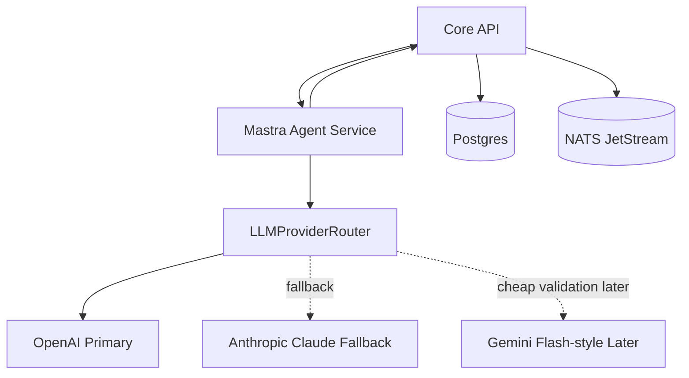
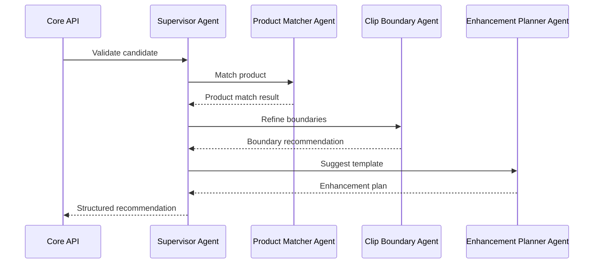
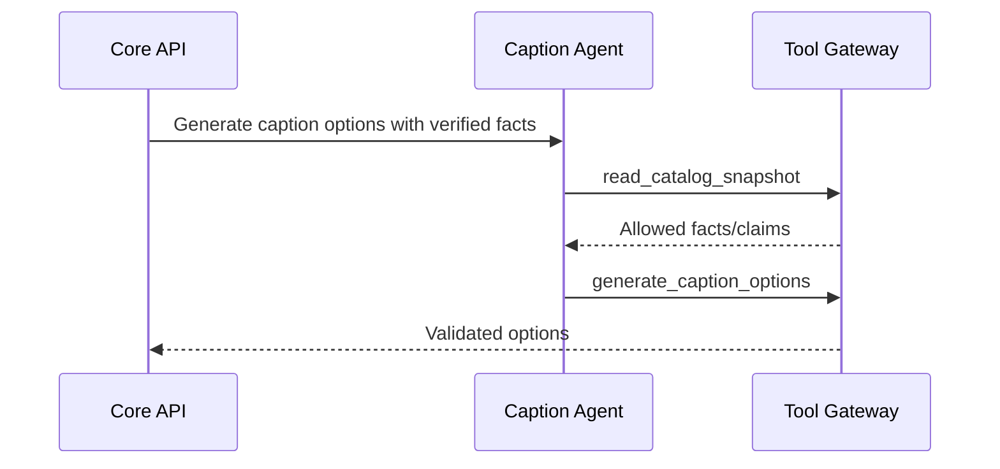

# 12 — Mastra Agent Architecture Specification

**Project:** Lumiq — Live Commerce Moment Vault  
**Document ID:** `12-agent-architecture-mastra.md`  
**Status:** Draft v1  
**Audience:** AI engineers, backend engineers, Mastra developers, QA, coding agents  
**Depends on:** `00-spec-index.md`, `01-product-requirements.md`, `02-project-constitution.md`, `03-glossary-domain-language.md`, `04-requirements-ears.md`, `06-system-architecture-c4.md`, `11-json-schemas.md`

---

## 1. Purpose

This document defines Lumiq’s Mastra-based agent architecture.

Lumiq uses Mastra for:

```txt
supervisor agent orchestration
specialist agent definitions
typed internal tools
structured outputs
agent reasoning flows
agent memory access
agent debugging/testing via Mastra Studio
```

Lumiq does **not** use Mastra as the durable execution source of truth.

Durable execution remains:

```txt
Core API
Postgres state machines
NATS JetStream
Python workers
Genblaze Worker
Backblaze B2
```

Core rule:

```txt
Mastra decides/recommends.
Core API validates/authorizes.
NATS dispatches.
Workers execute.
Genblaze generates media.
B2 stores media/proof.
Postgres tracks truth.
```

---

## 2. Why Mastra Is Used

Mastra is used because Lumiq has open-ended reasoning tasks that are not well represented as rigid workflows:

```txt
Is this a commercially valuable moment?
Which product does this moment show?
Where should the final trim begin/end?
Which template is appropriate?
Is this caption safe and grounded?
Does this generated output misrepresent the product?
How should the provenance be explained to a reviewer?
```

Mastra agents are used for these reasoning tasks, while backend state machines execute deterministic lifecycle steps.

---

## 3. Boundary Rules

### 3.1 Agents may do

```txt
read safe context through tools
analyze evidence
produce structured recommendations
suggest product matches
suggest clip boundaries
suggest templates
generate constrained copy options
classify QA failures
explain provenance
request human review
```

### 3.2 Agents must not do

```txt
write to B2
delete from B2
call Decart or media providers directly
call Genblaze directly
mutate Postgres state directly
publish externally
change budgets
change retention policy
hard delete assets
override product facts
approve their own restricted actions
```

### 3.3 Tool gateway

All agent side effects go through the Core API Agent Tool Gateway, which checks:

```txt
service identity
agent_id
tool_name
organization_id
session_id
moment_id
capability
automation policy
budget policy
state machine
JSON Schema
idempotency_key
trace_id
audit requirements
```

---

## 4. Runtime Topology



---

## 5. Mastra Service Responsibilities

```yaml
mastra_agent_service:
  runtime: typescript
  framework: mastra
  responsibilities:
    - define_agents
    - define_tools
    - validate_structured_outputs
    - call_llm_provider_router
    - retrieve_safe_context_through_core_api
    - call_agent_tool_gateway
    - record_tool_call_results
    - expose_internal_agent_endpoints
    - support_mastra_studio_debugging
  non_responsibilities:
    - b2_writes
    - provider_media_calls
    - direct_db_mutation
    - durable_workflow_state
    - publish_execution
    - deletion_execution
```

---

## 6. Agent Roster

### 6.1 Supervisor Agent

```yaml
agent_id: supervisor-agent-v1
role: coordinator
purpose: Combine specialist outputs and decide what the system should recommend for a candidate moment.
primary_model_task: supervisor_decision
default_provider: openai
fallback_provider: anthropic
tools:
  - read_session_context
  - read_candidate_evidence
  - read_catalog_snapshot
  - read_org_memory
  - validate_product_match
  - suggest_template
  - suggest_boundaries
  - propose_moment_candidate
outputs:
  - supervisor_recommendation
permissions:
  can_recommend_capture: true
  can_authorize_capture: false
  can_request_generation_directly: false
  can_publish: false
human_review_triggers:
  - confidence_below_threshold
  - product_match_uncertain
  - possible_product_misrepresentation
  - ungrounded_claim_detected
```

### 6.2 Signal / Moment Agent

```yaml
agent_id: signal-moment-agent-v1
role: candidate_interpreter
purpose: Interpret cheap signal bursts and convert them into candidate moment proposals.
primary_model_task: moment_validation
tools:
  - read_candidate_evidence
  - propose_moment_candidate
outputs:
  - candidate_moment_assessment
```

### 6.3 Product Matcher Agent

```yaml
agent_id: product-matcher-agent-v1
role: product_grounding
purpose: Match frames/transcript evidence against the session catalog snapshot.
primary_model_task: product_match
tools:
  - read_catalog_snapshot
  - read_candidate_evidence
  - validate_product_match
outputs:
  - product_match_result
forbidden:
  - invent_product
  - invent_price
  - invent_offer
  - override_catalog_snapshot
```

### 6.4 Clip Boundary Agent

```yaml
agent_id: clip-boundary-agent-v1
role: boundary_refinement
purpose: Suggest tighter final trim boundaries inside a generous raw capture window.
primary_model_task: moment_validation
tools:
  - read_candidate_evidence
  - suggest_boundaries
outputs:
  - clip_boundary_recommendation
```

### 6.5 Enhancement Planner Agent

```yaml
agent_id: enhancement-planner-agent-v1
role: template_selection
purpose: Recommend enhancement template, caption/product card behavior, and AI restyle policy.
primary_model_task: supervisor_decision
tools:
  - read_session_context
  - read_catalog_snapshot
  - suggest_template
outputs:
  - enhancement_plan
forbidden:
  - enabling_major_restyle_without_policy
  - selecting_unknown_template
  - bypassing_qa
```

### 6.6 Caption / Copy Agent

```yaml
agent_id: caption-copy-agent-v1
role: constrained_copy_generation
purpose: Generate hooks, titles, captions, descriptions, and hashtags using verified product/campaign facts.
primary_model_task: caption_generation
tools:
  - read_catalog_snapshot
  - generate_caption_options
outputs:
  - caption_copy_options
forbidden:
  - ungrounded_claims
  - fake_discount
  - fake_availability
  - unsupported_superlatives
```

### 6.7 QA Agent

```yaml
agent_id: qa-agent-v1
role: quality_and_safety_review
purpose: Classify QA results and recommend retry/rerender/review/terminate actions.
primary_model_task: qa_review
tools:
  - read_candidate_evidence
  - read_catalog_snapshot
  - explain_qa_result
outputs:
  - qa_agent_assessment
```

### 6.8 Provenance Explainer Agent

```yaml
agent_id: provenance-explainer-agent-v1
role: lineage_explanation
purpose: Convert technical provenance graphs into human-readable explanations.
primary_model_task: provenance_explanation
tools:
  - explain_provenance
outputs:
  - provenance_explanation
forbidden:
  - hiding_missing_lineage
  - claiming_verified_when_unverified
```

---

## 7. Interaction Patterns

### 7.1 Candidate validation



### 7.2 Caption generation



---

## 8. Tool Contracts

All tools use `agent-tool-call.schema.json`.

### 8.1 Common envelope

```json
{
  "tool_call_id": "01HZX9ABCDEF12345678901234",
  "agent_id": "supervisor-agent-v1",
  "tool_name": "propose_moment_candidate",
  "organization_id": "01HZX9ORGDEF12345678901234",
  "session_id": "01HZX9SESSDEF1234567890123",
  "moment_id": null,
  "requested_by_user_id": null,
  "idempotency_key": "agent-tool:supervisor:candidate:01H...",
  "trace_id": "trace_abc",
  "payload": {}
}
```

### 8.2 Tool catalog

```yaml
tools:
  read_session_context:
    side_effect: false
    required_capability: agent:read_session_context
    allowed_agents: [supervisor-agent-v1, enhancement-planner-agent-v1]

  read_candidate_evidence:
    side_effect: false
    required_capability: agent:read_evidence
    allowed_agents: [supervisor-agent-v1, signal-moment-agent-v1, product-matcher-agent-v1, clip-boundary-agent-v1, qa-agent-v1]

  read_catalog_snapshot:
    side_effect: false
    required_capability: agent:read_catalog_snapshot
    allowed_agents: [supervisor-agent-v1, product-matcher-agent-v1, enhancement-planner-agent-v1, caption-copy-agent-v1, qa-agent-v1]

  propose_moment_candidate:
    side_effect: true
    required_capability: moment:propose
    allowed_agents: [supervisor-agent-v1, signal-moment-agent-v1]
    forbidden_effects: [authorize_capture, capture_media, request_generation]

  validate_product_match:
    side_effect: true
    required_capability: product:match_suggest
    allowed_agents: [product-matcher-agent-v1, supervisor-agent-v1]

  suggest_boundaries:
    side_effect: true
    required_capability: moment:suggest_boundaries
    allowed_agents: [clip-boundary-agent-v1, supervisor-agent-v1]

  suggest_template:
    side_effect: true
    required_capability: template:suggest
    allowed_agents: [enhancement-planner-agent-v1, supervisor-agent-v1]

  generate_caption_options:
    side_effect: true
    required_capability: copy:suggest
    allowed_agents: [caption-copy-agent-v1]

  explain_qa_result:
    side_effect: true
    required_capability: qa:explain
    allowed_agents: [qa-agent-v1]

  explain_provenance:
    side_effect: false
    required_capability: provenance:explain
    allowed_agents: [provenance-explainer-agent-v1]
```

---

## 9. Structured Outputs

Agents must return machine-validated structured outputs. Freeform text is allowed only as an explanation field.

### 9.1 Supervisor recommendation

```yaml
supervisor_recommendation:
  recommendation: capture_and_enhance | capture_only | queue_for_review | ignore
  confidence: number_0_to_1
  moment_type: product_reveal | offer_mention | try_on | feature_demo | host_reaction | before_after | limited_stock_cta | unknown
  recommended_template_id: string_or_null
  requires_human_review: boolean
  reason: string
  evidence_refs: string_array
```

### 9.2 Product match result

```yaml
product_match_result:
  matches:
    - product_id: ulid
      sku: string
      confidence: number_0_to_1
      evidence_refs: string_array
      uncertainty_reason: string_or_null
  needs_human_review: boolean
```

### 9.3 Boundary recommendation

```yaml
clip_boundary_recommendation:
  recommended_start_ms: integer
  recommended_end_ms: integer
  hook_start_ms: integer_or_null
  cta_end_ms: integer_or_null
  confidence: number_0_to_1
  reason: string
```

### 9.4 QA assessment

```yaml
qa_agent_assessment:
  qa_status: passed | failed | review_required
  failure_class: retryable | remediable | review_required | terminal | null
  checks:
    - check_name: string
      status: pass | fail | uncertain
      reason: string
  recommended_action: approve_for_review | rerender | escalate_to_human | terminate
```

---

## 10. LLMProviderRouter

Agents must not hardcode models.

```yaml
llm_provider_router:
  default_provider: openai
  task_routes:
    supervisor_decision:
      primary: openai
      fallback: anthropic
      max_cost_usd: 0.10
      requires_structured_output: true
    moment_validation:
      primary: openai
      fallback: google_gemini_flash_later
      max_cost_usd: 0.02
      requires_multimodal: true
    product_match:
      primary: openai
      fallback: google_gemini_flash_later
      max_cost_usd: 0.04
      requires_multimodal: true
    caption_generation:
      primary: openai
      fallback: anthropic
      max_cost_usd: 0.03
      requires_product_grounding: true
    qa_review:
      primary: anthropic
      fallback: openai
      max_cost_usd: 0.08
      requires_careful_reasoning: true
    provenance_explanation:
      primary: openai
      fallback: anthropic
      max_cost_usd: 0.02
    embedding:
      primary: openai
      max_cost_usd: 0.01
```

Every significant LLM call must create an `llm_runs` record.

---

## 11. Memory Architecture

Mastra may use working/contextual memory during a run. Durable governed memory is stored in Postgres.

Memory types:

```txt
brand_style_memory
review_memory
campaign_memory
template_memory
agent_decision_memory
```

Agents access memory only through `read_org_memory`.

Memory cannot override:

```txt
catalog snapshot facts
allowed claims
human approvals
QA policy
budget policy
retention policy
product visual integrity rules
```

---

## 12. Guardrails

### Prompt injection

Treat all user/media-derived text as untrusted:

```txt
transcripts
captions
product descriptions
chat messages
user creative prompts
uploaded file text
model outputs
provider errors
```

### Tool misuse

Bad tools:

```txt
execute_action
run_sql
delete_anything
call_provider
```

Good tools:

```txt
suggest_template
validate_product_match
explain_qa_result
```

### Product claim guardrail

Agents must not output final product facts unless backed by catalog snapshot or allowed claims.

### Product appearance guardrail

Agents must flag possible AI restyle changes to product appearance.

---

## 13. Observability

Mastra agent runs must log structured metadata:

```txt
agent_id
task_type
organization_id
session_id
moment_id
llm_run_id
tool_call_ids
trace_id
status
latency_ms
input_hash
output_hash
```

Do not log:

```txt
full raw prompt
full transcript
provider secret
B2 credentials
raw model output in normal logs
```

---

## 14. Evaluation and Testing

Test fixtures:

```txt
high-confidence product reveal
medium-confidence offer mention
duplicate moment
uncertain product match
ungrounded discount claim
AI restyle product-color change
QA remediable caption drift
QA terminal corrupted source
```

Required pass conditions:

```txt
No ungrounded claim should pass.
No agent should call unauthorized tool.
No malformed structured output should trigger side effects.
No cross-tenant memory should be retrieved.
No major restyle should auto-publish without review.
```

---

## 15. Implementation Layout

```txt
/apps/mastra
  src/mastra/index.ts
  src/mastra/agents/
  src/mastra/tools/
  src/mastra/schemas/
  src/mastra/router/llm-provider-router.ts
  src/mastra/guardrails/
  src/mastra/evals/
```

---

## 16. P0 Implementation Slice

```txt
supervisor-agent-v1
signal-moment-agent-v1 minimal
product-matcher-agent-v1 minimal
enhancement-planner-agent-v1 minimal
caption-copy-agent-v1 minimal
qa-agent-v1 minimal
provenance-explainer-agent-v1 minimal

OpenAI primary only
Claude fallback later
minimal Postgres memory or mocked memory
```

---

## 17. Agent PR Checklist

```txt
[ ] Agent has narrow role and instructions.
[ ] Agent uses LLMProviderRouter.
[ ] Agent tools are approved.
[ ] Tool calls use agent-tool-call.schema.json envelope.
[ ] Structured outputs are schema-validated.
[ ] No direct B2/provider/DB mutation.
[ ] No raw prompt/transcript logging.
[ ] Product claims are grounded.
[ ] Guardrails tested.
[ ] Cross-tenant memory impossible.
[ ] Requirement IDs referenced.
```

---

## 18. Change Log

| Version | Change |
|---|---|
| v1 | Initial Mastra agent architecture spec |
