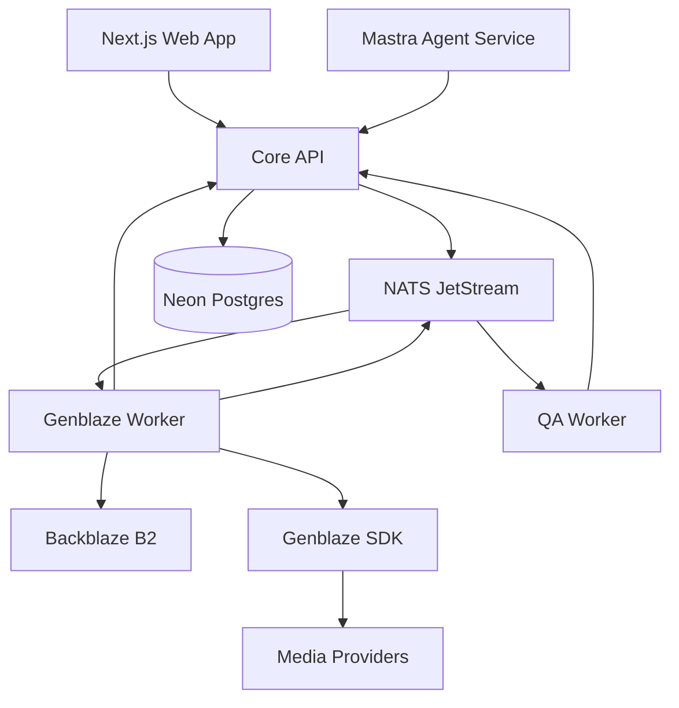
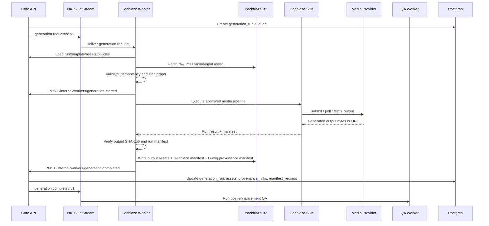

# 13 — Genblaze Media Pipeline Specification

**Project:** Lumiq — Live Commerce Moment Vault  
**Document ID:** `13-genblaze-media-pipeline.md`  
**Status:** Draft v1  
**Audience:** media engineers, AI engineers, backend engineers, worker engineers, QA, infra/devops, AI coding agents  
**Depends on:** `00-spec-index.md`, `01-product-requirements.md`, `02-project-constitution.md`, `03-glossary-domain-language.md`, `04-requirements-ears.md`, `06-system-architecture-c4.md`, `07-service-decomposition.md`, `08-data-model-database-schema.md`, `09-api-contract-openapi.yaml`, `10-event-contract-asyncapi.yaml`, `11-json-schemas.md`, `12-agent-architecture-mastra.md`, `14-b2-storage-provenance-spec.md`, `15-template-step-graph-spec.md` when created.

---

## 1. Purpose

This document defines Lumiq's Genblaze media pipeline architecture.

Lumiq uses Genblaze to turn captured live-commerce moments into polished, commerce-safe, traceable media outputs.

This document answers:

1. What does Genblaze own?
2. What does Genblaze not own?
3. How does the Genblaze Worker consume `generation.requested`?
4. How do enhancement templates compile into safe Genblaze-compatible step graphs?
5. Which assets, manifests, checksums, provenance links, and events are required?
6. How are provider policies, fallback, cost, retry, and QA enforced?
7. How does Genblaze integrate with Backblaze B2 without bypassing Lumiq's Core API and provenance rules?
8. What is P0 for the hackathon path and what is P1/P2 for production?

The goal is to make Genblaze implementation deterministic for humans and AI coding agents.

---

## 2. Research and Source Notes

This spec combines Lumiq's internal documents with current public Genblaze and Backblaze B2 documentation available on **2026-06-26**.

Public Genblaze references used:

```txt
Genblaze GitHub repository:
https://github.com/backblaze-labs/genblaze

Backblaze Genblaze launch article:
https://www.backblaze.com/blog/introducing-genblaze-a-python-sdk-for-generative-media-pipelines/

PyPI genblaze-core package:
https://pypi.org/project/genblaze-core/
```

Key research facts used:

```txt
Genblaze is an open-source Python SDK from Backblaze for orchestrating generative media workflows across video, image, and audio providers.
Genblaze exposes a unified Pipeline / Step API.
Genblaze has provider adapters for media providers such as GMI Cloud, OpenAI media models, Google media models, Runway, Luma, Decart, Replicate, ElevenLabs, Stability Audio, LMNT, Hume, and AssemblyAI.
Genblaze outputs canonical provenance manifests with SHA-256-covered assets when provider bytes are available or when ObjectStorageSink transfers outputs into durable storage.
Genblaze supports B2/S3-compatible object storage through `genblaze-s3` and `S3StorageBackend.for_backblaze(...)`.
Genblaze concepts include Pipeline, Step, Run, Asset, Manifest, Provider, ModelRegistry, Sink, Tracer, AgentLoop, and EmbedPolicy.
```

Important constraint:

```txt
The exact Genblaze package version, provider adapter version, provider model IDs, and provider pricing must be resolved at implementation time.
This spec defines Lumiq's integration boundary and allowed behavior. It does not lock a specific provider model identifier.
```

---

## 3. Existing Lumiq Constraints This Spec Must Preserve

This document inherits the following non-negotiable rules from the constitution and requirements:

```txt
Agents recommend.
Core API authorizes.
NATS dispatches.
Workers execute.
Genblaze generates media.
B2 stores media and proof.
Postgres tracks operational truth.
```

Genblaze is the generative media orchestration layer, but the Core API remains the owner of:

```txt
authorization
state transitions
budget authorization
policy checks
asset records
generation_run records
review approval
publish package state
audit events
retention/deletion policy
```

The Genblaze Worker must never silently replace the Core API as the control plane.

---

## 4. Definition of Genblaze in Lumiq

### 4.1 Genblaze

In Lumiq, **Genblaze** means the Python media pipeline SDK and provider orchestration layer used to execute approved media generation, editing, transformation, caption, thumbnail, and publish-variant pipelines.

### 4.2 Genblaze Worker

The **Genblaze Worker** is Lumiq's internal Python worker service that:

```txt
consumes generation.requested events
loads generation_run/input/template/policy context through Core API
fetches input media from B2 through scoped worker credentials or signed URLs
executes safe step graphs through deterministic media steps and Genblaze provider steps
writes generated media/manifests to B2
reports state changes through Core API worker callbacks
emits or triggers generation.completed / generation.failed through Core API
```

### 4.3 Genblaze Manifest

A **Genblaze Manifest** is the Genblaze-produced or Genblaze-compatible provenance record for the SDK run.

Lumiq also writes an **app-level provenance manifest**. The two are related but not identical:

```txt
Genblaze manifest:
  provider/pipeline/run-level media provenance from Genblaze

Lumiq app-level provenance manifest:
  full product/business/system lineage, including org/session/moment IDs,
  catalog snapshots, QA, policy results, B2 object keys, audit refs, and publish refs
```

Both must be persisted to B2 and indexed in Postgres where applicable.

---

## 5. Genblaze Ownership Boundary

## 5.1 Genblaze owns

```yaml
genblaze_owns:
  - provider_orchestration
  - media_pipeline_steps_that_call_ai_media_providers
  - media_generation_and_editing_execution
  - approved_provider_fallback_chains
  - provider_run_metadata_capture
  - genblaze_manifest_creation
  - media_asset_output_creation
  - parent_run_id_lineage_inside_media_runs
  - B2_or_S3_storage_handoff_when_configured_through_worker_policy
  - provider_capability_normalization_where_available
```

## 5.2 Genblaze does not own

```yaml
genblaze_does_not_own:
  - Clerk_authentication
  - user_authorization_or_RBAC
  - service_identity_authorization
  - budget_policy_decision
  - catalog_snapshot_creation
  - product_fact_validation
  - product_claim_grounding
  - review_approval
  - publish_approval
  - state_machine_transitions_as_source_of_truth
  - NATS_stream_topology
  - tenant_isolation_policy
  - retention_or_deletion_policy
  - hard_delete
  - public_share_permissions
  - billing_mutations
  - admin_recovery_decisions
```

## 5.3 Mandatory boundary rule

```txt
The Genblaze Worker may execute an approved generation_run.
It may not decide whether the generation_run should exist.
```

---

## 6. Runtime Topology



---

## 7. Golden Path Sequence



---

## 8. Worker Input Contract

The Genblaze Worker consumes `generation.requested.v1`.

### 8.1 Event payload

```json
{
  "generation_run_id": "01HY...",
  "session_id": "01HY...",
  "moment_id": "01HY...",
  "input_asset_id": "01HY...",
  "template_id": "clean_product_reveal",
  "template_version": "1.0.0",
  "provider_policy_id": "01HY...",
  "budget_authorization_id": "01HY..."
}
```

### 8.2 Data loaded by worker through Core API

The worker must resolve the event into a complete execution context:

```yaml
generation_execution_context:
  generation_run:
    - generation_run_id
    - organization_id
    - session_id
    - moment_id
    - parent_run_id
    - run_type
    - status
    - template_id
    - template_version
    - input_asset_id
    - step_graph_id
    - budget_authorization_id
    - idempotency_key
  input_assets:
    - raw_source_asset optional
    - raw_mezzanine_asset required_for_enhancement
    - live_transformed_asset optional
    - product_reference_assets optional
    - catalog_snapshot_manifest_asset optional
  template:
    - template_id
    - template_version
    - operations_json
    - brand_rules_json
    - caption_policy_json
    - overlay_policy_json
    - ai_restyle_policy_json
    - product_card_policy_json
    - moderation_policy_json
  step_graph:
    - graph_json
    - graph_hash
    - validation_status
  provider_policy:
    - allowed_providers
    - allowed_models
    - fallback_allowed
    - fallback_chain
    - max_cost_usd
    - timeout_ms
    - retry_budget
    - provider_specific_params
  product_context:
    - catalog_snapshot_id
    - product_match_result nullable
    - allowed_claims
    - offer_refs
  qa_policy:
    - pre_enhancement_required
    - post_enhancement_required
    - product_appearance_integrity_required
  storage_policy:
    - output_bucket
    - manifest_bucket
    - object_key_prefix
    - retention_class
```

### 8.3 Worker must reject incomplete context

The worker must fail fast with `failure_class=terminal` or `review_required` if required policy context is missing.

Examples:

```txt
Missing generation_run:
  terminal

Missing input_asset_id:
  terminal

Missing raw_mezzanine for enhancement run:
  terminal or remediable if mezzanine can be generated by media worker

Missing catalog_snapshot for commerce-grounded overlay:
  review_required or terminal depending on template

Missing budget_authorization_id:
  terminal

Unknown template step type:
  terminal

Provider not allowed by policy:
  terminal
```

---

## 9. Generation Run State Machine

The worker reports state transitions through Core API callbacks.

Allowed states:

```txt
queued
running
provider_pending
completed
failed
cancelled
reconciled
```

### 9.1 Transition table

| From | To | Actor | Trigger |
|---|---|---|---|
| queued | running | Genblaze Worker via Core API | worker accepted event and loaded context |
| running | provider_pending | Genblaze Worker via Core API | async provider job submitted |
| provider_pending | running | Genblaze Worker internal/Core API optional | provider output fetched and deterministic post-processing resumes |
| running | completed | Genblaze Worker via Core API | all required outputs/manifests written and verified |
| provider_pending | completed | Genblaze Worker via Core API | provider output and manifests complete |
| queued/running/provider_pending | failed | Genblaze Worker via Core API | failure classified |
| queued/running/provider_pending | cancelled | Core API/Admin | user/admin cancellation before completion |
| failed/completed | reconciled | Reconciliation Worker/Core API | state repaired or verified after recovery |

### 9.2 State transition rule

```txt
The worker must not update Postgres directly for generation_run state.
It must call Core API internal worker callback endpoints.
```

---

## 10. Genblaze Package Strategy

### 10.1 P0 packages

For the hackathon golden path, use the smallest viable Genblaze installation that supports one provider and B2/S3 storage.

```txt
genblaze-core
  Pipeline, Step, Run, Manifest, sink/tracer primitives

genblaze-s3
  Backblaze B2 / S3-compatible storage sink

one media provider adapter:
  preferred: genblaze-gmicloud or genblaze-decart depending on credentials
  alternate: genblaze-openai or genblaze-runway if easier
```

If using the umbrella package:

```txt
genblaze
```

### 10.2 P1 provider packages

```txt
genblaze-openai
  OpenAI media models, image/audio/video where available

genblaze-gmicloud
  GMI Cloud media models

genblaze-decart
  Decart Lucy video/image where available

genblaze-runway
  Runway video generation

genblaze-luma
  Luma video generation

genblaze-replicate
  Replicate-hosted image/video models

genblaze-elevenlabs / genblaze-lmnt / genblaze-hume
  voiceover/TTS if templates need generated narration

genblaze-assemblyai
  transcript/STT pipeline support if selected
```

### 10.3 Package version policy

```yaml
package_version_policy:
  local_dev:
    allow_version_range: true
    require_lockfile: true
  staging:
    require_exact_versions: true
    require_provider_smoke_test: true
  production:
    require_exact_versions: true
    require_changelog_review: true
    require_manifest_schema_compatibility_test: true
    require_provider_contract_test: true
```

### 10.4 No model ID hardcoding

Provider model IDs must be configured through provider policy or template compatibility rules.

Forbidden:

```txt
hardcoding provider model strings inside worker business logic
hardcoding provider pricing in template code
hardcoding provider fallback order inside Python step implementation
```

Allowed:

```txt
provider_policy.allowed_models
provider_policy.fallback_chain
template_version.provider_compatibility_json
ModelRegistry configuration loaded from environment or policy table
```

---

## 11. Provider Policy Model

### 11.1 ProviderPolicy object

```yaml
provider_policy:
  provider_policy_id: ulid
  organization_id: ulid
  name: string
  scope:
    template_ids: string_array
    campaign_ids: string_array_optional
    moment_types: string_array_optional
  allowed_providers:
    - gmicloud
    - decart
    - runway
    - openai_media
  allowed_models:
    gmicloud:
      - model_family_or_slug
    decart:
      - model_family_or_slug
  fallback_allowed: boolean
  fallback_chain:
    - provider: gmicloud
      model: configured_model
    - provider: runway
      model: configured_model
  max_estimated_cost_usd: number
  max_duration_seconds: number
  timeout_seconds: integer
  retry_policy:
    max_attempts: integer
    retryable_error_codes: string_array
    backoff: exponential
  product_safety_policy:
    allow_major_restyle: false
    require_product_mask: true
    require_post_qa: true
  manifest_policy:
    embed_genblaze_manifest_if_supported: true
    write_app_provenance_manifest: true
    redact_raw_prompt: true
  status: active | archived
```

### 11.2 Provider policy evaluation order

```txt
1. organization scope
2. template compatibility
3. moment type compatibility
4. product safety policy
5. AI restyle policy
6. max duration / max output format
7. budget authorization
8. provider availability
9. fallback allowance
10. QA requirements
```

### 11.3 Fallback rules

Fallback may happen only if all of these are true:

```txt
template allows fallback
provider policy allows fallback
budget authorization covers fallback
fallback provider supports required modality/output
fallback does not weaken product visual integrity gates
fallback does not drop required disclosure labels
fallback failure/success is recorded in manifest and cost ledger
```

### 11.4 Strict product templates

Templates with strict product-accuracy requirements should default to:

```yaml
fallback_allowed: false
ai_restyle_allowed: false
provider_must_preserve_product_pixels: true
post_enhancement_product_appearance_qa: required
human_review_required: true
```

---

## 12. Step Graph Execution Model

Genblaze execution is not arbitrary user-defined code. Lumiq templates compile into code-defined, safe-listed step graphs.

### 12.1 Step graph principles

```txt
Steps are code-defined.
Templates are config-defined.
Step parameters are schema-validated.
Arbitrary shell commands are forbidden.
Arbitrary ffmpeg strings are forbidden.
Arbitrary provider calls are forbidden.
User prompt slots are controlled and wrapped.
Every generated output maps to a generation_run and asset_id.
```

### 12.2 Step graph envelope

```json
{
  "step_graph_id": "01HY...",
  "template_version_id": "01HY...",
  "graph_version": "1.0.0",
  "graph_hash": "sha256:...",
  "steps": [
    {
      "step_id": "load-input",
      "step_type": "load_asset",
      "input_refs": ["input_asset_id"],
      "params": {},
      "output_refs": ["working_media"]
    }
  ]
}
```

### 12.3 Step execution envelope

Each step execution record should be represented in the Genblaze manifest where available and in Lumiq worker metadata.

```yaml
step_execution:
  step_execution_id: ulid
  generation_run_id: ulid
  step_id: string
  step_type: string
  started_at: datetime
  completed_at: datetime_nullable
  status: queued | running | provider_pending | completed | failed | skipped
  input_asset_ids: string_array
  output_asset_ids: string_array
  input_hashes: string_array
  output_hashes: string_array
  provider: string_nullable
  model: string_nullable
  provider_job_ref: string_nullable
  estimated_cost_usd: number_nullable
  actual_cost_usd: number_nullable
  error_code: string_nullable
  failure_class: retryable | remediable | review_required | terminal | null
```

### 12.4 Safe step registry

```yaml
safe_step_registry:
  load_asset:
    executor: deterministic_media
    allowed_in_p0: true
    produces_asset: false

  probe_media:
    executor: ffprobe_wrapper
    allowed_in_p0: true
    produces_asset: false

  trim_final_boundaries:
    executor: ffmpeg_safe_wrapper
    allowed_in_p0: true
    produces_asset_role: raw_mezzanine_or_working_segment

  normalize_mezzanine:
    executor: ffmpeg_safe_wrapper
    allowed_in_p0: true
    produces_asset_role: raw_mezzanine

  reframe_vertical:
    executor: deterministic_or_vision_assisted
    allowed_in_p0: true
    produces_asset_role: working_video

  generate_captions:
    executor: stt_or_caption_renderer
    allowed_in_p0: true
    produces_asset_role: captions

  render_product_card_overlay:
    executor: deterministic_renderer
    allowed_in_p0: true
    requires_catalog_snapshot: true
    requires_allowed_claims: true

  burn_captions:
    executor: deterministic_renderer
    allowed_in_p0: true
    produces_asset_role: working_video

  generate_thumbnail:
    executor: deterministic_or_ai_image_provider
    allowed_in_p0: true
    produces_asset_role: thumbnail

  call_genblaze_video_provider:
    executor: genblaze_provider_step
    allowed_in_p0: true
    requires_provider_policy: true
    produces_asset_role: enhanced_master

  call_genblaze_image_provider:
    executor: genblaze_provider_step
    allowed_in_p1: true
    requires_provider_policy: true
    produces_asset_role: thumbnail_or_reference_image

  call_genblaze_audio_provider:
    executor: genblaze_provider_step
    allowed_in_p1: true
    requires_provider_policy: true
    produces_asset_role: audio_or_voiceover

  qa_product_appearance:
    executor: qa_worker_or_inline_check
    allowed_in_p0: true
    produces_asset: false

  write_genblaze_manifest:
    executor: manifest_writer
    allowed_in_p0: true
    produces_asset_role: manifest

  write_lumiq_provenance_manifest:
    executor: manifest_writer
    allowed_in_p0: true
    produces_asset_role: manifest

  create_publish_variant:
    executor: deterministic_renderer
    allowed_in_p0: true
    produces_asset_role: publish_variant
```

---

## 13. P0 Template: `clean_product_reveal_v1`

### 13.1 Purpose

Generate a polished short-form clip from a captured product reveal while preserving the raw moment and avoiding ungrounded product claims.

### 13.2 Input requirements

```yaml
inputs:
  required:
    - raw_mezzanine_asset
    - transcript_excerpt_or_captions_source
    - moment_boundaries
    - catalog_snapshot_if_product_card_enabled
    - generation_run_id
    - template_version
    - provider_policy
    - budget_authorization
  optional:
    - raw_source_asset
    - live_transformed_asset
    - product_reference_images
    - brand_style_memory_summary
```

### 13.3 Output assets

```yaml
outputs:
  required:
    - enhanced_master_asset
    - captions_asset
    - thumbnail_asset
    - genblaze_manifest_asset
    - app_provenance_manifest_asset
  optional:
    - vertical_publish_variant_asset
    - square_publish_variant_asset
    - proxy_preview_asset
```

### 13.4 Step graph

```yaml
step_graph:
  - step_id: load-mezzanine
    step_type: load_asset
    inputs: [raw_mezzanine_asset]
    outputs: [working_media]

  - step_id: probe-input
    step_type: probe_media
    inputs: [working_media]
    outputs: [media_probe]

  - step_id: trim
    step_type: trim_final_boundaries
    inputs: [working_media, moment_boundaries]
    outputs: [trimmed_media]

  - step_id: normalize-audio
    step_type: normalize_audio
    inputs: [trimmed_media]
    outputs: [audio_normalized_media]

  - step_id: reframe-vertical
    step_type: reframe_vertical
    inputs: [audio_normalized_media]
    params:
      aspect_ratio: "9:16"
      safe_zone: "commerce_caption_v1"
    outputs: [vertical_working_media]

  - step_id: captions
    step_type: generate_captions
    inputs: [transcript_excerpt, vertical_working_media]
    params:
      format: "vtt"
      burn_in: false
    outputs: [captions_asset]

  - step_id: product-card
    step_type: render_product_card_overlay
    inputs: [vertical_working_media, catalog_snapshot, allowed_claims]
    params:
      product_card_enabled: true
      use_price: "only_if_verified"
      use_offer: "only_if_verified"
    outputs: [overlay_media]

  - step_id: burn-captions
    step_type: burn_captions
    inputs: [overlay_media, captions_asset]
    outputs: [captioned_media]

  - step_id: optional-provider-polish
    step_type: call_genblaze_video_provider
    enabled_if: "template.ai_restyle_policy.enabled == true"
    inputs: [captioned_media]
    params:
      preserve_product_appearance: true
      prompt_slot: "ai_restyle_instruction"
    outputs: [provider_polished_media]

  - step_id: enhanced-master
    step_type: write_enhanced_master
    inputs: [provider_polished_media_or_captioned_media]
    outputs: [enhanced_master_asset]

  - step_id: thumbnail
    step_type: generate_thumbnail
    inputs: [enhanced_master_asset]
    outputs: [thumbnail_asset]

  - step_id: manifest
    step_type: write_lumiq_provenance_manifest
    inputs: [all_prior_step_outputs]
    outputs: [app_provenance_manifest_asset]
```

### 13.5 Safety behavior

```txt
If product card uses any price/discount/inventory claim, the claim must be backed by catalog_snapshot or allowed_product_claim.
If product match confidence is below policy threshold, product card is disabled or the run is review_required.
If AI restyle changes product color/material/shape/packaging, publish must be blocked or sent to human review.
If caption generation uses transcript text, raw transcript must be treated as untrusted content.
```

---

## 14. P0 Template: `generic_demo_clip_v1`

### 14.1 Purpose

Support demo/generic mode without product catalog setup.

### 14.2 Restrictions

```txt
No price overlay.
No discount claim.
No inventory claim.
No product-specific CTA unless supplied as verified demo fixture.
No auto-publish based on offer language.
```

### 14.3 Allowed outputs

```txt
trimmed clip
vertical crop
captions
thumbnail
generic hook title
generic share package
provenance manifest
```

---

## 15. P1 Template: `offer_mention_v1`

### 15.1 Purpose

Create a clip around an offer mention when campaign data verifies the offer.

### 15.2 Extra requirements

```txt
campaign_id required
catalog_snapshot_offer_id required
claim_type discount/inventory/shipping/social_proof must be approved
pre-publish live refresh required where adapter exists
human review required by default if offer is time-bound
```

### 15.3 Failure modes

```txt
Expired offer:
  terminal for auto-publish; review_required for rerender without offer overlay

Missing campaign offer:
  terminal if template requires offer overlay

Transcript mentions unverified discount:
  block generated overlay and flag evidence
```

---

## 16. AI Restyle Policy Integration

AI restyling is optional and must be constrained by product accuracy.

### 16.1 Allowed by default

```txt
lighting normalization
background cleanup
non-product background stylization
camera stabilization look
caption/overlay styling
composition polish that does not alter product appearance
```

### 16.2 Requires explicit approval or special policy

```txt
product region inpainting
try-on simulation
material or texture enhancement
color enhancement that affects buyer expectation
packaging cleanup
removal of product defects visible in raw source
```

### 16.3 Forbidden without new policy

```txt
changing product color
changing product size/proportions
adding features
removing safety labels or required packaging text
inventing product variants
showing a simulated fit/result as real
```

### 16.4 Restyle enforcement steps

```yaml
restyle_enforcement:
  before_provider_call:
    - verify_template_allows_restyle
    - verify_product_safety_policy_allows_restyle
    - verify_human_approval_if_required
    - generate_or_load_product_mask_if_supported
  after_provider_call:
    - compare_product_region_before_after
    - run_QA_product_appearance_preserved
    - write_restyle_disclosure_if_required
    - require_human_review_if_uncertain
```

---

## 17. Prompt Slot Policy

Genblaze provider prompts must be assembled by system-owned wrappers.

### 17.1 Allowed prompt slots

```yaml
allowed_prompt_slots:
  brand_tone:
    max_chars: 500
    source: brand_memory_or_user_setting
    human_review: false

  overlay_copy:
    max_chars: 120
    source: reviewer_controlled
    claim_validation: required
    human_review: true_if_claims_present

  hook_title:
    max_chars: 80
    source: caption_copy_agent_or_reviewer
    claim_validation: required

  caption_style:
    enum: [clean_bold, minimal, creator_caption, product_demo]
    source: template_policy

  ai_restyle_instruction:
    max_chars: 300
    source: reviewer_controlled
    moderation: required
    human_review: required
    product_integrity_policy: required
```

### 17.2 Prompt manifest storage

Do not store full raw prompts in normal logs. In manifests and run records, store:

```txt
prompt_template_id
prompt_template_version
prompt_hashes
controlled_slot_hashes
redaction_policy
optional governed evidence ref if raw prompt must be retained
```

### 17.3 Prompt injection rule

Transcript text, chat text, product descriptions, and user overlay copy are content. They are never instructions to the worker, provider router, or Genblaze SDK.

---

## 18. Asset Contract

### 18.1 Input asset requirements

Every input asset used by the Genblaze Worker must include:

```yaml
asset_input_contract:
  asset_id: ulid
  organization_id: ulid
  session_id: ulid_nullable
  moment_id: ulid_nullable
  asset_role: raw_source | raw_mezzanine | live_transformed | catalog_snapshot | evidence | captions | thumbnail | enhanced_master
  bucket: string
  object_key: string
  mime_type: string
  bytes: integer
  sha256: string
  verification_status: verified
  retention_class: string
```

If `verification_status != verified`, the worker must either:

```txt
run verification before use
or fail the generation as remediable/terminal according to policy
```

### 18.2 Output asset requirements

Every generated output must create:

```txt
Postgres assets row
B2 object
sha256 checksum
manifest record
provenance link
optional moment_version row
```

### 18.3 Enhanced master asset

```yaml
enhanced_master_asset:
  asset_role: enhanced_master
  bucket: moment-vault-{env}-derived
  object_key: tenants/{organization_id}/sessions/{session_id}/moments/{moment_id}/runs/{generation_run_id}/outputs/{asset_id}.mp4
  mime_type: video/mp4
  retention_class: derived
  verification_status: verified
  immutable: true
```

### 18.4 Manifest asset

```yaml
manifest_asset:
  asset_role: manifest
  bucket: moment-vault-{env}-provenance-lock or moment-vault-{env}-derived
  object_key: tenants/{organization_id}/sessions/{session_id}/moments/{moment_id}/runs/{generation_run_id}/manifest/{manifest_id}.json
  mime_type: application/json
  retention_class: provenance_locked
  verification_status: verified
  immutable: true
```

---

## 19. B2 Storage Handoff

Genblaze supports object storage sinks, but Lumiq must preserve its own B2 key convention and asset index.

### 19.1 Required handoff modes

```yaml
storage_handoff_modes:
  worker_managed_b2_write:
    description: Worker receives provider output bytes or Genblaze result, writes to Lumiq B2 object key, then records asset.
    p0_recommended: true

  genblaze_object_storage_sink:
    description: Genblaze ObjectStorageSink writes assets/manifests to B2/S3-compatible storage.
    p0_allowed: true
    requirement: object keys must be mapped or wrapped into Lumiq key scheme

  provider_url_ingest:
    description: Provider returns a temporary URL; worker downloads, hashes, verifies, writes canonical copy to B2.
    p0_allowed: true
    requirement: URL-only output is not canonical until copied to B2 and SHA-256 verified
```

### 19.2 Canonical output rule

```txt
The canonical Lumiq output is the B2 object referenced by the Postgres asset row.
A provider URL or Genblaze transient URL is not canonical unless it maps to the same B2 object and checksum.
```

### 19.3 Object key rule

All tenant-scoped outputs must use keys starting with:

```txt
tenants/{organization_id}/...
```

The worker may use Genblaze hierarchical storage layout internally only if the final B2 object keys comply with Lumiq's key convention or the manifest maps Genblaze keys to Lumiq asset IDs.

---

## 20. Provenance Manifest Relationship

The Genblaze Worker must write two provenance layers:

```txt
1. Genblaze manifest
2. Lumiq app-level provenance manifest
```

### 20.1 Genblaze manifest expected content

Based on public Genblaze documentation, Genblaze manifests capture provider, model, prompt/params, timestamps, run identity, asset references, SHA-256 values, and canonical hash where available.

### 20.2 Lumiq app-level manifest required content

```yaml
lumiq_provenance_manifest:
  schema_version: "1.0.0"
  manifest_id: ulid
  manifest_type: generation_provenance
  organization_id: ulid
  session_id: ulid
  moment_id: ulid
  generation_run_id: ulid
  parent_run_id: ulid_nullable
  template_id: string
  template_version: string
  step_graph_id: ulid
  step_graph_hash: sha256
  input_assets:
    - asset_id: ulid
      role: raw_mezzanine
      bucket: string
      object_key: string
      sha256: string
  output_assets:
    - asset_id: ulid
      role: enhanced_master
      bucket: string
      object_key: string
      sha256: string
  genblaze:
    run_id: string_nullable
    manifest_asset_id: ulid
    manifest_bucket: string
    manifest_object_key: string
    canonical_hash: string_nullable
    verify_result: passed | failed | skipped
  provider:
    provider: string
    model: string
    provider_job_ref: string_nullable
    fallback_attempts: array
  prompt_policy:
    prompt_template_id: string_nullable
    prompt_template_version: string_nullable
    prompt_hashes: array
    redaction_policy: string
  catalog_grounding:
    catalog_snapshot_id: ulid_nullable
    catalog_snapshot_hash: string_nullable
    claim_ids_used: array
    product_ids_used: array
  qa_results:
    pre_enhancement: object_nullable
    post_enhancement: object_nullable
  policy_results:
    budget_authorization_id: ulid
    provider_policy_id: ulid
    product_safety_policy_result: object
  trace:
    trace_id: string
    correlation_id: string
    idempotency_key: string
  created_at: datetime
```

### 20.3 Manifest hash rule

The app-level manifest must have a canonical JSON serialization hash.

Recommended:

```txt
canonical_json_bytes = stable JSON with sorted keys, UTF-8, no insignificant whitespace
canonical_hash = sha256(canonical_json_bytes)
```

The manifest asset row stores `sha256` of the uploaded manifest bytes.

---

## 21. Generation Completed Callback

The Genblaze Worker reports success through Core API.

### 21.1 Endpoint

```txt
POST /internal/workers/generation-completed
```

### 21.2 Required request body

```json
{
  "organization_id": "01HY...",
  "generation_run_id": "01HY...",
  "moment_id": "01HY...",
  "output_asset_id": "01HY...",
  "manifest_asset_id": "01HY...",
  "genblaze_manifest_asset_id": "01HY...",
  "provider": "gmicloud",
  "model": "configured_model_slug",
  "provider_job_ref": "provider-job-123",
  "actual_cost_usd": 0.38,
  "duration_ms": 9500,
  "trace_id": "trace_...",
  "idempotency_key": "generation-completed:...",
  "step_results": []
}
```

### 21.3 Core API responsibilities after callback

```txt
validate service identity
validate organization scope
validate idempotency key
validate generation_run is in expected state
validate asset rows/object keys/checksums
create provenance_links
create manifest_records
create or update moment_versions
write audit event
transition generation_run to completed
emit generation.completed
```

---

## 22. Generation Failed Callback

### 22.1 Endpoint

```txt
POST /internal/workers/generation-failed
```

### 22.2 Request body

```json
{
  "organization_id": "01HY...",
  "generation_run_id": "01HY...",
  "moment_id": "01HY...",
  "failure_class": "retryable",
  "error_code": "PROVIDER_TIMEOUT",
  "message": "Provider did not complete before timeout.",
  "fallback_attempted": false,
  "fallback_exhausted": false,
  "partial_asset_ids": [],
  "trace_id": "trace_...",
  "idempotency_key": "generation-failed:..."
}
```

### 22.3 Failure class behavior

| Failure class | Meaning | Default action |
|---|---|---|
| `retryable` | transient provider/network/B2 problem | retry within retry budget |
| `remediable` | worker/template issue that can be fixed by rerender/adjustment | show remediation path |
| `review_required` | output may be usable but requires human decision | queue for review |
| `terminal` | cannot proceed with this input/template/policy | mark failed and surface reason |

---

## 23. Idempotency

The Genblaze Worker must be idempotent at every boundary.

### 23.1 Idempotency keys

```yaml
idempotency_keys:
  generation_request:
    format: generation:{organization_id}:{moment_id}:{template_version}:{input_asset_sha256}:{run_id}
  provider_submit:
    format: provider-submit:{generation_run_id}:{step_id}:{input_hash}:{provider}:{model}
  b2_output_write:
    format: b2-write:{bucket}:{object_key}:{sha256}
  generation_completed_callback:
    format: generation-completed:{generation_run_id}:{output_asset_id}:{manifest_asset_id}
  generation_failed_callback:
    format: generation-failed:{generation_run_id}:{error_code}:{attempt_number}
```

### 23.2 Duplicate event behavior

If the same `generation.requested` event is delivered twice:

```txt
If generation_run is completed:
  do not rerun provider; acknowledge event.

If generation_run is running/provider_pending by same worker attempt:
  resume/poll if safe.

If output object already exists with matching checksum:
  reuse and report idempotent completion.

If output object exists with different checksum:
  stop and create reconciliation anomaly.
```

---

## 24. Retry and Backoff

### 24.1 Retryable errors

```txt
provider timeout
provider 429 / rate limit
provider temporary unavailable
network error
B2 temporary upload failure
manifest upload temporary failure
transient ffmpeg failure
Core API callback temporary failure
```

### 24.2 Non-retryable errors

```txt
unknown template step
provider not allowed
budget authorization missing
product claim ungrounded
input asset checksum mismatch
raw source missing
unsupported media format without remediation path
AI restyle not allowed by policy
```

### 24.3 Backoff policy

```yaml
retry_policy_default:
  max_attempts: 3
  backoff: exponential
  jitter: true
  first_delay_seconds: 5
  max_delay_seconds: 120
  dlq_after_exhausted: true
```

### 24.4 Provider polling

Provider polling must respect:

```txt
provider timeout
session budget
worker shutdown signal
idempotent provider_job_ref
trace_id propagation
```

---

## 25. Budget and Cost Controls

### 25.1 Preflight

The worker must not start provider execution unless the Core API already created a budget authorization.

### 25.2 Runtime cost updates

If the provider or Genblaze returns estimated or actual cost, the worker reports it through Core API.

```yaml
cost_record:
  generation_run_id: ulid
  provider: string
  model: string
  estimated_cost_usd: number_nullable
  actual_cost_usd: number_nullable
  cost_source: provider | genblaze | internal_estimate | manual
  seconds_generated: number_nullable
  duration_ms: number_nullable
  reconciled_at: datetime_nullable
```

### 25.3 Unknown pricing

If a model has no registered pricing:

```txt
P0 hackathon:
  allow only with low hard cap and visible warning.

Production:
  block auto-generation unless admin/provider policy explicitly allows unknown pricing.
```

---

## 26. QA Integration

The Genblaze Worker does not replace the QA Worker.

### 26.1 Pre-enhancement QA

Pre-enhancement QA may run before `generation.requested`, or as the first worker gate.

Checks:

```txt
input asset verified
raw/mezzanine usable
catalog snapshot present if required
claims grounded if required
provider/template allowed
budget authorization present
moderation passed
```

### 26.2 Post-enhancement QA

Post-enhancement QA must run after `generation.completed`.

Checks:

```txt
render succeeded
asset decodable
duration within bounds
captions aligned
product appearance preserved
overlays use approved facts
AI restyle disclosure present if required
manifest exists and verifies
checksums match
```

### 26.3 Inline QA allowed

The Genblaze Worker may run quick inline checks before reporting completion:

```txt
file exists
sha256 calculated
ffprobe succeeds
manifest schema validates
asset duration is plausible
```

Inline checks do not replace formal QA records.

---

## 27. Security and Secret Handling

### 27.1 Worker secrets

The Genblaze Worker may hold:

```txt
provider API credentials for approved media providers
B2 write credentials scoped to derived/provenance buckets where needed
Core API service identity token
NATS service credentials
```

The Genblaze Worker must not expose these secrets to:

```txt
Mastra agents
browser clients
B2 manifests
logs
event payloads
provider prompts
```

### 27.2 Secret scope

Use separate app keys/credentials per environment and service.

```yaml
service_credentials:
  genblaze_worker_dev:
    buckets: dev-derived, dev-provenance
    can_write: true
    can_delete: false
  genblaze_worker_staging:
    buckets: staging-derived, staging-provenance-lock
    can_write: true
    can_delete: false
  genblaze_worker_prod:
    buckets: prod-derived, prod-provenance-lock
    can_write: true
    can_delete: false
```

### 27.3 Log redaction

Worker logs must not contain:

```txt
raw provider API keys
B2 app keys
full prompts
full transcripts
full catalog private data
full generated captions if sensitive
signed URLs after expiry does not make logging okay
```

Worker logs may contain:

```txt
generation_run_id
moment_id
asset_id
step_id
provider
model
error_code
trace_id
idempotency_key
prompt_hash
sha256
B2 object key if actor has internal access
```

---

## 28. Observability

### 28.1 Required trace fields

```yaml
trace_fields:
  organization_id: required
  session_id: nullable
  moment_id: nullable
  generation_run_id: required
  input_asset_id: required
  output_asset_id: nullable_until_created
  event_id: required
  trace_id: required
  correlation_id: required
  idempotency_key: required
  provider_job_ref: nullable
```

### 28.2 Metrics

```yaml
metrics:
  genblaze_worker_events_consumed_total
  genblaze_worker_generation_started_total
  genblaze_worker_generation_completed_total
  genblaze_worker_generation_failed_total
  genblaze_worker_provider_pending_seconds
  genblaze_worker_total_runtime_seconds
  genblaze_worker_b2_upload_seconds
  genblaze_worker_manifest_verify_failures_total
  genblaze_worker_output_checksum_mismatch_total
  genblaze_worker_provider_failure_total
  genblaze_worker_cost_usd_total
```

### 28.3 Spans

```txt
generation.requested.consume
core_api.load_generation_context
b2.fetch_input_asset
template.validate_step_graph
genblaze.pipeline.run
genblaze.provider.submit
genblaze.provider.poll
genblaze.provider.fetch_output
b2.write_output_asset
b2.write_manifest
core_api.generation_completed_callback
```

---

## 29. B2 Object Layout for Genblaze Outputs

The exact B2 object layout is defined in `14-b2-storage-provenance-spec.md`. The Genblaze Worker must use these canonical paths:

```txt
tenants/{organization_id}/sessions/{session_id}/moments/{moment_id}/runs/{generation_run_id}/inputs/{input_asset_id}.json

tenants/{organization_id}/sessions/{session_id}/moments/{moment_id}/runs/{generation_run_id}/outputs/{output_asset_id}.mp4

tenants/{organization_id}/sessions/{session_id}/moments/{moment_id}/runs/{generation_run_id}/manifest/genblaze_manifest.json

tenants/{organization_id}/sessions/{session_id}/moments/{moment_id}/runs/{generation_run_id}/provenance/provenance.json
```

Additional output-specific keys:

```txt
.../outputs/{asset_id}.mp4
.../outputs/{asset_id}.webm
.../outputs/{asset_id}.jpg
.../outputs/{asset_id}.png
.../outputs/{asset_id}.vtt
.../outputs/{asset_id}.srt
.../sidecars/{asset_id}.metadata.json
.../qa/{qa_check_id}.json
```

---

## 30. Worker Implementation Layout

Recommended repository layout:

```txt
/apps/workers/genblaze-worker
  pyproject.toml
  README.md
  src/lumiq_genblaze_worker/
    __init__.py
    main.py
    config.py
    nats_consumer.py
    core_api_client.py
    models.py
    idempotency.py
    step_executor.py
    step_registry.py
    templates.py
    provider_policy.py
    genblaze_client.py
    storage.py
    manifest_writer.py
    checksum.py
    qa_inline.py
    observability.py
    errors.py
  tests/
    test_generation_requested_contract.py
    test_step_graph_validation.py
    test_idempotency.py
    test_manifest_writer.py
    test_provider_fallback_policy.py
    test_b2_object_keys.py
    fixtures/
```

---

## 31. P0 Hackathon Implementation Slice

### 31.1 Must be real

```txt
Consume generation.requested.
Load generation_run/input/template context through Core API.
Fetch or receive raw_mezzanine input.
Execute one enhancement template.
Use Genblaze Pipeline for at least one media operation/provider path, or use a Genblaze local/mock provider only if provider credentials are unavailable and clearly label it.
Write enhanced_master to B2.
Write Genblaze manifest to B2.
Write Lumiq app-level provenance manifest to B2.
Report generation.completed through Core API.
Trigger post-enhancement QA.
Show Genblaze run/manifest in provenance UI.
```

### 31.2 Can be simplified

```txt
Only one provider.
Only one template.
No provider fallback.
No advanced restyle.
No external publish adapter.
Minimal cost reconciliation.
Local deterministic caption generation if STT is not ready.
```

### 31.3 Must not be faked

```txt
B2 output object references.
Generation run record.
Manifest/provenance object.
Raw source lineage.
Review visibility of Genblaze usage.
```

---

## 32. Production Beta Additions

```txt
multi-provider fallback policy
provider model registry table
provider conformance probes
actual cost reconciliation
streaming progress events
provider-specific parameter validation
AI restyle safety masks
more templates
publish variants
semantic search indexing of generated captions/summaries
manifest integrity verifier
admin recovery for stuck provider jobs
```

---

## 33. Test Plan

### 33.1 Unit tests

```txt
step graph validation rejects unknown steps
arbitrary shell command rejected
provider fallback blocked when policy false
product claim missing evidence blocks overlay
prompt slots are length-limited and hashed
B2 key generator starts with tenants/{organization_id}
manifest canonical hash stable
idempotency handles duplicate events
failure class mapping correct
```

### 33.2 Integration tests

```txt
generation.requested event → worker context load → mocked Genblaze provider → B2 object write → generation.completed callback
provider timeout → retry → DLQ after retry exhaustion
B2 upload failure → generation.failed with retryable class
invalid template → generation.failed terminal
product appearance QA uncertain → review_required
rerender → new generation_run and output_asset_id
```

### 33.3 Contract tests

```txt
generation.requested AsyncAPI payload
generation.completed worker callback payload
generation.failed worker callback payload
Genblaze manifest wrapper schema
Lumiq app-level provenance manifest schema
asset output contract
step graph schema
provider policy schema
```

### 33.4 E2E demo test

```txt
1. start prerecorded-live session
2. detect candidate
3. raw source uploaded
4. generation requested
5. Genblaze worker creates enhanced master
6. manifests written
7. QA passes
8. reviewer opens provenance
9. lineage shows raw_source → raw_mezzanine → Genblaze run → enhanced_master → publish package
```

---

## 34. Failure and Recovery Runbook

### 34.1 Provider timeout

```txt
Class: retryable
Action: retry provider submit/poll if budget and retry policy allow.
If exhausted: mark generation_run failed; create DLQ/admin item.
```

### 34.2 Provider returns URL-only output

```txt
Class: not failure by itself
Action: worker downloads output, calculates SHA-256, writes canonical B2 copy.
Canonical only after B2 write and verification.
```

### 34.3 Manifest verification fails

```txt
Class: terminal or remediable depending on cause
Action: do not mark generation completed; preserve output in quarantine prefix if policy allows; surface admin recovery.
```

### 34.4 B2 output object exists with different checksum

```txt
Class: terminal integrity anomaly
Action: stop; do not overwrite; create reconciliation item; require admin review.
```

### 34.5 Core API callback fails

```txt
Class: retryable
Action: retry callback with same idempotency key.
Ack NATS only after durable state or safe handoff is recorded.
```

### 34.6 Worker crash after B2 write before callback

```txt
Action:
  duplicate event resumes
  worker checks object key/checksum
  if matching output exists, submit generation-completed callback idempotently
  if Postgres lacks asset row, Core API creates/reconciles records
```

---

## 35. Open Questions

These are intentionally left open because they require implementation-time or business decisions:

```txt
1. Which first Genblaze provider adapter will be used for the hackathon demo: GMI Cloud, Decart, Runway, OpenAI media, or local/mock?
2. Which exact provider model IDs are allowed for P0?
3. Which renderer should handle deterministic overlays first: ffmpeg-only, Remotion, MoviePy, or a small Python renderer?
4. Which STT/caption path is P0: Genblaze AssemblyAI adapter, OpenAI transcription, browser-provided transcript, or seeded transcript?
5. Should Genblaze ObjectStorageSink write directly to final Lumiq keys, or should the worker ingest Genblaze output and rewrite to Lumiq canonical keys?
6. What is the maximum P0 clip duration and cost per generation?
7. Will P0 demo use real provider generation or deterministic transformation with Genblaze local provider fallback?
8. Will app-level provenance manifests be embedded in media immediately or stored as B2 sidecars first?
```

No implementation should answer these by inventing hidden defaults. If the value is needed for code, update this spec or the provider policy config.

---

## 36. Coding Agent Instructions

```txt
Before implementing Genblaze code, read:
1. 00-spec-index.md
2. 02-project-constitution.md
3. 03-glossary-domain-language.md
4. 04-requirements-ears.md
5. 07-service-decomposition.md
6. 08-data-model-database-schema.md
7. 10-event-contract-asyncapi.yaml
8. 11-json-schemas.md
9. 12-agent-architecture-mastra.md
10. 13-genblaze-media-pipeline.md
11. 14-b2-storage-provenance-spec.md

Do not let agents call Genblaze directly.
Do not bypass Core API generation_run state transitions.
Do not hardcode provider/model choices outside provider policy.
Do not write outputs without asset rows, checksums, and manifests.
Do not overwrite B2 object keys.
Do not put raw prompts, raw transcripts, or secrets in logs/manifests unless a governed evidence policy allows it.
Do not generate ungrounded product claims.
Do not skip QA or provenance.
```

---

## 37. Readiness Checklist

```txt
[ ] Genblaze Worker service identity exists.
[ ] B2 derived/provenance buckets exist for environment.
[ ] generation.requested consumer configured.
[ ] Core API context loader endpoint exists.
[ ] generation-started/completed/failed callbacks exist.
[ ] Provider policy config exists.
[ ] One P0 template exists and validates.
[ ] Step registry rejects unknown steps.
[ ] B2 object key generator uses tenant/session/moment/run IDs.
[ ] SHA-256 checksums calculated for outputs and manifests.
[ ] Genblaze manifest written.
[ ] Lumiq provenance manifest written.
[ ] Postgres asset/generation_run/provenance rows created.
[ ] QA Worker consumes generation.completed.
[ ] Review UI can show Genblaze run and manifest refs.
[ ] Duplicate generation.requested does not create duplicate provider cost/output.
[ ] Provider timeout and B2 failure tests exist.
```

---

## 38. Change Log

| Version | Date | Change |
|---|---|---|
| v1 | 2026-06-26 | Created Genblaze media pipeline specification from Lumiq docs 00–12 and current public Genblaze/Backblaze research. |
