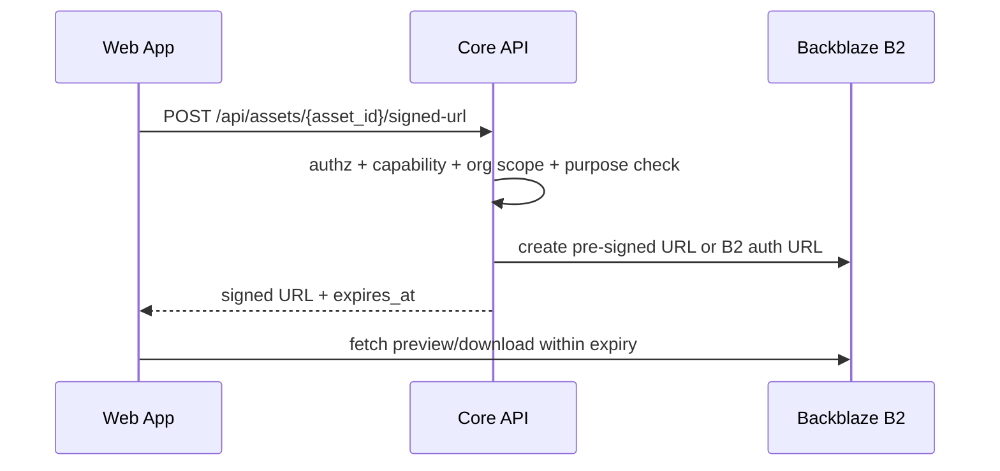

# 14 — B2 Storage & Provenance Specification

**Project:** Lumiq — Live Commerce Moment Vault  
**Document ID:** `14-b2-storage-provenance-spec.md`  
**Status:** Draft v1  
**Audience:** storage engineers, backend engineers, media engineers, QA, security, infra/devops, AI coding agents  
**Depends on:** `00-spec-index.md`, `01-product-requirements.md`, `02-project-constitution.md`, `03-glossary-domain-language.md`, `04-requirements-ears.md`, `06-system-architecture-c4.md`, `07-service-decomposition.md`, `08-data-model-database-schema.md`, `09-api-contract-openapi.yaml`, `10-event-contract-asyncapi.yaml`, `11-json-schemas.md`, `13-genblaze-media-pipeline.md`.

---

## 1. Purpose

This document defines Lumiq's Backblaze B2 storage and provenance architecture.

Lumiq is not just storing generated clips. It is building a traceable media vault where every polished commerce output can be traced back to source evidence, generation runs, product facts, QA gates, and publish packages.

This document answers:

1. Which buckets exist?
2. Which asset roles go where?
3. What B2 object key convention is canonical?
4. How do Postgres asset rows cross-reference B2 objects?
5. What checksum and verification rules are required?
6. What manifests are written and where?
7. How do Genblaze manifests and Lumiq app-level provenance manifests relate?
8. How do Object Lock, lifecycle rules, retention, deletion, signed URLs, and access policies work?
9. How does reconciliation detect broken lineage or orphaned objects?
10. What is P0 for the hackathon and what is P1/P2 for production?

---

## 2. Research and Source Notes

This spec combines Lumiq's internal documents with current public Backblaze B2 and provenance documentation available on **2026-06-26**.

Public references used:

```txt
Backblaze B2 Cloud Storage APIs overview:
https://www.backblaze.com/docs/cloud-storage-apis

Backblaze B2 S3-Compatible API:
https://www.backblaze.com/docs/cloud-storage-s3-compatible-api

Backblaze B2 Object Lock:
https://www.backblaze.com/docs/cloud-storage-object-lock

Enable Object Lock with S3-Compatible API:
https://www.backblaze.com/docs/cloud-storage-enable-object-lock-with-the-s3-compatible-api

Backblaze B2 File Information and SHA-1 guidance:
https://www.backblaze.com/docs/cloud-storage-file-information

Backblaze B2 Large Files:
https://www.backblaze.com/docs/cloud-storage-large-files

Backblaze B2 S3-compatible lifecycle rules announcement:
https://www.backblaze.com/blog/lifecycle-rules-now-supported-through-s3-compatible-apis/

Backblaze B2 lifecycle execution model:
https://www.backblaze.com/blog/a-deeper-look-at-s3-compatible-lifecycle-rules-in-backblaze-b2/

C2PA technical specification:
https://spec.c2pa.org/specifications/specifications/2.4/specs/C2PA_Specification.html

C2PA overview:
https://c2pa.org/
```

Key research facts used:

```txt
Backblaze B2 supports both Native API and S3-Compatible API for core storage actions.
The S3-Compatible API supports pre-signed URLs for downloading and uploading.
The S3-Compatible API has limited ACL support and does not fully support object tagging.
Backblaze B2 Object Lock can make files immutable until a given date; after Object Lock is enabled on a bucket, it cannot be disabled.
Object Lock supports governance and compliance modes, retention periods, legal hold, and default bucket retention settings.
Backblaze B2 stores SHA-1 checksums and recommends providing SHA-1 during upload; Lumiq additionally requires SHA-256 for app-level provenance.
Large file uploads use part-level SHA-1 checksums, and the full large file SHA-1 should be provided in fileInfo when using the Native API.
S3-compatible lifecycle rules in B2 can delete/hide objects after age thresholds, expire noncurrent versions, and delete incomplete multipart uploads; lifecycle execution is asynchronous/eventually consistent.
C2PA defines open technical standards for provenance/authenticity metadata; this spec keeps Lumiq app-level manifests future-compatible with C2PA concepts but does not claim C2PA compliance in P0.
```

---

## 3. Storage Principles

### 3.1 B2 is the media/provenance vault

B2 stores durable objects:

```txt
raw source media
raw mezzanine media
live-transformed media when lineage-relevant
enhanced master media
publish variants
thumbnails
captions
transcripts/excerpts where retained
evidence bundles
capture manifests
catalog snapshot manifests
Genblaze manifests
Lumiq app-level provenance manifests
publish manifests
logs/backups where appropriate
```

### 3.2 Postgres is operational truth

Postgres stores queryable state:

```txt
asset rows
generation_runs
manifest_records
provenance_links
moments
moment_versions
catalog_snapshots
publish_packages
qa_checks
audit_events
retention_jobs
reconciliation_jobs
```

### 3.3 Every important asset exists in both places

For canonical assets and manifests:

```txt
B2 object exists
Postgres asset or manifest record exists
sha256 is recorded
verification_status is recorded
organization_id is present
object key starts with tenants/{organization_id}/
```

### 3.4 Canonical objects are immutable

Canonical B2 objects are never overwritten.

New output means:

```txt
new asset_id
new object_key
new generation_run_id where applicable
new manifest
new provenance link
new QA state
```

### 3.5 Provenance is dual-source

Lumiq maintains:

```txt
Postgres provenance_links for query and UI
B2 provenance manifests for durable proof/export
```

### 3.6 Storage does not replace authorization

B2 stores objects. Core API controls:

```txt
who may read
who may download
who may share
who may delete
who may create signed URLs
which objects are public/private
which objects are under legal/audit retention
```

---

## 4. Bucket Strategy

Use separate buckets by environment and sensitivity.

### 4.1 Production buckets

```yaml
production_buckets:
  moment-vault-prod-raw:
    purpose: raw source, raw mezzanine, live-transformed assets
    sensitivity: high
    default_public: false
    object_lock_default: optional_by_plan
    lifecycle: app_retention_plus_tmp_cleanup

  moment-vault-prod-derived:
    purpose: enhanced master, thumbnails, captions, proxy previews, intermediate deterministic outputs
    sensitivity: medium_high
    default_public: false
    object_lock_default: false
    lifecycle: app_retention_plus_tmp_cleanup

  moment-vault-prod-published:
    purpose: publish variants, publish package media, share package assets
    sensitivity: medium
    default_public: false
    object_lock_default: false
    lifecycle: controlled_by_publish_package_policy

  moment-vault-prod-provenance-lock:
    purpose: provenance manifests, Genblaze manifests, catalog snapshot manifests, capture manifests
    sensitivity: high_audit
    default_public: false
    object_lock_default: recommended_for_enterprise_or_audit_plans
    lifecycle: long_retention_or_legal_policy

  moment-vault-prod-logs:
    purpose: redacted worker logs, exported audit bundles, operational evidence where allowed
    sensitivity: high
    default_public: false
    lifecycle: log_retention_policy

  moment-vault-prod-backups:
    purpose: database exports, manifest exports, disaster recovery bundles
    sensitivity: high
    default_public: false
    object_lock_default: optional
    lifecycle: backup_retention_policy
```

### 4.2 Staging buckets

```txt
moment-vault-staging-raw
moment-vault-staging-derived
moment-vault-staging-published
moment-vault-staging-provenance-lock
moment-vault-staging-logs
moment-vault-staging-backups
```

### 4.3 Development buckets

```txt
moment-vault-dev-raw
moment-vault-dev-derived
moment-vault-dev-published
moment-vault-dev-provenance
```

### 4.4 Bucket creation rules

```txt
Buckets must be environment-specific.
Production and staging must not share buckets.
Public buckets are not required for P0.
Buckets should be private by default.
Object Lock must be enabled only when the retention consequences are understood because it cannot be disabled once enabled.
Use dedicated app keys/service credentials per worker and environment.
```

---

## 5. Asset Role to Bucket Mapping

```yaml
asset_role_bucket_mapping:
  raw_source:
    bucket: moment-vault-{env}-raw
    retention_class: raw_active
    immutable: true
    public: false

  raw_mezzanine:
    bucket: moment-vault-{env}-raw
    retention_class: mezzanine
    immutable: true
    public: false

  live_transformed:
    bucket: moment-vault-{env}-raw
    retention_class: raw_active
    immutable: true
    public: false

  full_session_recording:
    bucket: moment-vault-{env}-raw
    retention_class: raw_active
    immutable: true
    public: false

  enhanced_master:
    bucket: moment-vault-{env}-derived
    retention_class: derived
    immutable: true
    public: false

  publish_variant:
    bucket: moment-vault-{env}-published
    retention_class: published
    immutable: true
    public: false

  thumbnail:
    bucket: moment-vault-{env}-derived
    retention_class: derived
    immutable: true
    public: false

  captions:
    bucket: moment-vault-{env}-derived or moment-vault-{env}-published
    retention_class: derived_or_published
    immutable: true
    public: false

  transcript:
    bucket: moment-vault-{env}-raw or moment-vault-{env}-derived
    retention_class: debug_or_derived
    immutable: true
    public: false

  evidence:
    bucket: moment-vault-{env}-provenance-lock or moment-vault-{env}-raw
    retention_class: audit_or_debug
    immutable: true
    public: false

  manifest:
    bucket: moment-vault-{env}-provenance-lock
    retention_class: provenance_locked
    immutable: true
    public: false

  catalog_snapshot:
    bucket: moment-vault-{env}-provenance-lock
    retention_class: provenance_locked
    immutable: true
    public: false

  proxy_preview:
    bucket: moment-vault-{env}-derived
    retention_class: tmp_or_derived
    immutable: false_if_tmp
    public: false
```

---

## 6. Canonical Object Key Convention

### 6.1 Global rule

Every tenant-scoped object key must start with:

```txt
tenants/{organization_id}/
```

### 6.2 ID requirements

Use ULIDs for:

```txt
organization_id
session_id
moment_id
asset_id
generation_run_id
manifest_id
publish_package_id
caption_id
thumbnail_id
evidence_id
catalog_snapshot_id
```

Do not use human names, product names, user email, or mutable labels as canonical key identifiers.

### 6.3 Session-level layout

```txt
tenants/{organization_id}/sessions/{session_id}/
  session_manifest.json
  catalog/
    catalog_snapshot_{catalog_snapshot_id}.json
    catalog_snapshot_manifest_{manifest_id}.json
  full_session/
    raw/{asset_id}.webm
    mezzanine/{asset_id}.mp4
  moments/{moment_id}/
    raw/
      source/{asset_id}.webm
      mezzanine/{asset_id}.mp4
      transformed/{asset_id}.mp4
    evidence/
      {evidence_id}.json
    transcripts/
      {transcript_excerpt_id}.json
    frames/
      {frame_ref_id}.jpg
    runs/{generation_run_id}/
      inputs/
        {input_asset_id}.json
      outputs/
        {asset_id}.mp4
        {asset_id}.jpg
        {asset_id}.vtt
      manifest/
        genblaze_manifest.json
        genblaze_manifest_{manifest_id}.json
      provenance/
        provenance.json
        provenance_{manifest_id}.json
      qa/
        {qa_check_id}.json
    publish/{publish_package_id}/
      variants/
        {publish_variant_id}.mp4
      captions/
        {caption_id}.vtt
        {caption_id}.srt
      thumbnails/
        {thumbnail_id}.jpg
      manifest/
        publish_manifest.json
      provenance/
        publish_provenance.json
```

### 6.4 Temp/scratch layout

Temporary objects must be clearly separated:

```txt
tenants/{organization_id}/tmp/sessions/{session_id}/chunks/{chunk_id}.webm

tenants/{organization_id}/tmp/runs/{generation_run_id}/working/{work_id}.mp4

tenants/{organization_id}/tmp/uploads/{upload_id}/{part_number}
```

Rules:

```txt
Temporary objects may have lifecycle expiration.
Temporary object keys may be replaced only if explicitly marked tmp and not referenced by canonical asset rows.
Temporary objects must not be used as canonical provenance evidence unless promoted to canonical asset keys.
```

### 6.5 Content-addressable optional layout

Content-addressable storage may be introduced later for deduplication.

```txt
tenants/{organization_id}/cas/assets/{sha256[0:2]}/{sha256[2:4]}/{sha256}.{ext}
```

P0 should prefer human-readable hierarchical keys because they make the demo lineage obvious.

---

## 7. Asset Row Contract

Every B2-backed asset is indexed in Postgres `assets`.

```yaml
asset_record:
  asset_id: ulid
  organization_id: ulid
  session_id: ulid_nullable
  moment_id: ulid_nullable
  generation_run_id: ulid_nullable
  asset_role: asset_role
  bucket: string
  object_key: string
  mime_type: string_nullable
  bytes: integer_nullable
  sha256: string_nullable
  width: integer_nullable
  height: integer_nullable
  duration_ms: integer_nullable
  frame_count: integer_nullable
  codec_video: string_nullable
  codec_audio: string_nullable
  retention_class: retention_class
  verification_status: unverified | verified | failed
  is_deleted: boolean
  deleted_at: datetime_nullable
  metadata_json: object
  created_at: datetime
  updated_at: datetime
```

### 7.1 Uniqueness

```txt
(bucket, object_key) must be globally unique.
```

### 7.2 Immutability

If a canonical `assets` row exists with `bucket + object_key`, no worker may write different bytes to that same B2 key.

### 7.3 Asset references

Object keys are internal references. Frontend access must use Core API signed URLs or share-page policy, not raw credentials.

---

## 8. Manifest Record Contract

Every manifest written to B2 should create a Postgres `manifest_records` row.

```yaml
manifest_record:
  manifest_id: ulid
  organization_id: ulid
  session_id: ulid_nullable
  moment_id: ulid_nullable
  asset_id: ulid_nullable
  generation_run_id: ulid_nullable
  manifest_type:
    - capture_manifest
    - catalog_snapshot_manifest
    - genblaze_manifest
    - generation_provenance
    - publish_manifest
    - publish_provenance
    - export_manifest
    - deletion_manifest
  schema_version: string
  bucket: string
  object_key: string
  sha256: string
  canonical_hash: string_nullable
  payload_preview_json: object_nullable
  created_at: datetime
```

### 8.1 Manifest preview rule

`payload_preview_json` may contain small, redacted UI-friendly details. It must not contain:

```txt
raw provider API keys
B2 credentials
full raw prompts
full transcripts unless governed evidence policy allows
private customer data beyond IDs/hashes
```

---

## 9. Checksum Strategy

### 9.1 Lumiq canonical checksum

Lumiq requires SHA-256 for canonical assets and manifests.

Required for:

```txt
raw_source
raw_mezzanine
live_transformed
enhanced_master
publish_variant
thumbnail
captions
manifest
catalog_snapshot
evidence bundles
```

### 9.2 Backblaze B2 SHA-1

Backblaze B2 stores SHA-1 checksums and recommends providing SHA-1 during upload for integrity. For large files, each part has a SHA-1 checksum; the entire large file does not automatically receive a SHA-1 unless supplied through file information.

Lumiq therefore records both when practical:

```yaml
checksum_fields:
  sha256:
    purpose: Lumiq canonical provenance and verification
    required: true
  b2_sha1:
    purpose: B2 upload/download integrity check
    required_when_available: true
  large_file_sha1:
    purpose: Native API large file whole-file hint
    required_when_using_native_large_file_if_available: true
  part_sha1s:
    purpose: large file part validation
    required_for_large_file_parts: true
```

### 9.3 Verification states

```txt
unverified:
  B2 object exists or is expected, but checksum verification not complete.

verified:
  B2 object exists, size matches, SHA-256 matches asset row, manifest schema validates where applicable.

failed:
  B2 object missing, size mismatch, checksum mismatch, schema invalid, or inaccessible.
```

### 9.4 Checksum workflow

```txt
1. Worker computes SHA-256 before upload where possible.
2. Worker uploads object to B2.
3. Worker receives B2 response and records B2 file/version metadata where available.
4. Worker verifies size and checksum after upload where possible.
5. Worker creates or updates asset row through Core API.
6. Reconciliation Worker periodically re-checks critical assets/manifests.
```

---

## 10. Upload Strategy

### 10.1 Browser/source client uploads

Browser uploads are allowed only for controlled temporary source blobs or chunks.

```yaml
browser_uploads:
  allowed:
    - tmp/session chunks
    - source upload blobs before canonicalization
    - product media uploads through Core API signed URL flow
  forbidden:
    - direct write to canonical raw keys without backend verification
    - direct write to provenance-lock bucket
    - direct write to published bucket without policy
    - direct exposure of B2 app keys
```

### 10.2 Backend worker uploads

Workers write canonical objects.

```yaml
worker_uploads:
  capture_worker:
    - raw_source
    - raw_mezzanine
    - capture_manifest
  genblaze_worker:
    - enhanced_master
    - captions
    - thumbnail
    - Genblaze manifest
    - app-level provenance manifest
  publish_worker:
    - publish_variant
    - publish captions
    - publish thumbnail
    - publish manifest
  catalog_service_or_worker:
    - catalog_snapshot_manifest
  audit_reconciliation_worker:
    - export bundles
    - audit exports
```

### 10.3 Native API vs S3-Compatible API

Lumiq may use either B2 Native API or S3-Compatible API, but each path must be consistent per worker.

```yaml
b2_api_selection:
  s3_compatible_api:
    recommended_for:
      - presigned URLs
      - Genblaze ObjectStorageSink/S3StorageBackend
      - S3-compatible SDK ergonomics
      - lifecycle configuration via S3 APIs
    caveats:
      - object-level ACLs are not fully supported
      - object tagging is not fully supported
      - browser POST presigned uploads are not supported

  native_api:
    recommended_for:
      - deep B2-specific operations
      - large file handling with explicit fileInfo
      - object lock/file lock workflows where SDK support is better
      - precise B2 file versions
    caveats:
      - different syntax than S3-compatible API
      - app must maintain its own abstraction
```

### 10.4 Large files

Large media files may require multipart/large-file upload.

Rules:

```txt
Use multipart/large-file upload for large session recordings and long raw captures.
Record part-level checksums where available.
Do not mark asset verified until final object is complete and re-readable.
Clean up incomplete multipart uploads through lifecycle rules and retention jobs.
```

---

## 11. Signed URL and Access Strategy

### 11.1 Private by default

B2 objects are private by default. The browser should not receive raw B2 credentials.

### 11.2 Signed URL flow



### 11.3 Purpose restrictions

```yaml
signed_url_purposes:
  preview:
    max_expiry_seconds: 900
    required_capability: asset:view
  download:
    max_expiry_seconds: 3600
    required_capability: asset:download_raw or asset:view_enhanced depending asset_role
  internal_worker:
    max_expiry_seconds: 3600
    required_service_identity: true
  share_page:
    max_expiry_seconds: 900
    required_publish_package_policy: true
```

### 11.4 Public share rule

A public share page does not make the B2 bucket public by default. It makes access available through Lumiq's share-page policy and signed URL issuance.

---

## 12. Object Lock Strategy

### 12.1 Object Lock purpose

Object Lock is used for immutability where audit/compliance policy requires stronger protection than application-level immutability.

Candidate buckets:

```txt
moment-vault-prod-provenance-lock
moment-vault-prod-backups
moment-vault-prod-logs for selected audit exports
```

### 12.2 Object Lock warning

Backblaze B2 Object Lock cannot be disabled after it is enabled on a bucket. Files protected by retention or legal hold cannot be deleted or changed before the retention/hold allows it.

Therefore:

```txt
Do not enable Object Lock casually in dev.
Use staging tests before production.
Keep raw/derived buckets separate from provenance-lock buckets.
Do not put short-retention temporary files into locked buckets.
```

### 12.3 Governance vs compliance mode

```yaml
object_lock_modes:
  governance:
    use_for: normal business audit where privileged override may be needed
    risk: privileged app keys can override if allowed
  compliance:
    use_for: strict legal/compliance retention
    risk: cannot be shortened/removed by normal users; mistakes are costly
  legal_hold:
    use_for: explicit disputes, legal obligations, investigations
    risk: no expiration date until hold removed
```

### 12.4 P0 recommendation

For hackathon P0:

```txt
Use application-level immutable keys and B2 private buckets.
Do not require real Object Lock unless it is easy and safe.
Show provenance-lock bucket naming and manifest immutability in UI/demo.
```

For production:

```txt
Enable Object Lock only for provenance/backups buckets after retention policy review.
```

---

## 13. Lifecycle Rules

### 13.1 Lifecycle responsibilities

B2 lifecycle rules automate low-level cleanup. App retention policy remains the business source of truth.

```txt
B2 lifecycle:
  temporary chunks
  scratch working files
  incomplete multipart uploads
  staging cleanup
  debug evidence expiration where policy allows

App retention:
  raw clip retention
  mezzanine retention
  published asset retention
  legal hold
  user deletion
  audit exceptions
  share revocation
  provenance retention
```

### 13.2 Lifecycle rule examples

```yaml
lifecycle_rules:
  tmp_chunks_7_days:
    bucket: moment-vault-{env}-raw
    prefix: tenants/*/tmp/
    action: delete_or_hide
    days: 7

  incomplete_uploads_3_days:
    bucket: all_media_buckets
    action: delete_incomplete_multipart_uploads
    days: 3

  debug_evidence_30_days:
    bucket: moment-vault-{env}-raw
    prefix: tenants/*/sessions/*/moments/*/evidence/debug/
    action: delete_or_hide
    days: 30

  staging_outputs_30_days:
    bucket: moment-vault-staging-derived
    prefix: tenants/
    action: delete_or_hide
    days: 30
```

### 13.3 Lifecycle caveat

Lifecycle execution is asynchronous and eventually consistent. The app must not assume immediate deletion after a lifecycle threshold.

---

## 14. Retention Classes

```yaml
retention_classes:
  tmp:
    default_days: 1_to_7
    physical_delete_allowed: true
    object_lock_allowed: false

  raw_active:
    default_days: 30_to_90
    physical_delete_allowed: after_retention_and_policy
    object_lock_allowed: optional_by_plan

  mezzanine:
    default_days: 90_to_180
    physical_delete_allowed: after_retention_and_policy
    object_lock_allowed: optional

  derived:
    default_days: indefinite_or_until_user_delete
    physical_delete_allowed: after_soft_delete_and_policy
    object_lock_allowed: false_by_default

  published:
    default_days: indefinite_or_until_revoked_deleted
    physical_delete_allowed: after_share_revocation_and_policy
    object_lock_allowed: false_by_default

  provenance_locked:
    default_days: indefinite_or_policy_defined
    physical_delete_allowed: policy_and_legal_review_required
    object_lock_allowed: true

  audit:
    default_days: 90_to_365_or_plan_policy
    physical_delete_allowed: after_audit_retention
    object_lock_allowed: optional

  debug:
    default_days: 7_to_30
    physical_delete_allowed: true
    object_lock_allowed: false
```

Exact retention durations are plan/business decisions and must be configured, not hardcoded.

---

## 15. Provenance Model

### 15.1 Provenance chain

Canonical chain:

```txt
raw_source_asset
  → raw_mezzanine_asset
  → live_transformed_asset optional
  → generation_run / Genblaze run
  → enhanced_master_asset
  → publish_variant_asset
  → publish_package
```

### 15.2 Provenance link table

Postgres `provenance_links` stores queryable relationships.

```yaml
provenance_link:
  provenance_link_id: ulid
  organization_id: ulid
  source_asset_id: ulid
  derived_asset_id: ulid
  generation_run_id: ulid_nullable
  parent_run_id: ulid_nullable
  relationship:
    - captured_as
    - normalized_to
    - transformed_to
    - generated_from
    - captioned_as
    - thumbnailed_as
    - packaged_as
    - published_as
  transform_signature: string_nullable
  verified: boolean
  verified_at: datetime_nullable
  metadata_json: object
  created_at: datetime
```

### 15.3 Relationship examples

```txt
raw_source → raw_mezzanine:
  relationship = normalized_to

raw_mezzanine → enhanced_master:
  relationship = generated_from
  generation_run_id = enhancement run

raw_mezzanine → captions:
  relationship = captioned_as
  generation_run_id = captions run or enhancement run

enhanced_master → thumbnail:
  relationship = thumbnailed_as

enhanced_master → publish_variant:
  relationship = published_as or variant_of

publish_variant → publish_manifest:
  relationship = packaged_as
```

---

## 16. Manifest Types

### 16.1 Capture manifest

Written when raw capture completes.

```yaml
capture_manifest:
  schema_version: "1.0.0"
  manifest_type: capture_manifest
  organization_id: ulid
  session_id: ulid
  moment_id: ulid
  raw_capture_start_ms: integer
  raw_capture_end_ms: integer
  candidate_start_ms: integer
  candidate_end_ms: integer
  source_type: string
  source_asset_ids: array
  output_asset_ids:
    raw_source_asset_id: ulid
    raw_mezzanine_asset_id: ulid_nullable
    live_transformed_asset_id: ulid_nullable
  signal_evidence_refs: array
  policy_decision_id: ulid
  checksums:
    raw_source_sha256: string
    raw_mezzanine_sha256: string_nullable
  b2_object_keys: object
  trace_id: string
  correlation_id: string
  created_at: datetime
```

### 16.2 Catalog snapshot manifest

Written when catalog snapshot is created.

```yaml
catalog_snapshot_manifest:
  schema_version: "1.0.0"
  manifest_type: catalog_snapshot_manifest
  organization_id: ulid
  catalog_snapshot_id: ulid
  campaign_id: ulid_nullable
  created_at: datetime
  product_count: integer
  offer_count: integer
  claim_count: integer
  products: array
  offers: array
  allowed_claims: array
  source_adapters: array
  snapshot_hash: string
  redaction_policy: string
```

### 16.3 Genblaze manifest

Written by or captured from Genblaze.

```yaml
genblaze_manifest_wrapper:
  schema_version: "1.0.0"
  manifest_type: genblaze_manifest
  organization_id: ulid
  session_id: ulid
  moment_id: ulid
  generation_run_id: ulid
  genblaze_run_id: string_nullable
  genblaze_manifest: object
  genblaze_manifest_hash: string
  verify_result: passed | failed | skipped
  created_at: datetime
```

### 16.4 Lumiq generation provenance manifest

Written for every generated output.

```yaml
generation_provenance_manifest:
  schema_version: "1.0.0"
  manifest_type: generation_provenance
  manifest_id: ulid
  organization_id: ulid
  session_id: ulid
  moment_id: ulid
  asset_id: ulid
  generation_run_id: ulid
  parent_run_id: ulid_nullable
  source_asset_ids: array
  derived_asset_ids: array
  relationship: generated_from
  provider: string
  model: string
  provider_job_ref: string_nullable
  template_id: string
  template_version: string
  step_graph_id: ulid
  step_graph_hash: string
  prompt_hashes: array
  input_sha256: string
  output_sha256: string
  catalog_snapshot_id: ulid_nullable
  catalog_snapshot_hash: string_nullable
  claim_ids_used: array
  qa_results: object
  policy_results: object
  b2_object_keys: object
  genblaze_manifest_asset_id: ulid_nullable
  canonical_hash: string
  trace_id: string
  correlation_id: string
  idempotency_key: string
  created_at: datetime
```

### 16.5 Publish manifest

Written when publish package is created.

```yaml
publish_manifest:
  schema_version: "1.0.0"
  manifest_type: publish_manifest
  organization_id: ulid
  session_id: ulid_nullable
  moment_id: ulid
  publish_package_id: ulid
  canonical_asset_id: ulid
  variant_asset_ids: array
  thumbnail_asset_id: ulid_nullable
  captions_asset_ids: array
  title_hash: string_nullable
  description_hash: string_nullable
  product_links: array
  provenance_manifest_asset_id: ulid
  approval:
    approved_by_user_id: ulid_nullable
    approved_at: datetime_nullable
  created_at: datetime
```

### 16.6 Deletion manifest

Written when deletion affects provenance or asset availability.

```yaml
deletion_manifest:
  schema_version: "1.0.0"
  manifest_type: deletion_manifest
  organization_id: ulid
  deletion_job_id: ulid
  requested_by_actor_type: user | service | system
  requested_by_actor_id: string
  request_reason: string
  resources:
    - resource_type: asset | moment | publish_package | share_page
      resource_id: ulid
      action: soft_deleted | physical_delete_scheduled | revoked | retained_due_to_policy
  policy_result: object
  retained_records: array
  deleted_object_keys: array
  created_at: datetime
```

---

## 17. Manifest Canonicalization

### 17.1 Canonical JSON

For app-level manifests, compute a canonical hash using deterministic JSON.

Recommended canonicalization:

```txt
UTF-8
sorted keys
no insignificant whitespace
stable array ordering for ordered relationships
explicit nulls for required nullable fields
```

### 17.2 Hash fields

```yaml
manifest_hash_fields:
  sha256:
    description: hash of exact uploaded manifest bytes
  canonical_hash:
    description: hash of canonicalized manifest payload excluding storage transport wrapper if needed
  genblaze_manifest_hash:
    description: hash of Genblaze manifest payload if wrapped
```

### 17.3 Hash exclusion rules

Fields that may be excluded from canonical hash only when explicitly documented:

```txt
retrieval URL
signed URL
temporary upload URL
non-deterministic trace display fields
post-write B2 version metadata if not known before manifest serialization
```

---

## 18. C2PA Compatibility Direction

### 18.1 P0 stance

P0 Lumiq manifests are app-level provenance manifests, not formal C2PA credentials.

### 18.2 Future compatibility

The app-level manifest should preserve concepts that map to C2PA:

```yaml
c2pa_alignment:
  asset:
    maps_to: asset / ingredient
  source_asset_ids:
    maps_to: ingredients
  generated_output:
    maps_to: action/assertion
  provider_model_template:
    maps_to: software_agent/action metadata
  input_sha256_output_sha256:
    maps_to: content binding / hard binding concepts
  actor_type_actor_id:
    maps_to: claim generator / actor metadata
  manifest_signature_future:
    maps_to: C2PA claim signature
```

### 18.3 Future work

```txt
Add C2PA signing service.
Embed C2PA manifest into MP4/JPEG/PNG where supported.
Store external C2PA manifest store in B2.
Expose Content Credentials badge on share pages only after real signing/validation exists.
Do not claim C2PA compliance until verified with C2PA tooling.
```

---

## 19. Access Control and Service Credentials

### 19.1 Service identities

```yaml
b2_service_identities:
  capture_worker:
    read: tmp/session chunks
    write: raw bucket
    delete: none_by_default

  genblaze_worker:
    read: raw bucket selected input keys
    write: derived bucket, provenance-lock bucket
    delete: none_by_default

  publish_worker:
    read: derived bucket canonical assets
    write: published bucket, provenance-lock bucket
    delete: none_by_default

  core_api:
    read_metadata: all scoped buckets
    create_signed_urls: all scoped buckets by capability
    write: limited manifests if service owns operation
    delete: none_or_retention_worker_only

  retention_worker:
    read: all scoped buckets
    delete: scheduled objects only
    legal_hold: only if explicitly granted

  audit_reconciliation_worker:
    read_metadata: all buckets
    write: logs/backups/reconciliation manifests
    delete: none_by_default
```

### 19.2 App key rules

```txt
No shared super-key across all services.
Separate keys per environment.
Separate keys per worker/service where practical.
No B2 keys exposed to browsers or agents.
No B2 keys stored in manifests or logs.
Rotate production keys.
```

### 19.3 Tenant isolation

B2 cannot enforce application tenant scope by itself if multiple tenants share a bucket. Therefore, Lumiq enforces tenant isolation through:

```txt
object key prefix tenants/{organization_id}/
Core API authorization
signed URL generation policy
worker context validation
asset row organization_id checks
reconciliation anomaly detection
```

---

## 20. Event Integration

### 20.1 Storage-related events

```txt
moment.raw.uploaded
generation.completed
generation.failed
qa.completed
review.approved
publish.completed
asset.deleted
dead_letter.event.created
```

### 20.2 Event envelope requirements

Every storage/provenance event must include:

```txt
event_id
event_type
schema_version
organization_id
occurred_at
producer
idempotency_key
correlation_id
trace_id
payload
```

### 20.3 B2 object references in events

Events may include `asset_id` and `manifest_asset_id`. They should not include raw signed URLs.

Allowed:

```txt
asset_id
manifest_asset_id
bucket
object_key for internal events only where needed
sha256
```

Forbidden:

```txt
B2 app key
provider API key
long-lived secret URL
full raw prompt
full raw transcript
```

---

## 21. API Integration

### 21.1 User-facing endpoints

```txt
GET /api/assets/{asset_id}
POST /api/assets/{asset_id}/signed-url
POST /api/assets/{asset_id}/delete
GET /api/moments/{moment_id}/provenance
GET /api/moments/{moment_id}/compare
GET /api/publish-packages/{publish_package_id}
POST /api/publish-packages/{publish_package_id}/create-share-page
```

### 21.2 Internal worker callbacks

```txt
POST /internal/workers/capture-completed
POST /internal/workers/generation-completed
POST /internal/workers/generation-failed
POST /internal/workers/publish-completed
POST /internal/workers/asset-verified
```

### 21.3 Signed URL response

```json
{
  "url": "https://...",
  "expires_at": "2026-06-26T12:00:00Z",
  "asset_id": "01HY...",
  "purpose": "preview"
}
```

Signed URLs are never stored as canonical metadata because they expire and may leak access if logged.

---

## 22. Deletion and Revocation

### 22.1 Soft delete first

Deletion flow:

```txt
1. user/admin requests delete
2. Core API checks capability and policy
3. resource is soft-deleted
4. UI/search hides resource
5. public/share access revoked
6. retention job scheduled
7. physical deletion occurs only when retention/legal/audit policy allows
8. deletion manifest/audit event written
```

### 22.2 Physical deletion blockers

```txt
Object Lock retention active
legal hold active
audit retention required
published package still active
share page still active
organization export pending
billing/legal dispute hold
policy marks provenance retained
```

### 22.3 Revocation without deletion

Share pages and public access can be revoked without deleting canonical media.

```txt
share_page.status = revoked
publish_package.status = revoked if package revoked
signed URLs no longer issued for public access
canonical asset remains stored according to retention
```

### 22.4 Provenance after deletion

If privacy policy requires removing media but audit policy retains a manifest, retained provenance must avoid serving deleted media and should show:

```txt
asset_deleted: true
deleted_at
retained_reason
redacted_fields
```

---

## 23. Reconciliation

### 23.1 Reconciliation goals

Detect and repair inconsistencies between:

```txt
Postgres asset rows
B2 objects
manifest records
provenance links
generation runs
publish packages
```

### 23.2 Reconciliation checks

```yaml
reconciliation_checks:
  asset_row_points_to_existing_b2_object:
    severity: high
  b2_object_has_asset_row_if_under_canonical_prefix:
    severity: medium_high
  asset_sha256_matches_b2_download_hash:
    severity: high
  manifest_schema_validates:
    severity: high
  manifest_references_existing_assets:
    severity: high
  provenance_link_has_source_and_derived_asset:
    severity: high
  generation_run_completed_has_output_and_manifest:
    severity: high
  publish_package_ready_has_variants_and_manifest:
    severity: high
  tmp_objects_expired:
    severity: low
```

### 23.3 Anomaly classes

```txt
missing_b2_object
orphan_b2_object
checksum_mismatch
manifest_invalid
manifest_missing
provenance_link_broken
asset_row_missing
object_key_collision
retention_policy_conflict
object_lock_delete_blocked
```

### 23.4 Reconciliation actions

```txt
mark asset verification_status failed
create reconciliation_job
create admin recovery item
retry verification
rebuild manifest if all inputs exist and policy allows
link orphan object if checksum/key proves identity
schedule deletion for orphan tmp object
block publish if lineage incomplete
```

---

## 24. Admin and Recovery UI Requirements

Admin recovery must expose B2/provenance issues.

### 24.1 B2 reconciliation view

Fields:

```txt
anomaly_id
organization_id
bucket
object_key
asset_id nullable
manifest_id nullable
severity
status
first_seen_at
last_checked_at
recommended_action
trace_id
```

Actions:

```txt
retry verification
open asset
open manifest
mark accepted exception
schedule deletion
rebuild manifest
link orphan with reason
mark terminal
```

Every action requires:

```txt
admin:recover capability
reason
audit event
idempotency key
```

### 24.2 Provenance graph admin detail

Admin detail should show:

```txt
asset IDs
B2 keys
checksums
generation_run IDs
manifest asset IDs
policy results
QA results
event IDs
trace IDs
reconciliation status
```

---

## 25. Export Package

Organizations should be able to export allowed data.

### 25.1 Export manifest

```yaml
export_manifest:
  schema_version: "1.0.0"
  organization_id: ulid
  export_id: ulid
  requested_by_user_id: ulid
  created_at: datetime
  included:
    - organization_metadata
    - sessions
    - moments
    - assets_manifest
    - generation_runs
    - provenance_links
    - catalog_snapshots
    - publish_packages
    - audit_summary
  b2_objects:
    - asset_id: ulid
      bucket: string
      object_key: string
      sha256: string
      signed_url_ref: optional
  redactions:
    - raw_prompts
    - raw_private_transcripts_if_policy_requires
```

### 25.2 Export storage

Exports should be written to:

```txt
moment-vault-{env}-backups/tenants/{organization_id}/exports/{export_id}/...
```

### 25.3 Export access

Export download should use signed URLs with short expiration and owner/admin capability checks.

---

## 26. Genblaze Integration

The Genblaze Worker writes or captures:

```txt
Genblaze output asset
Genblaze manifest
Lumiq provenance manifest
```

### 26.1 Genblaze ObjectStorageSink rule

If Genblaze writes directly to B2 through `ObjectStorageSink`, the worker must ensure:

```txt
object keys conform to Lumiq tenant/session/moment/run layout
or a deterministic mapping from Genblaze object keys to Lumiq asset IDs is written in manifest_records
```

### 26.2 URL-only provider output rule

If Genblaze/provider returns URL-only media:

```txt
worker must fetch bytes
compute sha256
write canonical B2 object
record asset row
write manifest
```

URL-only output is not canonical until copied into Lumiq B2 and verified.

---

## 27. Product Grounding and Evidence Storage

Catalog snapshots are evidence.

### 27.1 Commerce-grounded session requirement

If generated output uses product facts, the session must have:

```txt
catalog_snapshot_id
catalog snapshot rows in Postgres
catalog snapshot manifest in B2
snapshot_hash
```

### 27.2 Allowed claim proof

If output uses an offer/claim:

```txt
claim_id appears in manifest
catalog_snapshot_hash appears in manifest
caption/overlay output references claim source
pre-publish refresh result appears before external publish where supported
```

### 27.3 Evidence bundle

For accepted/captured moments, store evidence bundle:

```yaml
evidence_bundle:
  signal_ids: array
  transcript_excerpt_ids: array
  frame_ref_ids: array
  product_match_result_id: string_nullable
  policy_decision_ids: array
  budget_authorization_id: string_nullable
  qa_check_ids: array
```

---

## 28. Privacy and Redaction

### 28.1 Do not store unnecessary sensitive data

Avoid storing full transcripts, full prompts, or customer-sensitive product data in generic manifests.

Use:

```txt
excerpt IDs
hashes
redacted summaries
governed evidence object refs
```

### 28.2 Redaction policy fields

Manifests that omit sensitive fields must include:

```yaml
redaction_policy:
  raw_prompt: hash_only | governed_ref | omitted
  raw_transcript: excerpt_ref | governed_ref | omitted
  product_private_data: redacted | included_by_policy
```

### 28.3 Prompt and transcript retention

```txt
Full session transcript chunks should have shorter retention.
Accepted moment excerpts may be retained longer.
Caption outputs are derived/publish assets.
Raw prompts should be hash-only unless governed evidence retention is enabled.
```

---

## 29. Observability

### 29.1 Trace fields

Every B2 write should be traceable with:

```txt
organization_id
session_id nullable
moment_id nullable
asset_id
generation_run_id nullable
manifest_id nullable
bucket
object_key
sha256
trace_id
correlation_id
idempotency_key
worker_id
```

### 29.2 Metrics

```yaml
metrics:
  b2_upload_success_total
  b2_upload_failure_total
  b2_upload_latency_seconds
  b2_bytes_uploaded_total
  b2_signed_url_issued_total
  b2_signed_url_denied_total
  b2_checksum_mismatch_total
  b2_reconciliation_anomaly_total
  provenance_manifest_written_total
  provenance_manifest_validation_failed_total
  object_lock_delete_blocked_total
  lifecycle_pending_delete_total
```

### 29.3 Logs

Allowed log fields:

```txt
asset_id
bucket
object_key
sha256 prefix/full internal logs only
bytes
mime_type
trace_id
error_code
status
```

Forbidden log fields:

```txt
B2 app keys
provider API keys
signed URLs in normal logs
full raw prompts
full raw transcripts
private catalog data beyond IDs/hashes
```

---

## 30. P0 Hackathon Slice

### 30.1 Must be real

```txt
B2 bucket configuration for dev/staging.
Raw source asset upload to B2.
Enhanced master asset upload to B2.
Genblaze manifest upload to B2.
Lumiq provenance manifest upload to B2.
Postgres asset rows with bucket/object_key/sha256.
Review UI or provenance UI showing B2 object keys/manifests.
Signed preview URL flow or equivalent private access flow.
```

### 30.2 Can be simplified

```txt
Object Lock can be simulated by immutable key policy and bucket naming.
Lifecycle rules can be documented/configured but not deeply automated.
Full export package can be P1.
Deep reconciliation can be a simple admin check.
C2PA embedding can be future work.
```

### 30.3 Must not be faked

```txt
B2 object references.
Manifest object paths.
SHA-256 values.
Raw → generated lineage.
Postgres asset index.
```

---

## 31. Production Beta Additions

```txt
Object Lock on provenance-lock buckets after policy review.
Lifecycle rules for tmp and incomplete multipart uploads.
Reconciliation worker with scheduled sweeps.
Retention jobs and deletion manifests.
Export packages.
Provider cost manifests and usage ledgers.
C2PA-compatible manifest evolution.
Per-plan retention defaults.
Tenant-dedicated buckets for enterprise.
Cross-region replication strategy if needed.
```

---

## 32. Testing Plan

### 32.1 Unit tests

```txt
B2 key generator includes organization/session/moment/run IDs.
Asset role maps to correct bucket.
Canonical key cannot be reused with different checksum.
Manifest canonical hash is stable.
Manifest schema rejects missing required fields.
Signed URL policy enforces purpose and capability.
Retention class maps to expected policy.
Delete policy blocks locked/legal-held objects.
```

### 32.2 Integration tests

```txt
Capture Worker writes raw_source → asset row verified.
Genblaze Worker writes enhanced_master + manifests → provenance links exist.
Publish Worker writes publish variants → publish manifest exists.
Signed URL endpoint returns preview URL for authorized user and denies unauthorized user.
Reconciliation detects missing B2 object.
Reconciliation detects checksum mismatch.
Delete request soft-deletes asset and revokes share page.
```

### 32.3 Failure simulation tests

```txt
B2 upload fails.
B2 upload succeeds but callback fails.
Duplicate worker event attempts same object write.
Object key collision with different checksum.
Manifest upload missing.
B2 lifecycle removes tmp object while worker expects it.
Object Lock blocks deletion.
Signed URL leaks into log test should fail lint/security check.
```

### 32.4 E2E storage test

```txt
1. Start prerecorded-live session.
2. Capture raw moment.
3. Verify raw_source B2 object and asset row.
4. Generate enhanced master.
5. Verify Genblaze manifest and app provenance manifest in B2.
6. Approve canonical version.
7. Create publish package.
8. Open provenance UI.
9. Confirm raw_source → raw_mezzanine → Genblaze run → enhanced_master → publish_variant chain.
```

---

## 33. Implementation Layout

Recommended code layout:

```txt
/packages/storage
  src/b2/client.ts or py
  src/b2/key-generator.ts
  src/b2/signed-url.ts
  src/b2/checksum.ts
  src/b2/manifest-canonicalize.ts
  src/b2/retention-policy.ts
  src/b2/reconciliation.ts
  src/b2/bucket-registry.ts
  tests/

/apps/api/src/modules/assets
/apps/api/src/modules/provenance
/apps/api/src/modules/retention
/apps/workers/capture-worker
/apps/workers/genblaze-worker
/apps/workers/publish-worker
/apps/workers/audit-reconciliation-worker
```

---

## 34. Open Questions

These require explicit decisions before production:

```txt
1. Exact production retention days by plan for raw_source, mezzanine, transcript chunks, evidence, audit, and provenance.
2. Whether production provenance-lock bucket uses Object Lock governance mode or compliance mode.
3. Whether Object Lock is enabled at bucket creation for prod provenance-lock or applied later to selected objects.
4. Whether Genblaze ObjectStorageSink writes directly to Lumiq final keys or worker rewrites outputs to canonical keys.
5. Whether signed share pages use B2 signed URLs directly, a CDN layer, or Core API proxying.
6. Whether enterprise tenants receive dedicated buckets.
7. Which C2PA signing/embedding toolchain will be used later.
8. Whether B2 Native API or S3-Compatible API is the primary app abstraction for each worker.
```

No implementation should invent these values silently.

---

## 35. Coding Agent Instructions

```txt
Before implementing storage/provenance code, read:
1. 00-spec-index.md
2. 02-project-constitution.md
3. 03-glossary-domain-language.md
4. 04-requirements-ears.md
5. 07-service-decomposition.md
6. 08-data-model-database-schema.md
7. 09-api-contract-openapi.yaml
8. 10-event-contract-asyncapi.yaml
9. 11-json-schemas.md
10. 13-genblaze-media-pipeline.md
11. 14-b2-storage-provenance-spec.md

Do not overwrite canonical B2 objects.
Do not expose B2 credentials to browser or agents.
Do not create B2 keys without tenants/{organization_id}/ prefix.
Do not mark assets verified without checksum validation.
Do not write generated media without a generation_run.
Do not write manifests without schema validation.
Do not delete physical objects without retention/legal/share policy checks.
Do not rely on lifecycle rules for immediate business deletion.
Do not claim C2PA compliance until actual C2PA signing/validation is implemented.
```

---

## 36. Readiness Checklist

```txt
[ ] Environment-specific buckets exist.
[ ] Bucket registry maps asset roles to buckets.
[ ] B2 app keys are service-scoped.
[ ] Object key generator is implemented and tested.
[ ] Asset rows store bucket/object_key/sha256/verification_status.
[ ] Manifest records store schema_version/bucket/object_key/sha256.
[ ] Raw capture writes raw_source and capture manifest.
[ ] Genblaze worker writes enhanced output, Genblaze manifest, and app provenance manifest.
[ ] Publish worker writes publish package assets and manifest.
[ ] Signed URL endpoint enforces capability and expiry.
[ ] Soft delete removes UI/search access and revokes share pages.
[ ] Reconciliation detects missing/mismatched B2 objects.
[ ] Lifecycle cleanup configured for tmp/incomplete uploads where safe.
[ ] Object Lock decision documented before prod enablement.
[ ] Provenance UI displays B2 keys/checksums/manifests by permission level.
```

---

## 37. Change Log

| Version | Date | Change |
|---|---|---|
| v1 | 2026-06-26 | Created B2 storage and provenance specification from Lumiq docs 00–12 and current public Backblaze/C2PA research. |
