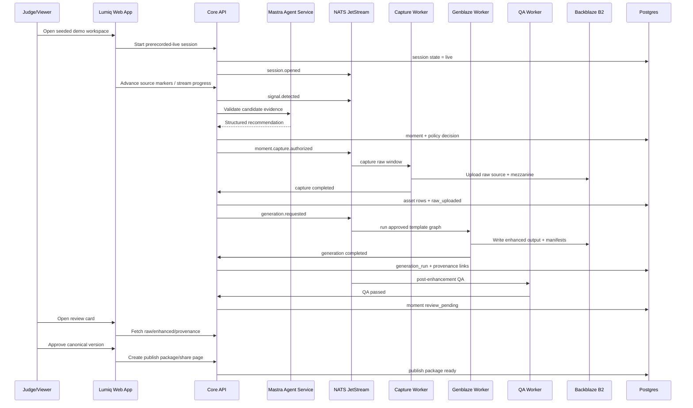

# 26 — Hackathon Demo Submission Specification

**Project:** Lumiq — Live Commerce Moment Vault  
**Document ID:** `26-hackathon-demo-submission-spec.md`  
**Status:** Draft v1  
**Audience:** founders, demo builders, frontend engineers, backend engineers, AI engineers, media engineers, judges, reviewers, AI coding agents  
**Depends on:** `00-spec-index.md`, `01-product-requirements.md`, `02-project-constitution.md`, `03-glossary-domain-language.md`, `04-requirements-ears.md`, `05-user-flows-ux-spec.md`, `06-system-architecture-c4.md`, `07-service-decomposition.md`, `08-data-model-database-schema.md`, `09-api-contract-openapi.yaml`, `10-event-contract-asyncapi.yaml`, `11-json-schemas.md`, `12-agent-architecture-mastra.md`, `13-genblaze-media-pipeline.md`, `14-b2-storage-provenance-spec.md`, `15-template-step-graph-spec.md`, `16-moment-detection-ranking-spec.md`, `17-catalog-product-grounding-spec.md`, `18-qa-moderation-policy-spec.md`, `19-security-rbac-threat-model.md`, `20-ai-security-safety-spec.md`, `21-privacy-retention-deletion-spec.md`, `22-observability-audit-cost-spec.md`, `23-infrastructure-deployment-spec.md`, `24-testing-evaluation-spec.md`, `25-admin-recovery-runbooks.md`

---

## 1. Purpose

This document defines the exact Lumiq hackathon submission and demo plan.

It answers:

```txt
What problem should the demo explain?
What exact scenario should judges see?
What is real vs simulated?
What seeded product/campaign/session data is required?
What should the demo video show?
What should the live app path demonstrate?
How should Lumiq explain Backblaze B2, Genblaze, Mastra, and provenance?
What fallback paths are acceptable if a provider or live component fails?
What must be verified before submission?
```

The goal is to make the hackathon submission judge-ready without changing the production architecture.

Core demo rule:

```txt
The demo must prove Lumiq is not a generic AI clipper. It must show a traceable live-commerce media pipeline: raw source moment → B2 raw asset → Genblaze generation run → enhanced master → QA/review → publish package/share page → B2-backed provenance.
```

---

## 2. Submission Thesis

### 2.1 One-liner

```txt
Lumiq detects high-converting live-commerce moments, generates polished product clips through Genblaze, and stores every raw, generated, and published asset in Backblaze B2 with durable provenance.
```

### 2.2 Judge-facing thesis

Most livestream shopping sessions contain valuable product moments, but teams lose them because they are hard to find, clip, polish, verify, and reuse. Existing AI clipping tools can generate attractive output, but commerce teams also need proof: which live moment produced the clip, which product facts were used, whether AI changed the product appearance, and where the raw source is stored.

Lumiq solves this by combining:

```txt
Mastra agents:
  reason about candidate moments, product matches, templates, QA, and provenance explanations

Core API + NATS + workers:
  authorize and execute the workflow with state machines and audit logs

Genblaze:
  orchestrates generative media/editing steps and produces media run metadata

Backblaze B2:
  stores raw source clips, enhanced outputs, manifests, captions, thumbnails, publish packages, and provenance records

Neon Postgres:
  tracks queryable operational truth, states, links, costs, and audit metadata
```

The differentiator is not simply that Lumiq creates a clip. The differentiator is that every polished clip is traceable back to the exact source moment and generation pathway that created it.

---

## 3. External Submission Assumptions

Hackathon portals vary. This spec is designed for a Devpost-style submission but does not assume one specific contest rule unless the rule is visible in the target hackathon page.

### 3.1 Required artifacts to prepare

```yaml
submission_artifacts:
  app_url:
    required: true
    source: deployed_lumiq_web_app
  demo_video_url:
    required: true
    target_length: "2:30 to 3:00"
    note: "Check final hackathon rules for maximum length. Use under 3 minutes unless the specific rules allow longer."
  project_story:
    required: true
    format: markdown
  screenshots:
    required: recommended
    count: 3_to_6
  architecture_diagram:
    required: recommended
    format: png_or_svg
  repository_url:
    required: depends_on_hackathon
  built_with_tags:
    required: likely
    include:
      - Backblaze B2
      - Genblaze
      - Mastra
      - OpenAI
      - NATS JetStream
      - Neon Postgres
      - Clerk
      - Next.js
      - Python workers
```

### 3.2 Final rule check

Before submission, confirm the target hackathon rules for:

```txt
video maximum length
required public/private repository setting
required license
required tool usage explanation
required app URL availability window
team member list
project category
submission deadline timezone
```

Do not rely on this document to override the official hackathon rules.

---

# 4. Demo Success Criteria

Judges must be able to see all of the following in one smooth path.

```yaml
demo_success_criteria:
  product_story:
    - real_world_live_commerce_problem_is_clear
    - commerce_trust_and_product_accuracy_are_clear
  app_workflow:
    - user_starts_or_replays_prerecorded_live_session
    - product_reveal_or_offer_moment_is_detected
    - Mastra_recommendation_or_agent_explanation_is_visible
    - capture_policy_authorizes_raw_capture
    - raw_source_asset_is_stored_in_B2
    - Genblaze_pipeline_generates_enhanced_master
    - enhanced_master_and_manifest_are_stored_in_B2
    - QA_status_is_visible
    - reviewer_approves_canonical_version
    - publish_package_or_share_page_is_created
    - provenance_graph_shows_raw_to_generated_to_published_lineage
  technical_proof:
    - B2_object_keys_are_visible
    - sha256_or_checksum_fields_are_visible
    - generation_run_id_is_visible
    - manifest_or_provenance_json_is_visible
    - state_machine_progression_is_visible
  demo_integrity:
    - simulated_components_are_labeled
    - no_fake_external_publish_is_claimed
    - no_unverified_product_claim_is_rendered
```

---

# 5. Locked Demo Scenario

## 5.1 Scenario name

```txt
The Crossbody Bag Flash Offer Demo
```

## 5.2 Demo story

A small ecommerce brand is running a live shopping session for a product launch. The host shows a crossbody bag, demonstrates its features, and mentions a campaign offer. Lumiq detects the product reveal moment, captures the raw source clip, uses Genblaze to generate a polished vertical clip with captions and a product card, runs QA, stores assets/manifests in Backblaze B2, and shows a provenance graph proving how the final clip was created.

## 5.3 Why this scenario

This scenario is intentionally chosen because:

```txt
fashion/accessory product reveals are visually understandable
product appearance integrity matters
commerce claims can be simple and grounded
vertical short-form output is easy for judges to recognize
raw vs enhanced comparison is obvious
B2 object tree and provenance manifest are meaningful
```

## 5.4 Seeded brand

Use a fictional brand to avoid real-world claim risk.

```yaml
brand:
  organization_name: "Aster & Co. Demo"
  workspace_slug: "aster-demo"
  brand_tone: "clean, confident, practical"
  brand_safety_note: "All claims are fictional seeded demo claims and must be stored as allowed claims before rendering."
```

## 5.5 Seeded product

```yaml
product:
  product_id: "seeded_ulid_product_aster_crossbody"
  sku: "ASTER-CROSSBODY-001"
  name: "Aster Everyday Crossbody"
  category: "fashion_accessory"
  product_url: "https://example.com/products/aster-everyday-crossbody"
  base_price:
    amount: 79.00
    currency: "USD"
  seeded_media:
    - role: primary_image
      description: "Front view product image"
    - role: reference_image
      description: "Strap and pocket detail image"
  verified_claims:
    - claim_type: feature
      claim_text: "three interior pockets"
      allowed: true
    - claim_type: feature
      claim_text: "adjustable strap"
      allowed: true
    - claim_type: discount
      claim_text: "15% launch offer"
      allowed: true
      valid_for_demo: true
  blocked_claim_examples:
    - "waterproof"
    - "best-selling"
    - "limited stock"
```

## 5.6 Seeded campaign

```yaml
campaign:
  campaign_name: "Aster Launch Live"
  offer_summary: "15% launch offer"
  active_products:
    - "ASTER-CROSSBODY-001"
  allowed_overlay_copy:
    - "Aster Everyday Crossbody"
    - "15% launch offer"
    - "Adjustable strap"
    - "Three interior pockets"
  prohibited_overlay_copy:
    - "waterproof"
    - "best-selling"
    - "only 3 left"
    - "guaranteed to fit all outfits"
```

## 5.7 Seeded prerecorded-live source

The demo should use a short prerecorded source to avoid live camera/provider timing risk.

```yaml
source_video:
  source_type: prerecorded_live
  target_duration_seconds: 75_to_120
  format: mp4_or_webm
  orientation: landscape_or_desktop_capture_allowed
  required_sections:
    - intro
    - product_reveal
    - feature_demo
    - offer_mention
    - CTA
  moment_of_interest:
    moment_type: product_reveal
    expected_start_ms: 26000
    expected_end_ms: 47000
    raw_capture_start_ms: 20000
    raw_capture_end_ms: 54000
    final_trim_start_ms: 27000
    final_trim_end_ms: 45000
```

## 5.8 Seeded transcript

```txt
00:00–00:08
Welcome back. Today I’m showing a new everyday bag from Aster.

00:09–00:24
Before we start, I’ll show you the shape and how it sits crossbody.

00:25–00:32
Here it is: the Aster Everyday Crossbody. I like how compact it is without looking tiny.

00:33–00:41
It has an adjustable strap and three interior pockets, so your keys, wallet, and phone stay separate.

00:42–00:49
For this launch live, we have a 15% launch offer linked below.

00:50–01:05
I’ll put it on so you can see the fit. This is the kind of piece I’d use every day.
```

## 5.9 Expected detection signals

```yaml
expected_signals:
  - signal_type: keyword_hit
    time_ms: 25000
    trigger: "Aster Everyday Crossbody"
    expected_score: 0.80
  - signal_type: product_visible
    time_ms: 28000
    trigger: "product held close to camera"
    expected_score: 0.85
  - signal_type: feature_mention
    time_ms: 35000
    trigger: "adjustable strap and three interior pockets"
    expected_score: 0.75
  - signal_type: offer_mention
    time_ms: 43000
    trigger: "15% launch offer"
    expected_score: 0.88
  - signal_type: candidate_moment
    time_ms: 44000
    expected_moment_type: product_reveal
    expected_confidence: 0.90
```

---

# 6. What Must Be Real vs Simulated

## 6.1 Must be real for the submission

```yaml
must_be_real:
  app:
    - deployed_web_app_or_reliable_local_demo_recording
    - authenticated_workspace_or_seeded_demo_mode
    - real_review_queue_or_moment_detail_ui
  data:
    - seeded_product_catalog_rows
    - seeded_campaign_or_offer_rows
    - catalog_snapshot_record
    - catalog_snapshot_manifest_in_B2_where_possible
  workflow:
    - session_record_created
    - candidate_moment_created
    - Mastra_agent_structured_recommendation_or_recorded_agent_output
    - capture_policy_decision
    - raw_source_asset_record
    - B2_raw_object_upload
    - generation_run_record
    - Genblaze_worker_or_Genblaze_mock_with_explicit_label
    - enhanced_master_asset_record
    - B2_enhanced_object_upload
    - provenance_manifest_written
    - QA_result_written
    - canonical_approval_action
    - publish_package_or_share_page_record
  proof:
    - visible_B2_object_key
    - visible_sha256_or_checksum
    - visible_generation_run_id
    - visible_provenance_graph
```

## 6.2 May be simulated if labeled

```yaml
may_be_simulated:
  ingestion:
    - true_external_livestream_adapter
    - OBS_or_RTMP_ingest
    - live_chat_spike_signals
  commerce:
    - Shopify_sync
    - WooCommerce_sync
    - live_inventory_refresh
  publishing:
    - TikTok_external_publish
    - Instagram_external_publish
    - YouTube_external_publish
  provider_behavior:
    - advanced_provider_fallback
    - expensive_full_video_restyle
    - full_multimodal_product_detection_if_seeded_evidence_is_used
  analytics:
    - downstream_conversion_metrics
    - external_social_performance
```

## 6.3 Must not be claimed if simulated

```txt
Do not claim external social publishing is live if the system only creates a share page.
Do not claim Shopify integration is live if using seeded catalog data.
Do not claim full session recording is enabled if only moment capture is stored.
Do not claim an AI restyle preserved product color unless QA checked it or the restyle is disabled.
Do not claim all B2 objects are legally immutable unless Object Lock is actually configured.
```

---

# 7. Golden Demo Path

The golden path is the single sequence that should work before any other demo variation.



---

# 8. Required Screens for Demo

## 8.1 Setup / Demo workspace screen

Must show:

```txt
organization name
campaign name
product count
allowed claims count
catalog snapshot status
provider/storage readiness
start demo session button
```

Minimum acceptable implementation:

```txt
A seeded demo workspace card with product/campaign summary and a Start Demo Session action.
```

## 8.2 Live Studio

Must show:

```txt
source video preview
session status
signal feed
candidate moment card
budget or policy status
progress chain
bottom timeline or simplified event timeline
```

Critical visible state chain:

```txt
Signal → Candidate → Capture authorized → Raw uploaded → Genblaze enhancing → QA → Review ready
```

## 8.3 Review Queue / Moment Detail

Must show:

```txt
enhanced clip preview
raw/enhanced comparison access
AI explanation
product fact panel
QA status
lineage mini-chain
approve/rerender/reject actions
```

## 8.4 Provenance Panel

Must show:

```txt
raw_source_asset
raw_mezzanine_asset
generation_run / Genblaze run
enhanced_master_asset
publish_package or publish_variant
manifest links
B2 object keys
sha256 checksums
```

## 8.5 Share Page

Must show:

```txt
approved video preview
title/description
product link
provenance badge
private/public/revoked state
```

---

# 9. Demo Video Script

Target: 2:30–3:00.

Use this script as the default demo video storyboard.

## 9.1 Video timeline

```yaml
demo_video_timeline:
  "00:00-00:15":
    title: "Problem"
    narration: "Livestream sellers create valuable product moments, but those moments disappear unless someone manually clips, edits, checks facts, and stores proof."
    visuals:
      - quick shot of live session timeline
      - empty manual clipping pain visual
  "00:15-00:30":
    title: "What Lumiq is"
    narration: "Lumiq is a live commerce moment vault. It detects valuable moments, captures the raw source, generates polished clips through Genblaze, and stores every asset and manifest in Backblaze B2."
    visuals:
      - app shell
      - architecture mini chain: Mastra → Genblaze → B2 → Provenance
  "00:30-00:50":
    title: "Seeded commerce context"
    narration: "The session is grounded in a product catalog and campaign snapshot, so AI cannot invent product claims."
    visuals:
      - product catalog row
      - allowed claims panel
      - catalog snapshot manifest status
  "00:50-01:25":
    title: "Live Studio detection"
    narration: "As the prerecorded-live session plays, cheap signals detect a product reveal and offer mention. A Mastra agent validates the moment and recommends capture."
    visuals:
      - video preview
      - signal feed
      - candidate card
      - short agent explanation
  "01:25-01:50":
    title: "Capture and Genblaze generation"
    narration: "The backend authorizes capture, writes the raw source to B2, and dispatches an approved template to the Genblaze Worker."
    visuals:
      - progress chain
      - raw uploaded state
      - generation_run_id
      - B2 object key
  "01:50-02:15":
    title: "Review and QA"
    narration: "The reviewer sees the enhanced master, QA result, product facts, and raw-versus-enhanced comparison before approving the canonical version."
    visuals:
      - Review Queue card
      - side-by-side compare
      - QA passed chip
  "02:15-02:40":
    title: "Provenance proof"
    narration: "Every output traces back to the exact raw moment, Genblaze run, template version, manifest, checksum, and B2 object."
    visuals:
      - full provenance graph
      - manifest preview
      - share page with provenance badge
  "02:40-03:00":
    title: "Closing"
    narration: "Lumiq turns live commerce moments into reusable clips without losing source truth or buyer trust."
    visuals:
      - final share page
      - one-line value proposition
```

## 9.2 Narration draft

```txt
Livestream commerce is full of valuable product moments, but teams often lose them or turn them into clips with no proof of where they came from.

This is Lumiq: a live commerce moment vault. It watches a session, detects high-value sales moments, captures the raw source, generates a polished clip through Genblaze, and stores every asset and manifest in Backblaze B2.

This demo uses a seeded product catalog and campaign snapshot for the Aster Everyday Crossbody. The clip can use only approved facts, like the adjustable strap, three interior pockets, and the 15% launch offer.

As the prerecorded-live session plays, Lumiq detects product visibility, a product name mention, and an offer mention. A Mastra supervisor agent validates the evidence and recommends capture. The Core API checks policy and budget before the Capture Worker writes the raw source to B2.

Then the Genblaze Worker runs the approved enhancement template. It creates the enhanced master, captions, thumbnail, and manifest. QA checks caption alignment, product facts, and product appearance integrity.

In Review, the user compares raw and enhanced, sees the product facts, and approves the canonical version. Finally, Lumiq creates a publish package and share page.

The important part is the provenance graph. This final clip traces back to the raw source asset, Genblaze run, template version, checksums, B2 object keys, QA results, and publish package. Lumiq is not just an AI clipper. It is a traceable AI media vault for commerce moments.
```

---

# 10. Live Demo Run-of-Show

This is the path for a live judging session or recorded walkthrough.

## 10.1 Pre-demo checklist

```yaml
pre_demo_checklist:
  environment:
    - app_url_loads
    - seeded_demo_org_exists
    - demo_user_can_log_in
    - B2_credentials_valid
    - NATS_running_or_demo_event_runtime_enabled
    - Core_API_healthy
    - worker_health_visible
  data:
    - seeded_product_exists
    - seeded_campaign_exists
    - catalog_snapshot_exists
    - allowed_claims_exist
    - prerecorded_source_uploaded_or_available
  demo_run:
    - previous_demo_runs_archived_or_clearly_labeled
    - test_run_completed_successfully
    - B2_object_tree_visible_in_app_or_admin
    - share_page_url_ready
  fallback:
    - fallback_precomputed_generation_run_exists
    - fallback_manifest_exists
    - fallback_screenshots_available
```

## 10.2 Live path

```txt
1. Open Lumiq workspace.
2. Show seeded product/campaign context.
3. Start prerecorded-live session.
4. Let source reach product reveal.
5. Point out signal feed and candidate card.
6. Show Mastra recommendation and policy decision.
7. Show progress chain from capture to Genblaze generation.
8. Open Review Queue when QA passes.
9. Compare raw vs enhanced.
10. Approve canonical version.
11. Create publish package/share page.
12. Open provenance panel.
13. Expand B2 object key/checksum/manifest details.
14. End with share page/provenance badge.
```

## 10.3 What to say when showing each technical proof

### B2 proof

```txt
This raw source object is stored in Backblaze B2. The object key includes the tenant, session, moment, and asset ID. The enhanced master and provenance manifest are stored separately, so the output is traceable and immutable by convention.
```

### Genblaze proof

```txt
This generation run was executed by the Genblaze Worker from an approved template step graph. The run records the template version, provider metadata, output asset, and manifest asset.
```

### Mastra proof

```txt
The agent does not capture or publish directly. It only returns a structured recommendation. The Core API checks policy, budget, and state before workers execute anything.
```

### Product grounding proof

```txt
The overlay and caption use only facts from the catalog snapshot and allowed claims. Unsupported claims such as waterproof or best-selling are blocked.
```

---

# 11. Judge-facing Project Story

Use this for the hackathon project page.

## 11.1 Inspiration

```txt
Live commerce sessions are packed with useful product moments: reveals, feature demos, offers, and host reactions. But after a stream ends, those moments are buried in long recordings. AI clipping can help, but for commerce, a clip is not enough. Sellers need to know which product facts were used, whether AI changed product appearance, and where the raw source is stored.
```

## 11.2 What it does

```txt
Lumiq watches a live or prerecorded-live commerce session, detects high-value moments, captures the raw source clip, runs a Genblaze media pipeline to create a polished clip, stores raw/generated/published assets in Backblaze B2, and exposes a provenance graph showing exactly how the final publish package was produced.
```

## 11.3 How it works

```txt
Mastra agents validate candidate moments and recommend templates.
The Core API checks permissions, budgets, product facts, and state-machine policy.
NATS JetStream dispatches work to workers.
The Capture Worker stores raw source and mezzanine assets in Backblaze B2.
The Genblaze Worker executes approved media pipeline steps and writes outputs/manifests.
QA checks product facts, captions, and product appearance integrity.
Reviewers approve canonical versions and create publish packages/share pages.
Postgres tracks operational truth, while B2 stores media and provenance proof.
```

## 11.4 What is unique

```txt
Lumiq is traceable by design. Every polished clip has a visible chain back to the source moment, raw asset, catalog snapshot, Genblaze run, template version, QA result, and B2 provenance manifest.
```

## 11.5 Built with

```txt
Next.js / TypeScript
Mastra
OpenAI
Genblaze
Backblaze B2
Neon Postgres
NATS JetStream
Python media workers
Clerk
FFmpeg/Remotion-style rendering where implemented
```

## 11.6 Challenges

```txt
The main challenge was designing an AI media workflow where agents can reason but cannot directly mutate storage, providers, publishing, or billing. Lumiq solves that with a strict split: agents recommend, Core API authorizes, workers execute, Genblaze generates media, B2 stores proof, and Postgres tracks truth.
```

## 11.7 What is next

```txt
Next steps are Shopify catalog sync, OBS/RTMP ingestion, richer QA evaluation, provider fallback policies, semantic search, publish adapters, and enterprise-grade retention/legal hold controls.
```

---

# 12. Screenshots and Gallery Plan

Prepare 5 screenshots.

```yaml
screenshot_gallery:
  - name: "Live Studio detecting a product moment"
    shows:
      - source_preview
      - signal_feed
      - candidate_card
  - name: "Review Queue publish-readiness card"
    shows:
      - enhanced_preview
      - QA_status
      - product_facts
      - approve_action
  - name: "Raw vs enhanced comparison"
    shows:
      - raw_player
      - enhanced_player
      - trim_metadata
  - name: "Provenance graph"
    shows:
      - raw_source_node
      - Genblaze_run_node
      - enhanced_master_node
      - publish_package_node
      - checksums
  - name: "B2 object tree / manifest panel"
    shows:
      - bucket
      - object_key
      - sha256
      - manifest_preview
```

Do not include screenshots that expose real provider keys, user emails, private tokens, or raw customer data.

---

# 13. Demo Data Contract

Seed data should be reproducible.

## 13.1 Seed command

Recommended command:

```bash
pnpm demo:seed
```

or:

```bash
python scripts/seed_demo_workspace.py --scenario aster-crossbody
```

## 13.2 Seed output

```yaml
seed_outputs:
  organization:
    organization_id: required
  user:
    demo_user_id: required
  catalog:
    product_id: required
    allowed_claim_ids: required
  campaign:
    campaign_id: required
  catalog_snapshot:
    catalog_snapshot_id: required
    manifest_asset_id: required_where_B2_enabled
  session_source:
    source_asset_id_or_source_ref: required
  templates:
    template_id: "clean_product_reveal"
    template_version: "1.0.0"
```

## 13.3 Seed invariants

```txt
All seeded rows must use the same organization_id.
All B2 object keys must start with tenants/{organization_id}/.
Allowed claims must exist before captions/overlays are generated.
Demo data must be clearly marked as demo data.
Rerunning seed must be idempotent.
```

---

# 14. Demo Modes

## 14.1 Preferred mode — real B2 + real Genblaze path

```yaml
preferred_demo_mode:
  b2: real
  genblaze: real_or_minimal_real_pipeline
  mastra: real_structured_output
  source: prerecorded_live
  external_publish: simulated_share_page_only
```

## 14.2 Acceptable fallback mode — cached generated media with real B2/provenance

Allowed only if provider generation fails close to demo time.

```yaml
fallback_demo_mode:
  b2: real
  genblaze: cached_previous_run_or_mock_labeled
  raw_capture: real
  enhanced_output: cached_asset
  provenance_manifest: real_manifest_for_cached_run
  ui_label_required: true
```

Required label:

```txt
This demo is replaying a previously completed Genblaze run because the live provider path is unavailable. The B2 assets and provenance manifest shown are real.
```

## 14.3 Non-acceptable mode

```txt
Static Figma-only demo with no B2 objects.
Video-only mockup with no app URL.
Claiming real Genblaze execution without run records or manifests.
Claiming real B2 storage while only using local files.
Claiming external publish while only showing a share page.
```

---

# 15. Demo Error and Fallback Runbook

## 15.1 If session playback fails

```txt
Open the pre-seeded completed session.
State clearly: "This is the same demo run after processing."
Continue from Review Queue and Provenance.
```

## 15.2 If Mastra/LLM call fails

```txt
Use cached structured agent recommendation fixture.
Show the agent_tool_call record and mark it as fixture-backed if needed.
Do not claim a live LLM call happened.
```

## 15.3 If B2 upload fails

```txt
Do not proceed as if storage worked.
Show failure state in Admin/Recovery or use the last successful run.
Explain that B2 storage is required for the vault promise.
```

## 15.4 If Genblaze provider fails

```txt
Show failed generation_run state if demonstrating robustness.
For main demo, switch to a cached successful Genblaze run and label it clearly.
```

## 15.5 If QA fails

```txt
If the failure is intentional, show how the review state is blocked.
If unintentional, use a prior QA-passed run for the final demo path.
```

---

# 16. Submission Readiness Checklist

## 16.1 Product readiness

```txt
[ ] One-line value proposition is visible.
[ ] Project story explains why provenance matters for commerce.
[ ] Demo scenario is understandable without backend knowledge.
[ ] Simulated components are labeled.
[ ] No unsupported product claims appear in final output.
```

## 16.2 Technical readiness

```txt
[ ] App URL loads.
[ ] Demo user login works.
[ ] Seeded product/campaign exists.
[ ] Prerecorded-live demo starts.
[ ] Candidate detection appears.
[ ] Agent recommendation appears.
[ ] Raw capture writes B2 object.
[ ] Generation run creates enhanced master or cached run is labeled.
[ ] Provenance manifest exists.
[ ] QA result appears.
[ ] Approval action works.
[ ] Publish package/share page works.
[ ] B2 object keys/checksums are visible.
```

## 16.3 Video readiness

```txt
[ ] Video is under the target limit.
[ ] Video includes functioning app footage.
[ ] Video explains Backblaze B2 usage.
[ ] Video explains Genblaze usage.
[ ] Video explains real-world utility.
[ ] Video has readable zoom/captions.
[ ] Video link is public/unlisted as required.
```

## 16.4 Submission page readiness

```txt
[ ] Project name: Lumiq.
[ ] Tagline included.
[ ] Built-with tags included.
[ ] App link included.
[ ] Demo video link included.
[ ] Screenshots uploaded.
[ ] Repo link included if required.
[ ] Final proofread completed.
```

---

# 17. Acceptance Criteria

## DEMO-AC-001 — Golden path visible

```txt
Given the demo workspace is seeded
When the demo session is started
Then judges can see a product moment detected, captured, generated, reviewed, published, and traced.
```

## DEMO-AC-002 — B2 usage meaningful

```txt
Given a raw or generated asset exists
When the provenance panel is opened
Then B2 bucket/object_key/checksum information is visible.
```

## DEMO-AC-003 — Genblaze usage meaningful

```txt
Given an enhanced master exists
When the generation details are opened
Then a generation_run linked to the Genblaze Worker/template/manifest is visible.
```

## DEMO-AC-004 — Product grounding visible

```txt
Given the final clip uses product facts
When the reviewer opens Product Facts
Then facts are linked to catalog snapshot or allowed claims.
```

## DEMO-AC-005 — Provenance visible

```txt
Given a publish package exists
When the provenance graph is opened
Then raw source, generation run, enhanced master, manifest, and publish package nodes are visible.
```

## DEMO-AC-006 — Simulation honesty

```txt
Given any component is simulated or cached
When it appears in the demo
Then the UI, narration, or submission notes clearly label it.
```

---

# 18. Demo-specific Risks

```yaml
demo_risks:
  provider_latency:
    impact: high
    mitigation: use_prerecorded_source_and_cached_successful_genblaze_run_as_fallback
  B2_permission_error:
    impact: high
    mitigation: preflight_bucket_key_check_before_demo
  agent_malformed_output:
    impact: medium
    mitigation: schema_validate_and_have_fixture_output
  product_claim_error:
    impact: high
    mitigation: use_fictional_seeded_product_and_allowed_claims
  live_ui_timing:
    impact: medium
    mitigation: allow_fast_forward_or_seeded_completed_session
  internet_failure:
    impact: high
    mitigation: recorded_demo_video_plus_screenshots
```

---

# 19. Open Questions

These must be finalized before submission but should not block implementation.

```txt
1. Exact hackathon submission URL and final rules.
2. Exact deployed app URL.
3. Exact public demo video URL.
4. Whether repository must be public.
5. Exact demo product visuals/source video.
6. Whether live provider generation will be run during judging or replayed from a completed run.
7. Whether Object Lock is enabled in the demo provenance bucket.
8. Exact final sponsor/tool tags required by the hackathon page.
```

---

# 20. Change Log

| Version | Change |
|---|---|
| v1 | Created hackathon demo submission specification with exact demo scenario, seeded data, real/simulated boundaries, video script, live runbook, and readiness checklist. |
