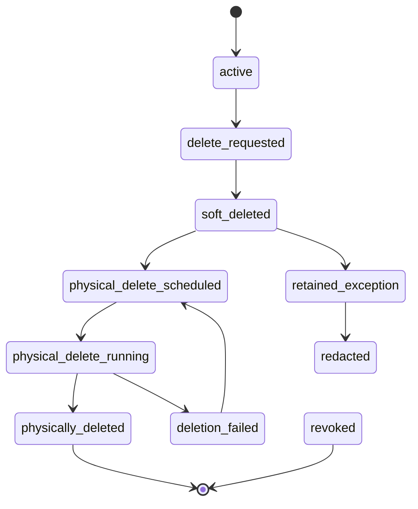

# 21 — Privacy, Retention & Deletion Specification

**Project:** Lumiq — Live Commerce Moment Vault  
**Document ID:** `21-privacy-retention-deletion-spec.md`  
**Status:** Draft v1  
**Audience:** backend engineers, storage engineers, privacy/compliance reviewers, security engineers, product, QA, support/admin, AI coding agents  
**Depends on:** `00-spec-index.md`, `01-product-requirements.md`, `02-project-constitution.md`, `03-glossary-domain-language.md`, `04-requirements-ears.md`, `05-user-flows-ux-spec.md`, `06-system-architecture-c4.md`, `07-service-decomposition.md`, `08-data-model-database-schema.md`, `09-api-contract-openapi.yaml`, `10-event-contract-asyncapi.yaml`, `11-json-schemas.md`, `14-b2-storage-provenance-spec.md`, `17-catalog-product-grounding-spec.md`, `18-qa-moderation-policy-spec.md`, `19-security-rbac-threat-model.md`, `20-ai-security-safety-spec.md`.

---

## 1. Purpose

This document defines Lumiq's privacy, retention, deletion, export, and legal/audit exception policy.

Lumiq handles raw video, audio, transcripts, product catalogs, generated clips, publish packages, provenance manifests, agent records, LLM records, audit logs, and share pages. Some of these objects are high-value evidence. Some may contain personal data. Some must be retained for operational/audit integrity. Some must be deleted when users request deletion or retention windows expire.

This document answers:

1. Which data classes exist?
2. Which assets are retained by default?
3. How long should raw video, transcripts, generated outputs, logs, and manifests be kept?
4. How does soft delete work?
5. How does physical deletion work across Postgres, B2, search indexes, share pages, and agent memory?
6. How do legal holds, Object Lock, and audit exceptions affect deletion?
7. How does export work?
8. How do retention jobs, lifecycle rules, and reconciliation jobs interact?
9. What is P0 for the hackathon path and P1/P2 for production?

Core rule:

```txt
Moment-only storage is the default. Raw source is preserved for evidence during its retention window. Deletion is soft-first, access is revoked immediately, and physical deletion follows policy.
```

---

## 2. Research and Source Notes

This spec combines Lumiq internal documents with current public references available on **2026-06-26**.

Public references used:

```txt
Backblaze B2 Object Lock:
https://www.backblaze.com/docs/cloud-storage-object-lock

Backblaze B2 Lifecycle Rules:
https://www.backblaze.com/docs/cloud-storage-lifecycle-rules

Backblaze B2 Configure and Manage Lifecycle Rules:
https://www.backblaze.com/docs/cloud-storage-configure-and-manage-lifecycle-rules

EU GDPR Article 17 / Right to Erasure:
https://eur-lex.europa.eu/eli/reg/2016/679/oj/eng
https://gdpr-info.eu/art-17-gdpr/

European Commission data protection rights overview:
https://commission.europa.eu/law/law-topic/data-protection/information-individuals_en
```

Key external facts used:

```txt
Backblaze B2 Object Lock supports retention settings and legal hold; if retention or legal hold applies, a file is protected from deletion.
Backblaze B2 Lifecycle Rules can automatically hide/delete older file versions according to bucket rules.
GDPR Article 17 describes a right to erasure for personal data in specified circumstances; implementation must account for legal/audit exceptions and jurisdiction-specific obligations.
```

Important constraint:

```txt
This is a product/engineering specification, not legal advice. Jurisdiction-specific retention and deletion policy must be reviewed before production launch.
```

---

## 3. Source-of-Truth Constraints

This document inherits these Lumiq rules:

```txt
Moment-only storage by default.
Full session recording is optional and requires explicit policy.
Raw source clips are canonical evidence during their retention window.
Canonical B2 objects are immutable and must not be overwritten.
Deletion is soft-first.
Share links must be revocable without deleting canonical assets.
Provenance retention must respect policy.
Organizations must be able to export allowed data, manifests, and asset references.
Normal logs must not store full transcripts, prompts, model outputs, or secrets.
Tenant isolation applies to database rows, B2 keys, NATS payloads, search indexes, audit events, provider usage, LLM runs, and agent memory.
```

Relevant requirement IDs:

```txt
REQ-SESSION-006    Full Session Recording Optional
REQ-CAPTURE-004    Raw Source Asset Write
REQ-CAPTURE-006    Live-transformed Capture
REQ-ASSET-001      B2 Canonical Media Storage
REQ-ASSET-003      Immutable Canonical Objects
REQ-ASSET-004      Checksums
REQ-PUBLISH-005    Revocation
REQ-PROV-001       Dual-source Provenance
REQ-RETENTION-001  Tiered Retention
REQ-RETENTION-002  Soft Delete First
REQ-RETENTION-003  Share Link Revocation
REQ-RETENTION-004  Data Export
REQ-AUDIT-001      Full Action Audit
REQ-AUDIT-003      Redacted Logs
REQ-NFR-004        Data Integrity
```

---

## 4. Privacy Principles

### 4.1 Minimize collection

Store only what Lumiq needs for:

```txt
moment detection
raw evidence
media generation
QA/review
publishing
provenance
audit/recovery
customer export
```

### 4.2 Moment-only by default

Default:

```txt
store accepted/captured moments only
store raw capture windows for those moments
store transcript excerpts for accepted/captured moments
avoid storing full session recording unless explicitly enabled
```

### 4.3 Preserve proof without hoarding raw data

Raw evidence matters, but raw media and full transcripts should have shorter retention than enhanced/published outputs and minimal manifests.

### 4.4 Revoke access immediately on delete/revoke

When a user deletes or revokes something, normal UI/search/public access should stop immediately even if physical deletion is delayed.

### 4.5 Separate audit from content

Audit logs should record who did what, when, and why, but not store large media, raw transcripts, full prompts, or unnecessary personal data.

---

## 5. Data Classification

```yaml
data_classes:
  public_share_content:
    examples:
      - public_share_page_title
      - public_publish_description
      - public_product_links
    sensitivity: public_when_enabled

  user_account_data:
    examples:
      - user_email
      - display_name
      - membership_role
    sensitivity: personal_data

  organization_data:
    examples:
      - organization_name
      - settings
      - budgets
      - provider_policy_metadata
    sensitivity: tenant_confidential

  catalog_commerce_data:
    examples:
      - product_name
      - sku
      - price
      - product_url
      - allowed_claims
      - campaign_offer
    sensitivity: tenant_confidential

  raw_media_data:
    examples:
      - raw_source_asset
      - raw_mezzanine_asset
      - live_transformed_asset
      - full_session_recording
    sensitivity: high

  transcript_data:
    examples:
      - full_session_transcript_chunk
      - transcript_excerpt
      - caption_text
    sensitivity: high_or_medium_by_scope

  generated_media_data:
    examples:
      - enhanced_master_asset
      - publish_variant_asset
      - thumbnail_asset
      - captions_asset
    sensitivity: tenant_confidential_or_public_if_published

  provenance_data:
    examples:
      - provenance_manifest
      - genblaze_manifest
      - catalog_snapshot_manifest
      - checksum_records
    sensitivity: tenant_confidential

  ai_metadata:
    examples:
      - agent_tool_call
      - llm_run
      - prompt_hash
      - output_hash
      - agent_memory
    sensitivity: tenant_confidential_high_when_contentful

  audit_operational_data:
    examples:
      - audit_event
      - dead_letter_event
      - provider_usage_record
      - cost_ledger_entry
    sensitivity: tenant_confidential
```

---

## 6. Retention Classes

The canonical retention classes are inherited from the data model and B2 spec.

```yaml
retention_classes:
  tmp:
    purpose: temporary upload chunks, scratch renders, transient worker files
    default_policy: short_expiry

  raw_active:
    purpose: raw source evidence and accepted moment source segments
    default_policy: 30_to_90_days_by_plan

  mezzanine:
    purpose: normalized raw processing copies
    default_policy: 90_to_180_days_by_plan

  derived:
    purpose: enhanced masters, thumbnails, captions, QA derivatives
    default_policy: indefinite_until_user_delete_or_plan_limit

  published:
    purpose: approved publish variants and share/export assets
    default_policy: indefinite_until_revoke_or_delete

  provenance_locked:
    purpose: provenance manifests, catalog snapshots, lineage proof
    default_policy: long_retention_or_indefinite_subject_to_deletion_policy

  audit:
    purpose: audit logs and operational evidence
    default_policy: 90_to_365_days_or_plan_policy

  debug:
    purpose: failed-step evidence and troubleshooting bundles
    default_policy: short_to_medium_expiry
```

---

## 7. Recommended Default Retention Matrix

These are recommended product defaults. Exact plan-specific values are open questions and must be confirmed before production pricing/legal launch.

| Data / Asset | Default P0/Hackathon | Recommended Production Default | Notes |
|---|---:|---:|---|
| temporary upload chunks | 1–7 days | 1–7 days | B2 lifecycle eligible |
| scratch render outputs | 1–7 days | 1–14 days | never canonical |
| low-confidence rejected signals | session duration or 7 days | 7–30 days | no full embeddings by default |
| full session transcript chunks | not stored by default | 7–30 days | shorter than accepted excerpts |
| accepted transcript excerpts | retained with moment | 90–180 days or until deletion | may be needed for QA/provenance |
| raw_source moment asset | retained for demo | 30–90 days | canonical evidence during window |
| raw_mezzanine asset | retained for demo | 90–180 days | supports rerender/QA |
| live_transformed asset | if lineage-relevant | 30–90 days or longer if published | depends on audience visibility |
| enhanced_master asset | indefinite for demo | indefinite until deletion/plan policy | user-facing value |
| publish_variant asset | indefinite for demo | indefinite until revoked/deleted | public access controlled separately |
| thumbnail/captions assets | with publish package | with package or until deletion | captions may contain personal data |
| catalog snapshot rows | retained for demo | long-lived with session/provenance | queryable operational truth |
| catalog snapshot manifest | retained for demo | provenance retention policy | B2 manifest evidence |
| provenance manifest | retained for demo | long-lived / policy governed | deletion may redact subject data |
| audit_events | retained for demo | 90–365 days or plan/legal policy | no raw transcripts/prompts |
| llm_runs metadata | retained for demo | 90–365 days or policy | hashes, costs, status, no raw prompts |
| agent_memory_records | optional P1 | org policy / opt-out | never overrides catalog facts |
```

---

## 8. Full Session Recording Policy

Default:

```txt
full_session_recording_enabled = false
```

If enabled:

```txt
user must see storage/cost warning
host/organization consent must be explicit
session policy record must exist
full_session_recording asset uses retention_class raw_active or explicit full_session_recording class if added
transcript retention must be stated separately
public access remains disabled by default
```

Full session recording is not required for the P0 hackathon path.

---

## 9. Transcript Retention Policy

### 9.1 Transcript levels

```yaml
transcript_levels:
  live_buffer:
    purpose: real-time signal detection
    persistence: optional_short_lived

  transcript_chunk:
    purpose: session-level speech processing
    persistence: short_retention

  transcript_excerpt:
    purpose: accepted/captured moment evidence
    persistence: linked_to_moment_retention

  caption_asset:
    purpose: output/publish subtitles
    persistence: linked_to_generated_or_published_asset
```

### 9.2 Transcript minimization

```txt
Do not log full transcript chunks.
Do not send full session transcript to LLM by default.
Use excerpt IDs and hashes in logs.
Use shortest sufficient excerpt for agent reasoning.
Delete or anonymize transcript chunks when retention expires.
Preserve caption files only while needed for publish package or user retention policy.
```

---

## 10. Deletion Model

### 10.1 Delete types

```yaml
delete_types:
  soft_delete:
    definition: mark record deleted, hide from normal UI/search, revoke public access
    default: true

  scheduled_physical_delete:
    definition: create retention/deletion job to remove B2 objects and eligible rows after grace/policy checks
    default: true_for_user_deletion_where_allowed

  hard_delete:
    definition: immediate physical deletion where policy/legal allows
    default: false
    requires: admin_or_owner_capability_and_reason

  revoke_only:
    definition: remove public/share access without deleting canonical assets
    default_for: share_pages_and_publish_visibility

  redaction:
    definition: remove personal/sensitive fields while preserving minimal audit/provenance shell
    default_for: audit_or_provenance_exceptions
```

### 10.2 Soft delete sequence

```txt
1. User requests delete/revoke.
2. Core API checks capability and organization scope.
3. Core API checks retention/legal/audit constraints.
4. Record is marked is_deleted=true or status=deleted/revoked.
5. Normal UI/search hides the object.
6. Share pages and signed/public access are revoked.
7. Search index deletion job is queued.
8. Physical deletion job is scheduled if allowed.
9. Audit event is written.
10. Reconciliation verifies final state.
```

### 10.3 Deletion state machine



### 10.4 Physical deletion order

```txt
1. Revoke public/share access.
2. Remove from search indexes and embeddings.
3. Remove or deactivate agent memory references.
4. Delete B2 objects where allowed and not locked/held.
5. Update Postgres asset rows with deletion status/timestamps.
6. Redact optional sensitive fields in related records where policy requires.
7. Preserve minimal audit records if allowed/required.
8. Write deletion completion audit event.
```

---

## 11. B2 Lifecycle Rules vs App Retention

### 11.1 App retention owns business policy

App retention decides:

```txt
which organization policy applies
which assets are eligible
whether legal hold exists
whether audit exception exists
whether share links must be revoked
whether provenance can be redacted or deleted
whether search/embeddings must be removed
```

### 11.2 B2 lifecycle rules own mechanical cleanup

B2 lifecycle rules may clean:

```txt
tmp/upload_chunks/
tmp/scratch/
debug/evidence_expiring/
old non-canonical versions in explicitly temporary prefixes
```

B2 lifecycle rules must not silently delete:

```txt
raw_source assets during active retention window
enhanced_master canonical assets
publish_variant assets with active share/package
provenance manifests not eligible for deletion
catalog snapshot manifests used by active sessions
```

### 11.3 Object Lock and legal hold

Use Object Lock / legal hold only for buckets or objects that require protection from deletion.

```yaml
object_lock_policy:
  provenance_lock_bucket:
    use_case: long-lived provenance or compliance mode where required
    default_for_hackathon: optional
  legal_hold:
    use_case: legal/audit exception
    deletion_behavior: block_physical_delete_until_hold_removed
  retention_mode:
    governance_or_compliance: production_decision_required
```

---

## 12. Legal / Audit Exceptions

Deletion may be blocked, delayed, or redacted instead of fully removed when:

```txt
legal hold is active
audit retention requires minimal event record
billing/cost record must be preserved
security incident investigation is active
chargeback/dispute/accounting issue is active
regulatory or contractual retention applies
backup retention has not expired
```

Exception records should include:

```txt
exception_id
organization_id
resource_type
resource_id
exception_type
reason
created_by_actor_type
created_by_actor_id
created_at
expires_at nullable
review_required_at nullable
status
```

Rules:

```txt
Exceptions must be visible to authorized admins.
Exceptions must have reason and owner.
Exceptions must be reviewed periodically.
Exceptions do not justify retaining more content than necessary.
```

---

## 13. Data Export Policy

### 13.1 Export scope

An organization export package may include:

```txt
organization metadata
users/memberships summary
sessions
moments
asset manifest
B2 object manifest
generation_runs
provenance_links
manifest_records
catalog snapshots
products/campaigns/allowed claims
publish packages and variants
share pages summary
agent_tool_calls metadata
llm_runs metadata
audit summary
cost ledger summary
retention/deletion job summary
```

### 13.2 Export package structure

```txt
exports/{export_job_id}/
  export_manifest.json
  organization.json
  sessions.jsonl
  moments.jsonl
  assets.jsonl
  b2_objects.jsonl
  generation_runs.jsonl
  provenance_links.jsonl
  manifest_records.jsonl
  catalog/
    products.jsonl
    campaigns.jsonl
    snapshots.jsonl
  publish/
    publish_packages.jsonl
    share_pages.jsonl
  audit/
    audit_summary.jsonl
  ai/
    agent_tool_calls_metadata.jsonl
    llm_runs_metadata.jsonl
  media_download_links.json optional
```

### 13.3 Export access

```txt
owner/admin capability required
export job is audited
export package is private by default
signed download URL is short-lived
export expires after policy window
export should not include raw secrets or provider credentials
raw media download links included only if actor has asset:download_raw or equivalent
```

### 13.4 Export states

```txt
requested
queued
running
completed
failed
expired
revoked
```

---

## 14. Search, Embeddings, and Agent Memory Deletion

Deletion must remove or deactivate derived references:

```txt
structured search rows
full-text indexes
pgvector embeddings
thumbnail/frame embeddings
agent_memory_records linked to deleted source
cached review summaries
public share metadata
analytics derived rows where policy requires
```

Default:

```txt
accepted/captured moment deletion removes embeddings for that moment
raw transcript deletion removes transcript embeddings
agent memory from deleted source is deactivated or redacted
aggregate analytics may remain only if anonymized/non-identifying by policy
```

---

## 15. Backups and Delayed Physical Deletion

Backups may retain deleted data temporarily.

Policy requirements:

```txt
backup retention window documented
restore process must not resurrect deleted records into active UI/search
restored data must replay deletion tombstones before becoming visible
legal/audit exceptions must be preserved through restore
```

Restore rule:

```txt
If a database backup is restored, retention/deletion tombstones and revoked share states must be replayed before serving user traffic.
```

---

## 16. Privacy UI / Admin UX

Settings / Admin should expose:

```txt
organization retention policy
full session recording default
raw source retention days
transcript retention days
published asset retention policy
provenance retention policy
export requests
active deletion jobs
failed deletion jobs
legal/audit exceptions
share page revocations
B2 reconciliation anomalies
```

Review UI should show:

```txt
raw retention expiry
whether full session recording is enabled
whether transcript excerpt exists
whether public share link exists
whether provenance manifest exists
```

---

## 17. API / Event Implications

Existing API endpoints:

```txt
POST /api/assets/{asset_id}/delete
POST /api/publish-packages/{publish_package_id}/create-share-page
GET  /api/share/{share_slug}
```

Recommended future endpoints:

```txt
GET  /api/organizations/{organization_id}/retention-policy
PATCH /api/organizations/{organization_id}/retention-policy
POST /api/organizations/{organization_id}/export
GET  /api/exports/{export_job_id}
POST /api/exports/{export_job_id}/revoke
GET  /api/admin/deletion-jobs
POST /api/admin/deletion-jobs/{job_id}/retry
POST /api/admin/legal-holds
DELETE /api/admin/legal-holds/{legal_hold_id}
```

Recommended events:

```txt
retention.sweep.requested
retention.asset.expired
deletion.requested
deletion.soft_deleted
deletion.physical_scheduled
deletion.physical_completed
deletion.failed
export.requested
export.completed
legal_hold.applied
legal_hold.removed
share.revoked
```

All events use the standard event envelope.

---

## 18. P0 Implementation Slice

For the hackathon path, implement:

```txt
1. Moment-only default storage.
2. Asset retention_class field usage.
3. Soft delete for assets/moments.
4. Share link revocation on delete/revoke.
5. Asset delete endpoint with capability check and audit event.
6. Search/UI hiding for soft-deleted assets.
7. B2 object keys tenant-scoped and immutable.
8. Basic export manifest generation for demo org/session/moments/assets/provenance.
9. Redacted logs: no full transcripts/prompts/model outputs.
10. Admin-visible deletion failure/reconciliation state, even if minimal.
```

P0 may defer automated physical deletion, Object Lock, full legal hold management, and complex DSAR workflows, but must not falsely claim physical deletion if only soft delete happened.

---

## 19. P1 / Production Beta

```txt
automated retention sweeps
B2 lifecycle rules for tmp/debug prefixes
physical deletion worker
export job worker
legal/audit exception records
full retention settings UI
backup restore tombstone replay
search/embedding deletion jobs
agent memory deletion/deactivation
B2 reconciliation with deletion state
plan-specific retention defaults
```

---

## 20. Acceptance Criteria

```txt
Given full_session_recording_enabled=false
When a session ends
Then only authorized moments are stored by default.

Given raw_source retention has expired
When retention sweep runs
Then the asset is marked eligible and deletion is scheduled if no hold/exception exists.

Given a user deletes an asset
When the delete request is accepted
Then the asset is hidden from normal UI/search and public access is revoked immediately.

Given a share page is revoked
When an unauthenticated user opens the old URL
Then the media is not served.

Given a legal hold exists on a B2 object
When physical deletion runs
Then deletion is blocked and the exception is recorded.

Given an owner requests export
When export completes
Then an export manifest includes sessions, moments, assets, B2 object references, generation runs, provenance links, catalog snapshots, and audit summary where allowed.
```

---

## 21. Open Questions

```txt
1. Exact retention defaults by plan.
2. Exact production policy for Object Lock bucket modes.
3. Exact legal hold workflow and authorized roles.
4. Exact jurisdiction-specific privacy request workflow.
5. Exact physical deletion grace period.
6. Exact backup retention and restore tombstone replay process.
7. Exact scope of raw media download in export packages.
8. Exact policy for retaining/redacting provenance after deletion.
9. Exact transcript retention by plan and by full-session recording mode.
10. Exact support SLA for export/deletion completion.
```

Until resolved, use conservative defaults:

```txt
moment-only storage
short transcript retention
soft delete first
immediate access revocation
no hard delete without policy/capability/audit
no public access unless explicitly enabled
```

---

## 22. AI Coding Agent Instructions

```txt
When implementing privacy/retention/deletion:
1. Do not physically delete first unless the spec explicitly allows it.
2. Do not leave share links active after delete/revoke.
3. Do not remove audit records without explicit policy.
4. Do not delete B2 objects that are under retention or legal hold.
5. Do not claim deletion completed until B2/search/DB effects are reconciled.
6. Do not store raw transcripts/prompts/model outputs in normal logs.
7. Use retention_class consistently.
8. Use idempotency keys for deletion/export jobs.
```

---

## 23. Change Log

| Version | Date | Change |
|---|---|---|
| v1 | 2026-06-26 | Created privacy, retention, deletion, export, and legal/audit exception specification. |
