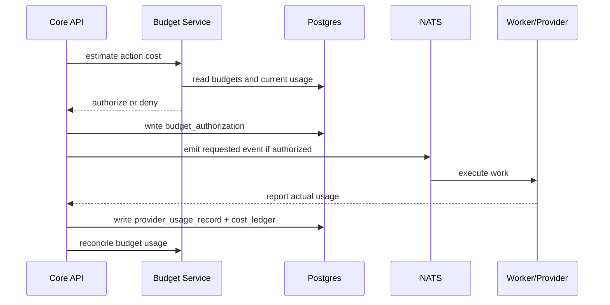

# 22 — Observability, Audit & Cost Specification

**Project:** Lumiq — Live Commerce Moment Vault  
**Document ID:** `22-observability-audit-cost-spec.md`  
**Status:** Draft v1  
**Audience:** platform engineers, backend engineers, AI engineers, media engineers, SRE/devops, finance/ops, security, QA, AI coding agents  
**Depends on:** `00-spec-index.md`, `01-product-requirements.md`, `02-project-constitution.md`, `03-glossary-domain-language.md`, `04-requirements-ears.md`, `05-user-flows-ux-spec.md`, `06-system-architecture-c4.md`, `07-service-decomposition.md`, `08-data-model-database-schema.md`, `09-api-contract-openapi.yaml`, `10-event-contract-asyncapi.yaml`, `11-json-schemas.md`, `12-agent-architecture-mastra.md`, `13-genblaze-media-pipeline.md`, `14-b2-storage-provenance-spec.md`, `15-template-step-graph-spec.md`, `16-moment-detection-ranking-spec.md`, `18-qa-moderation-policy-spec.md`, `19-security-rbac-threat-model.md`, `20-ai-security-safety-spec.md`, `21-privacy-retention-deletion-spec.md`.

---

## 1. Purpose

This document defines Lumiq's observability, audit, and cost-control specification.

Lumiq is event-driven, agent-assisted, media-heavy, and provider-backed. A single user action may pass through the Web App, Core API, Mastra Agent Service, LLMProviderRouter, NATS JetStream, Capture Worker, Genblaze Worker, Genblaze/media providers, B2, QA Worker, Publish Worker, Postgres, and Review UI. Without consistent traces, metrics, logs, audit events, and cost records, the system cannot be trusted, debugged, recovered, or priced.

This document answers:

1. Which traces must exist?
2. Which metrics must be collected?
3. What can and cannot be logged?
4. Which audit events are required?
5. How are cost estimates, budget checks, actual provider usage, and reconciliation recorded?
6. How are provider usage records linked to generation runs, LLM runs, moments, and assets?
7. Which dashboards and alerts are required?
8. How does observability support Admin/Recovery?
9. What is P0 for the hackathon path and P1/P2 for production?

Core rule:

```txt
Every important action must be traceable, auditable, and cost-attributable without leaking raw prompts, full transcripts, secrets, or private media into normal logs.
```

---

## 2. Research and Source Notes

This spec combines Lumiq internal documents with current public observability/security references available on **2026-06-26**.

Public references used:

```txt
OpenTelemetry documentation:
https://opentelemetry.io/docs/

OpenTelemetry Semantic Conventions:
https://opentelemetry.io/docs/concepts/semantic-conventions/
https://opentelemetry.io/docs/specs/semconv/

OpenTelemetry Logs specification:
https://opentelemetry.io/docs/specs/otel/logs/

OWASP ASVS:
https://owasp.org/www-project-application-security-verification-standard/

OWASP ASVS V7 Error Handling and Logging:
https://github.com/OWASP/ASVS/blob/master/4.0/en/0x15-V7-Error-Logging.md
```

Key external facts used:

```txt
OpenTelemetry is a vendor-neutral framework for instrumenting, generating, collecting, and exporting telemetry such as traces, metrics, and logs.
OpenTelemetry semantic conventions define common names and attributes for operations and telemetry data.
OpenTelemetry logs include resource context and enable correlation with traces and metrics.
OWASP ASVS provides a basis for verifying web application security controls, including logging and monitoring practices.
```

Important constraint:

```txt
Observability is not permission. Logs and traces help operators understand behavior, but Core API authorization, policy checks, schemas, and state machines remain enforcement points.
```

---

## 3. Source-of-Truth Constraints

This document inherits these Lumiq rules:

```txt
Every important side effect must be audited.
Trace IDs are required across API, events, agents, workers, provider calls, and B2 writes.
Provider and LLM usage must be recorded in cost ledgers or usage records.
Normal logs must not include full raw transcripts, full prompts, full model outputs, private product data beyond IDs/hashes, or secrets.
Events use a standard envelope with event_id, event_type, schema_version, organization_id, occurred_at, producer, idempotency_key, correlation_id, trace_id, and payload.
Workers acknowledge events only after durable state has been written or safely recorded.
DLQ and recovery must be visible in Admin/Recovery.
```

Relevant requirement IDs:

```txt
REQ-LLM-003    LLM Run Records
REQ-LLM-005    No Raw Prompt Logging
REQ-COST-001   Media Generation Budget
REQ-COST-002   LLM Budget
REQ-COST-003   Cost Reconciliation
REQ-COST-004   Budget Visibility
REQ-EVENT-001  Typed Event Envelope
REQ-EVENT-004  Idempotent Consumers
REQ-EVENT-005  Dead-letter Handling
REQ-AUDIT-001  Full Action Audit
REQ-AUDIT-002  Trace Correlation
REQ-AUDIT-003  Redacted Logs
REQ-AUDIT-004  Operational Metrics
REQ-ADMIN-001  Recovery Console
REQ-ADMIN-002  Manual Replay
REQ-ADMIN-003  B2 Reconciliation
REQ-NFR-001    Reliability
REQ-NFR-002    Latency Visibility
REQ-NFR-004    Data Integrity
```

---

## 4. Observability Principles

### 4.1 Correlate the golden path

Every golden-path run should be traceable:

```txt
session start
→ signal detection
→ candidate proposal
→ Mastra recommendation
→ capture authorization
→ raw B2 upload
→ Genblaze generation
→ QA
→ review approval
→ publish package
→ share page/provenance
```

### 4.2 Audit business truth, log operational detail

```txt
audit_events = durable business/security history
system_events = durable event processing history
logs = operational/debug telemetry
metrics = aggregate health and performance
traces = request/job path across services
cost ledger = financial/accounting trace
```

### 4.3 Do not put secrets or raw sensitive content in telemetry

Use IDs, hashes, references, sizes, statuses, and counts.

### 4.4 Cost is a first-class observable

AI/media provider usage must be tracked like latency or errors. Lumiq cannot safely automate generation without cost visibility.

---

## 5. Trace Model

### 5.1 Required trace tuple

Every major action should carry:

```txt
organization_id
session_id nullable
moment_id nullable
asset_id nullable
generation_run_id nullable
publish_package_id nullable
event_id nullable
agent_tool_call_id nullable
llm_run_id nullable
trace_id
correlation_id
idempotency_key
```

### 5.2 Trace propagation

```txt
Browser request
  → Core API request_id / trace_id
  → Postgres state transition
  → NATS event envelope trace_id/correlation_id
  → worker span
  → B2 write span
  → provider call span
  → worker callback span
  → Core API state update span
  → audit_event
```

### 5.3 Span naming convention

```yaml
span_names:
  api:
    - core_api.sessions.start
    - core_api.moments.authorize_capture
    - core_api.generation.request
    - core_api.review.approve
    - core_api.publish.create_package
  agent:
    - mastra.supervisor.validate_candidate
    - mastra.product_matcher.match_product
    - mastra.caption_copy.generate_options
    - mastra.qa.explain_result
  worker:
    - worker.capture.finalize_raw
    - worker.capture.upload_b2
    - worker.genblaze.execute_pipeline
    - worker.qa.post_enhancement
    - worker.publish.create_package
  storage:
    - b2.upload_object
    - b2.verify_checksum
    - b2.create_signed_url
    - b2.delete_object
  provider:
    - llm.openai.structured_output
    - genblaze.pipeline.run
    - media_provider.generate_video
```

### 5.4 Required span attributes

```yaml
required_span_attributes:
  common:
    - service.name
    - deployment.environment
    - lumiq.organization_id
    - lumiq.trace_id
    - lumiq.correlation_id
    - lumiq.idempotency_key
  session:
    - lumiq.session_id
    - lumiq.source_type
  moment:
    - lumiq.moment_id
    - lumiq.moment_state
    - lumiq.moment_type
  asset:
    - lumiq.asset_id
    - lumiq.asset_role
    - lumiq.b2.bucket
    - lumiq.b2.object_key_hash
    - lumiq.asset.sha256
  generation:
    - lumiq.generation_run_id
    - lumiq.template_id
    - lumiq.template_version
    - lumiq.provider
    - lumiq.model
  ai:
    - lumiq.agent_id
    - lumiq.llm_run_id
    - lumiq.task_type
  event:
    - lumiq.event_id
    - lumiq.event_type
    - lumiq.schema_version
```

Do not add raw prompts, full transcripts, raw provider outputs, or signed URLs to spans.

---

## 6. Metrics Registry

### 6.1 P0 operational metrics

```yaml
p0_metrics:
  sessions:
    - time_to_first_detected_moment_ms
    - session_start_success_total
    - session_start_failure_total
  capture:
    - raw_capture_success_total
    - raw_capture_failure_total
    - raw_capture_duration_ms
    - b2_upload_success_total
    - b2_upload_failure_total
    - b2_upload_latency_ms
  generation:
    - generation_run_success_total
    - generation_run_failure_total
    - generation_run_latency_ms
    - genblaze_run_success_total
    - genblaze_run_failure_total
    - provider_failure_total
  qa:
    - qa_pass_total
    - qa_failed_total
    - qa_review_required_total
    - qa_latency_ms
  review_publish:
    - review_approved_total
    - review_rejected_total
    - publish_package_created_total
    - share_page_created_total
  events:
    - nats_event_processed_total
    - nats_event_retry_total
    - dead_letter_total
    - worker_duplicate_event_total
  agents_llm:
    - agent_tool_call_success_total
    - agent_tool_call_denied_total
    - llm_run_success_total
    - llm_run_failure_total
    - malformed_llm_output_total
  costs:
    - estimated_cost_usd_total
    - actual_cost_usd_total
    - cost_per_generated_clip_usd
    - cost_per_approved_clip_usd
```

### 6.2 P1 production metrics

```yaml
p1_metrics:
  queue:
    - worker_queue_lag_ms
    - worker_processing_time_ms
    - event_ack_latency_ms
  storage:
    - b2_reconciliation_anomaly_total
    - checksum_mismatch_total
    - signed_url_created_total
    - deletion_job_failure_total
  ai_safety:
    - prompt_injection_detected_total
    - ungrounded_claim_blocked_total
    - restyle_review_required_total
    - unsafe_tool_call_denied_total
  product_quality:
    - product_match_accuracy_sampled
    - caption_accuracy_sampled
    - product_claim_violation_total
    - product_appearance_violation_total
  budget:
    - budget_authorization_denied_total
    - budget_remaining_usd
    - provider_daily_spend_usd
    - llm_daily_spend_usd
```

### 6.3 Metric labels

Allowed labels:

```txt
environment
service_name
organization_plan
source_type
moment_type
asset_role
run_type
provider
model_family_or_alias
template_id
failure_class
error_code
```

Avoid high-cardinality labels:

```txt
raw session_id on high-volume metrics
raw moment_id on high-volume metrics
raw asset_id on high-volume metrics
raw object_key
raw prompt text
raw transcript text
user email
```

Use exemplars or trace links for high-cardinality debugging.

---

## 7. Logging Policy

### 7.1 Log levels

```yaml
log_levels:
  debug:
    use: local_or_staging_only_by_default
    content: ids_hashes_statuses_small_metadata
  info:
    use: normal_successful_operations
    content: state_transitions_summaries
  warn:
    use: recoverable_failures_policy_denials_budget_warnings
  error:
    use: failed_operations_requiring_retry_or_admin_attention
  security:
    use: authz_denials_cross_tenant_attempts_forbidden_agent_tool_calls
```

### 7.2 Allowed log fields

```txt
timestamp
level
service_name
environment
organization_id
session_id
moment_id
asset_id
generation_run_id
publish_package_id
event_id
agent_tool_call_id
llm_run_id
trace_id
correlation_id
idempotency_key
action
status
error_code
failure_class
latency_ms
bytes
sha256
input_hash
output_hash
provider
model
template_id
cost_estimate_usd
actual_cost_usd
```

### 7.3 Forbidden normal log fields

```txt
full raw transcript
full prompt
full model output
raw provider response if contentful
B2 credentials
provider API keys
Clerk JWTs
signed asset URLs
passwords or tokens
private product bulk data beyond IDs/hashes
customer payment details
```

### 7.4 Redaction requirements

```txt
redact email addresses unless needed in auth audit view
hash object keys in normal logs unless admin/audit context requires exact key
never log signed URLs
truncate provider error messages and strip secrets
store sensitive evidence only in governed evidence storage with retention class
```

---

## 8. Audit Events

### 8.1 Audit event principles

Audit events are durable records of meaningful actions, not debug logs.

Audit required for:

```txt
auth-sensitive actions
state transitions
agent tool calls
LLM task completion metadata
provider calls
B2 asset writes
checksum verification failures
budget decisions
review approval/rejection
canonical promotion
publish package creation/approval
share page creation/revocation
delete/revoke/export/retention changes
admin recovery actions
service identity denials
cross-tenant access denials
```

### 8.2 Audit event fields

```yaml
audit_event_required_fields:
  - audit_event_id
  - organization_id
  - actor_type
  - actor_id
  - action
  - resource_type
  - resource_id
  - before_state
  - after_state
  - policy_result_json
  - idempotency_key
  - request_id
  - trace_id
  - created_at
```

### 8.3 Actor types

```txt
user
service_agent
worker
system
```

### 8.4 Example audit actions

```txt
session.started
session.ended
moment.capture_authorized
moment.capture_denied
asset.created
asset.verified
asset.soft_deleted
generation.requested
generation.completed
generation.failed
agent.tool_call.succeeded
agent.tool_call.denied
llm.run.completed
qa.completed
review.approved
review.rejected
publish.package_created
share.created
share.revoked
budget.authorization_denied
retention.policy_changed
admin.dlq_retried
b2.reconciliation_anomaly
```

---

## 9. Cost and Budget Model

### 9.1 Cost principles

```txt
Estimate before expensive action.
Authorize against budget before expensive action.
Record provider usage after action.
Reconcile estimate vs actual when provider returns actual usage.
Show budget state in Live Studio/Admin.
Deny, queue, or require approval when budget is insufficient.
```

### 9.2 Budget scopes

```yaml
budget_scopes:
  organization:
    examples: [org_monthly_budget, org_monthly_llm_budget]
  campaign:
    examples: [campaign_generation_budget, campaign_publish_budget]
  session:
    examples: [session_auto_enhancement_budget, session_llm_budget]
  provider:
    examples: [provider_daily_cap, model_specific_cap]
  automation:
    examples: [max_auto_enhancements_per_session, max_rerenders_per_moment]
```

### 9.3 Cost ledger fields

```yaml
cost_ledger_fields:
  - cost_ledger_id
  - organization_id
  - scope_type
  - scope_id
  - action_type
  - provider
  - model
  - generation_run_id
  - llm_run_id
  - asset_id
  - publish_package_id
  - estimated_cost_usd
  - actual_cost_usd
  - cost_source
  - usage_quantity
  - usage_unit
  - budget_authorization_id
  - trace_id
  - created_at
  - reconciled_at
```

### 9.4 Provider usage records

Media provider usage should record:

```txt
provider
model
provider_job_ref
generation_run_id
duration_ms
seconds_generated
input_asset_duration_ms
output_asset_duration_ms
resolution
attempt_count
fallback_attempted
estimated_cost_usd
actual_cost_usd
status
error_code
```

LLM provider usage should record:

```txt
provider
model
llm_run_id
task_type
agent_id
input_tokens nullable
output_tokens nullable
cached_tokens nullable
estimated_cost_usd
actual_cost_usd
latency_ms
status
error_code
```

B2 usage estimates may record:

```txt
bytes_stored
asset_role
bucket
retention_class
estimated_monthly_storage_cost_usd
estimated_egress_cost_usd where applicable
```

---

## 10. Budget Authorization Flow



Deny behavior:

```txt
No provider call should happen.
Reason must be stored.
User/admin should see budget-blocked state.
Audit event must be written.
```

---

## 11. Service Instrumentation Matrix

```yaml
instrumentation_matrix:
  web_app:
    traces:
      - user_action_to_api_request
      - live_studio_progress_poll_or_subscription
    logs:
      - client_errors_without_sensitive_media
    metrics:
      - page_load_time
      - api_error_rate

  core_api:
    traces:
      - public_api_requests
      - internal_agent_tool_requests
      - worker_callbacks
      - state_transitions
      - event_publish
    audit:
      - all_sensitive_commands
    metrics:
      - request_latency
      - authz_denied_total
      - state_transition_failure_total

  mastra_agent_service:
    traces:
      - agent_runs
      - tool_calls
      - llm_provider_calls
    logs:
      - llm_run_ids_and_hashes_only
    metrics:
      - agent_tool_call_success_total
      - malformed_output_total
      - llm_cost_usd

  capture_worker:
    traces:
      - capture_finalize
      - b2_upload
      - checksum_calculation
    metrics:
      - capture_success_total
      - b2_upload_latency_ms
      - checksum_mismatch_total

  genblaze_worker:
    traces:
      - generation_request_consume
      - b2_fetch_input
      - genblaze_pipeline_run
      - provider_call
      - b2_write_outputs
      - manifest_write
    metrics:
      - generation_latency_ms
      - provider_failure_total
      - actual_cost_usd

  qa_worker:
    traces:
      - pre_enhancement_qa
      - post_enhancement_qa
      - pre_publish_qa
    metrics:
      - qa_pass_total
      - qa_review_required_total
      - qa_failure_by_class_total

  publish_worker:
    traces:
      - package_build
      - variant_write
      - share_asset_prepare
    metrics:
      - publish_package_success_total
      - share_create_total

  audit_reconciliation_worker:
    traces:
      - b2_reconciliation
      - retention_sweep
      - deletion_job
    metrics:
      - reconciliation_anomaly_total
      - deletion_job_failure_total
```

---

## 12. Dashboards

### 12.1 Hackathon / demo dashboard

```txt
active sessions
captured moments
generation runs by status
B2 uploads by status
QA pass/review/fail
publish packages
cost estimate total
latest DLQ/failure
```

### 12.2 Production operations dashboard

```txt
API p50/p95 latency
worker queue lag
NATS retry/DLQ rate
B2 upload latency/failure rate
Genblaze/provider success rate
QA failure classes
cost per generated/approved/published clip
LLM cost by task type
agent tool denial rate
budget denials
retention/deletion failures
B2 reconciliation anomalies
```

### 12.3 Security/audit dashboard

```txt
cross-tenant access denied
agent forbidden tool attempts
prompt injection detections
ungrounded claim blocks
share link creations/revocations
asset deletions
admin recovery actions
service identity failures
```

### 12.4 Finance/cost dashboard

```txt
org monthly spend
campaign spend
session spend
provider spend by model
cost per moment
cost per approved clip
cost per published package
budget remaining
actual vs estimated variance
fallback cost impact
```

---

## 13. Alerting

P0 alerts:

```txt
B2 upload failure rate exceeds threshold
Genblaze generation failures spike
NATS DLQ receives new P0 event
Core API authz/security errors spike
Budget cap reached for active session
Provider actual cost exceeds estimate by threshold
B2 checksum mismatch detected
```

P1 alerts:

```txt
worker queue lag exceeds SLO
QA terminal failure spike
cost per approved clip exceeds target
agent malformed output spike
prompt injection detections spike
reconciliation anomalies found
retention/deletion job failures
public share access anomaly
```

Alert records should link to:

```txt
trace_id
organization_id
session_id/moment_id where applicable
runbook link
admin recovery action if applicable
```

---

## 14. SLO / Reliability Targets

Initial suggested targets; exact numbers are open questions.

```yaml
slo_targets:
  raw_capture_success_rate:
    target: ">= 99% for authorized captures in stable conditions"
  b2_upload_success_rate:
    target: ">= 99% after retries"
  generation_completion_rate:
    target: ">= 95% for supported templates/providers"
  qa_completion_rate:
    target: ">= 99% after generation.completed"
  dead_letter_rate:
    target: "< 1% of events"
  audit_write_success:
    target: "effectively 100% for sensitive actions"
  trace_correlation_coverage:
    target: ">= 95% of golden-path operations"
```

Do not treat these as contractual SLAs until production business terms are defined.

---

## 15. Admin / Recovery Observability

Admin views must allow authorized users to inspect:

```txt
failed generation runs
DLQ events
stuck moments
B2 reconciliation anomalies
provider failures
budget anomalies
agent tool failures
LLM run failures
retention/deletion failures
audit events by trace/resource/user
```

Admin recovery actions must require:

```txt
admin capability
reason
idempotency_key
audit event
state transition
trace_id
```

---

## 16. Privacy and Security of Telemetry

Telemetry retention:

```txt
logs: short to medium retention by environment/plan
audit_events: 90–365 days or policy
metrics: aggregate retention may be longer
traces: short to medium retention, sampled where needed
cost ledger: accounting/business retention policy
```

Telemetry access:

```txt
least privilege
organization scoped where user-facing
admin-only for cross-system traces
no raw sensitive content in normal telemetry
export/delete policy applies where telemetry contains personal data
```

---

## 17. P0 Implementation Slice

For the hackathon path, implement:

```txt
1. trace_id and correlation_id on API requests, events, worker callbacks, and audit events.
2. audit_events for session start, capture authorization, asset creation, generation requested/completed/failed, QA completed, review approval, publish package creation, share page creation, delete/revoke.
3. llm_runs metadata for Mastra LLM calls.
4. agent_tool_calls metadata for agent tools.
5. provider_usage_records or generation_runs cost fields for Genblaze/media usage.
6. budget_authorizations for generation requests.
7. cost_ledger entries for generation/LLM usage where estimates are available.
8. redacted structured logs.
9. minimal dashboard/admin view for failed runs and DLQ.
10. metrics counters for capture, B2 upload, generation, QA, publish, DLQ, and cost total.
```

P0 may use a simple OpenTelemetry-compatible structured logging approach before a full observability vendor is selected.

---

## 18. P1 / Production Beta

```txt
OpenTelemetry collector/exporter setup
full metrics dashboard
distributed tracing across all workers
SLO alerts
cost reconciliation worker
provider actual usage ingestion
B2 storage cost estimator
budget anomaly alerts
security/audit dashboard
retention/deletion observability
trace sampling policy
log retention policy
```

---

## 19. Acceptance Criteria

```txt
Given a moment is generated
When an admin inspects it
Then API calls, NATS events, worker callbacks, provider calls, B2 writes, audit events, and cost records share trace_id/correlation_id.

Given a reviewer approves a moment
When approval succeeds
Then an audit_event records actor, action, before_state, after_state, moment_id, and trace_id.

Given an LLM call occurs
When logs are emitted
Then logs contain IDs/hashes/status/cost metadata and not the full raw prompt or output.

Given a generation request is created
When budget is insufficient
Then no provider call is made, the denial is recorded, and the UI can show budget-blocked state.

Given a provider returns actual usage
When reconciliation runs
Then cost_ledger stores actual_cost_usd and links it to generation_run_id or llm_run_id.

Given a B2 checksum mismatch is detected
When reconciliation completes
Then an anomaly is visible in Admin and an alert/audit record exists.
```

---

## 20. Open Questions

```txt
1. Exact observability vendor/backend.
2. Exact OpenTelemetry collector deployment model.
3. Exact trace sampling rates by environment.
4. Exact log retention windows by plan/environment.
5. Exact SLO thresholds for production beta.
6. Exact provider pricing source and update cadence.
7. Exact B2 storage cost estimator assumptions.
8. Exact budget behavior: deny vs queue vs require approval.
9. Exact alert thresholds for DLQ, provider failure, and cost anomaly.
10. Exact audit export format.
```

Until resolved, use conservative defaults:

```txt
log less sensitive content, not more
write audit records for all sensitive actions
use trace_id everywhere
estimate and authorize before provider calls
reconcile actual cost when available
surface failures in Admin/Recovery
```

---

## 21. AI Coding Agent Instructions

```txt
When implementing observability/audit/cost:
1. Add trace_id, correlation_id, and idempotency_key to every boundary.
2. Do not log raw prompts, raw transcripts, raw model outputs, signed URLs, or secrets.
3. Write audit events for state transitions and sensitive actions.
4. Record llm_runs and agent_tool_calls metadata.
5. Estimate cost before provider calls.
6. Record actual usage when provider data exists.
7. Link cost records to organization_id and run IDs.
8. Do not use high-cardinality IDs as metric labels unless using exemplars/traces.
9. Make failures visible in Admin/Recovery.
```

---

## 22. Change Log

| Version | Date | Change |
|---|---|---|
| v1 | 2026-06-26 | Created observability, audit, cost ledger, budget, metrics, logs, traces, and provider usage specification. |
